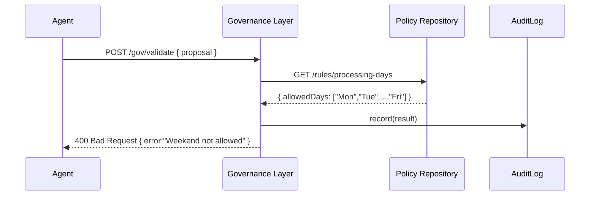

# Chapter 14: Governance Layer

In the previous chapter we learned how the [Management Layer](13_management_layer_.md) orchestrates complex workflows. Now it’s time to meet the **Governance Layer**, our “board of directors” for HMS-NFO. This layer sets the high-level rules, ethical guardrails, and compliance checks that every service and AI agent must follow.

---

## 1. Motivation: Why a Governance Layer?

Imagine the AI Representative Agent ([Chapter 5](05_ai_representative_agent__hms_a2a__.md)) proposes a rule change to fast-track FOIA requests filed on weekends. That sounds great for speed—but what if weekend staffers aren’t available to process them? Or what if law requires all requests to be logged Monday–Friday?

The **Governance Layer** steps in like an oversight board:

1. It holds **policy documents** (e.g., “No weekend-only processing”).  
2. It checks every proposed change against those rules.  
3. If something violates a rule, it rejects or flags it for human review.  
4. It logs all decisions for transparency and audit.

This ensures **safety**, **accountability**, and **legal compliance** across every module—from microservices to AI agents.

---

## 2. Key Concepts

1. **Policy Repository**  
   A centralized store of high-level rules and ethical guidelines (e.g., “All FOIA changes require human sign-off”).

2. **Validation Engine**  
   Code that compares incoming proposals or API calls against the policies.

3. **Compliance Checks**  
   Automated tests to ensure a service change doesn’t break regulatory constraints.

4. **Approval Workflow**  
   If a request passes all checks, it proceeds; otherwise it’s escalated or blocked.

5. **Audit Trail**  
   A permanent record of who approved or rejected what, with timestamps.

---

## 3. Solving a Governance Use Case

Use Case: An AI agent submits a proposal to “fast-track weekend FOIA requests.” The Governance Layer must:

1. Fetch the stored policy rule about weekends.  
2. Validate the proposal.  
3. Reject it if it conflicts.  
4. Log the decision.

### 3.1 Sequence Diagram



---

## 4. Using the Governance Layer

### 4.1 Define Your Policies

_File: `governance/config/policies.js`_
```js
// Days allowed for FOIA processing
module.exports = {
  processingDays: ["Mon","Tue","Wed","Thu","Fri"],
  maxThreshold: 30  // max days before auto-escalation
};
```
This file lists our high-level rules in one place.

### 4.2 Expose a Validation Endpoint

_File: `governance/routes/validation.js`_
```js
const express = require('express');
const { validateProposal } = require('../handlers/validation');
const router = express.Router();

// Agents and services call this to check compliance
router.post('/gov/validate', validateProposal);
module.exports = router;
```
We expose a single HTTP endpoint for compliance checks.

### 4.3 Implement the Validation Handler

_File: `governance/handlers/validation.js`_
```js
const policies = require('../config/policies');
const auditLog = require('../lib/auditLog');

async function validateProposal(req, res) {
  const { proposal } = req.body;
  const weekdays = policies.processingDays;
  // Reject if a weekend action is requested
  if (proposal.day && !weekdays.includes(proposal.day)) {
    await auditLog.record(req.user.id, proposal, "rejected");
    return res.status(400).json({ error: "Weekend processing not allowed" });
  }
  // Passed all checks
  await auditLog.record(req.user.id, proposal, "approved");
  res.json({ status: "approved" });
}

module.exports = { validateProposal };
```
1. We load our policies.  
2. We compare the proposal against them.  
3. We log every decision.  
4. We return an approval or rejection.

---

## 5. Under the Hood: What Happens Step-by-Step

1. **Incoming Request**: An AI agent or module `POST`s a proposal to `/gov/validate`.  
2. **Policy Fetch**: The Governance Layer loads rules from `policies.js`.  
3. **Validation**: It checks the proposal fields (e.g., `day` is in allowed days).  
4. **Decision Logging**: It writes an entry into the Audit Log.  
5. **Response**: It returns `200 OK` for approval, or `400 Bad Request` with an error message for violations.

---

## 6. Internal Implementation Snippets

### 6.1 Audit Logging

_File: `governance/lib/auditLog.js`_
```js
async function record(userId, proposal, decision) {
  // In a real system, write to a DB or external log
  console.log(`[Audit] ${new Date().toISOString()} | User:${userId} | ${decision}`, proposal);
}

module.exports = { record };
```
A simple logger that writes structured audit entries.

### 6.2 Mounting in Your Server

_File: `governance/index.js`_
```js
const express = require('express');
const validationRouter = require('./routes/validation');
const { authenticate } = require('hms-sys/security');
const app = express();

app.use(express.json());
app.use(authenticate);           // ensure user identity
app.use(validationRouter);       // governance endpoints

app.listen(7000, () => console.log('Governance Layer on 7000'));
```
We secure our layer with the common HMS-SYS authentication.

---

## 7. What We’ve Learned

- The **Governance Layer** holds your board-level rules and runs compliance checks on every proposal.  
- We saw how to define policies, expose a validation endpoint, and implement a handler that enforces rules.  
- Every decision is logged in the **Audit Trail** for transparency.

Next up: learn how to observe the whole platform in real time in [Chapter 15: Real-Time Metrics & Monitoring](15_real_time_metrics___monitoring_.md).

---

Generated by [AI Codebase Knowledge Builder](https://github.com/The-Pocket/Tutorial-Codebase-Knowledge)