# Chapter 14: Healthcare Domain Integration (HMS-UHC + MED)

[← Back to Chapter 13: Secure Inter-Agency Exchange (HMS-A2A)](13_secure_inter_agency_exchange__hms_a2a__.md)

---

## 1. Why do we need a “HIPAA-proof pipe”?

Story time!

Jamila, 67, lives in Kansas City.  
Her county just deployed a shiny **AI-optimised vaccine-booster intake form** built with HMS-AGX.  
To skip questions Jamila already answered at her hospital, the form must “peek” at her electronic health record (EHR):

1. Pull her last vaccine date from **Saint Mary’s Hospital** (Epic EHR).  
2. Add allergy info from **Medco Pharmacy** (HL7 feed).  
3. Log every byte for HIPAA auditors.

Without a specialised, healthcare-grade pipe, developers would juggle:

* 15 different EHR vendor APIs  
* Federal HIPAA privacy rules  
* State immunisation registries  
* Future device-recall notices from FDA

**Healthcare Domain Integration (HMS-UHC + MED)** is that pipe—think of it as the **“health-data subway”** inside HMS-AGX.

---

## 2. Key ideas (plain English)

| Concept | Think of it as… | Analogy |
|---------|-----------------|---------|
| **Consent Envelope** | Digitally signed HIPAA “permission slip.” | Sealed medical chart |
| **EHR Connector** | Adapter for each vendor (Epic, Cerner, etc.). | Universal power plug |
| **FHIR Mapper** | Translates HL7/FHIR objects ↔ HMS JSON. | Language interpreter |
| **De-Identification Filter** | Removes or masks PHI when not needed. | Black marker on a form |
| **Audit Beacon** | Auto-sends “who-saw-what-when” logs. | Security camera log |

Remember the flow: **Consent → Connector → Mapper → (optional) De-ID → Audit**.

---

## 3. Quick start (18 lines)

Below we fetch Jamila’s COVID-19 booster record and pre-fill the AI form.

```python
from hms_agx.uhc import UhcGateway, ConsentEnvelope

# 1️⃣  Jamila e-signs the HIPAA consent for vaccine lookup
consent = ConsentEnvelope(
    user_id   = "JAMILA-987",
    scope     = ["immunization"],
    purpose   = "vaccine_booster_form"
)

# 2️⃣  The county portal asks UHC for the data
uhc   = UhcGateway()                       # 🔌 health-data subway
record = uhc.fetch(
    consent  = consent,
    patient  = "JAMILA-987",
    source   = "st_marys.epic.ehr",
    resource = "Immunization"
)

print(record["status"])        # "completed"
print(record["data"]["date"])  # "2023-09-16"
```

What happened?

1. `ConsentEnvelope` captures *who* and *why*.  
2. `fetch()` talks to the correct **EHR Connector**, runs through the **FHIR Mapper**, masks fields not in scope, and returns JSON safe to feed into the micro-frontend form.

---

## 4. Under the hood (5-actor picture)

```mermaid
sequenceDiagram
    participant UI  as Portal Form
    participant CE  as Consent Envelope
    participant UHC as Health Hub Gateway
    participant EHR as Hospital EHR
    participant AUD as Audit Beacon
    UI->>CE: sign HIPAA consent
    UI->>UHC: request Immunization
    UHC->>EHR: FHIR query (with consent token)
    EHR-->>UHC: FHIR bundle
    UHC->>UI: mapped JSON
    UHC-->>AUD: 🔔 log disclosure
```



---

## 5. Tiny internal components (≤ 20 lines each)

### 5.1 Consent Envelope

```python
# file: hms_agx/uhc/consent.py
from dataclasses import dataclass, field
import uuid, time
@dataclass
class ConsentEnvelope:
    user_id: str
    scope: list[str]
    purpose: str
    token: str = field(default_factory=lambda: uuid.uuid4().hex)
    ts:    int  = field(default_factory=lambda: int(time.time()))
```

Plain container signed later by ESQ (see [Compliance & Legal Reasoning Service](07_compliance___legal_reasoning_service__hms_esq__.md)).

---

### 5.2 Health Hub Gateway (UhcGateway)

```python
# file: hms_agx/uhc/gateway.py
from .connectors import get_connector
from .mapper     import map_fhir
from .audit      import beacon

class UhcGateway:
    def fetch(self, consent, patient, source, resource):
        conn = get_connector(source)        # pick Epic/Cerner etc.
        fhir = conn.query(patient, resource, consent.token)
        data = map_fhir(fhir, consent.scope)
        beacon.log(consent, source, resource)   # HIPAA audit
        return {"status": "completed", "data": data}
```

*Only 8 lines!* Real code adds retries and error handling.

---

### 5.3 FHIR-to-JSON Mapper (super-minimal)

```python
# file: hms_agx/uhc/mapper.py
def map_fhir(bundle, scope):
    vax = bundle["entry"][0]["resource"]
    allowed = {"immunization": ["date", "vaccineCode"]}
    return {k: vax[k] for k in allowed.get(scope[0], [])}
```

Maps just the fields listed for the **scope**, enforcing “minimum necessary” HIPAA rule.

---

### 5.4 Audit Beacon

```python
# file: hms_agx/uhc/audit.py
def log(consent, source, resource):
    entry = f"{consent.user_id} • {resource} • {source} • {consent.ts}"
    open("audit.log","a").write(entry + "\n")
```

In production this streams to the [Data & Metrics Observatory](16_data___metrics_observatory__hms_dta___ops__.md).

---

## 6. How HMS-UHC integrates with earlier chapters

| Earlier chapter | Role here |
|-----------------|-----------|
| [Service Mesh (SVC)](11_backend_service_mesh__hms_svc_layer__.md) | All Connector calls ride the encrypted mesh. |
| [Secure A2A](13_secure_inter_agency_exchange__hms_a2a__.md) | Cross-state EHR pulls use the diplomatic pouch if states differ. |
| [MCP](09_model_context_protocol__hms_mcp__.md) | `tool_manifest` lists `uhc.fetch`; ESQ checks HIPAA scope before approval. |
| [HITL Oversight](04_human_in_the_loop__hitl__oversight_.md) | Low confidence mapping or consent mismatch → human review. |
| [External Sync](12_external_system_synchronization_.md) | FDA device-recall events broadcast to hospitals through the same connectors. |

---

## 7. Common pitfalls & guardrails

| Pitfall | Built-in guardrail |
|---------|-------------------|
| Request without consent | UHC rejects with “401 HIPAA consent required.” |
| Pulling extra PHI fields | Mapper strips anything outside `scope`. |
| Missing audit entry | Beacon writes synchronously before data returns. |
| Vendor outage | Connector retries & falls back to cached immunisation registry. |

---

## 8. Frequently asked questions

**Q: Do I need to know HL7 or FHIR?**  
Not for basic use. UHC hides vendor quirks; you get plain JSON.

**Q: How is PHI encrypted at rest?**  
Connectors store nothing by default. If caching is enabled, data rests in AES-256 volumes.

**Q: What about GDPR or state privacy laws?**  
Consent Envelope supports extra flags (`expiry`, `jurisdiction`) checked by ESQ.

**Q: Can I test without a real EHR?**  
Yes—UHC ships with a “mock” connector that returns sample FHIR bundles for demos.

---

## 9. What you learned

• The pain point: moving EHR or vaccine data under stringent HIPAA rules.  
• Five core building blocks: Consent Envelope, EHR Connector, FHIR Mapper, De-ID Filter, Audit Beacon.  
• A 18-line code snippet that fetched Jamila’s booster record.  
• An under-the-hood tour with tiny, readable classes.  
• How HMS-UHC teams up with mesh, A2A, MCP, HITL, and metrics.

---

Ready to see how money—copays, reimbursements, grants—flows just as smoothly?  
Continue to [Chapter 15: Financial & Transaction Layer (HMS-ACH)](15_financial___transaction_layer__hms_ach__.md) →

---

Generated by [AI Codebase Knowledge Builder](https://github.com/The-Pocket/Tutorial-Codebase-Knowledge)