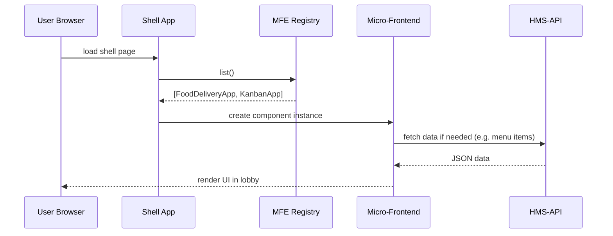

# Chapter 14: HMS-MFE (Micro-Frontends)

In [Chapter 13: HMS-MKT (Public Portal)](13_hms_mkt__public_portal__.md) you saw how a single Vue app lets citizens fill out any service form. But as our system grows, one big app can become slow and hard to maintain. Enter **HMS-MFE (Micro-Frontends)**—think of them as the little modular kiosks in a government lobby (payment kiosk, scheduling kiosk, forms kiosk, dashboards kiosk). Each kiosk is self-contained, focused on one task, but plugs into a shared lobby (the shell).

## 1. Motivation: Why Micro-Frontends?

Imagine a DMV lobby where:

  - One kiosk issues driver’s licenses.  
  - Another processes title transfers.  
  - A third prints voter registration forms.  

Each kiosk is built, tested, and deployed independently. If the voter-registration team needs a new UI, they don’t touch the license kiosk.  
Likewise, **HMS-MFE** lets teams ship UI components (for banking, education, healthcare) without stepping on each other’s toes.

**Central Use Case:**  
The Department of Agriculture wants a **FoodDeliveryApp.vue** for ordering meals, while the Department of Education wants a **KanbanApp.vue** for tracking school projects. Both should load inside the citizen portal shell without bundling everything into one codebase.

## 2. Key Concepts

1. **Shell (Host App)**  
   A minimal container that loads, displays, and manages micro-frontends.  

2. **Micro-Frontend (MFE)**  
   A self-contained UI module (e.g. `FoodDeliveryApp.vue`) exposing its root component and public API.  

3. **Registration & Mounting**  
   How the shell discovers available MFEs (static list or dynamic registry) and injects them into named slots.

4. **Communication**  
   Simple event or property passing so MFEs can talk to the shell or each other (e.g. “order placed” event).

5. **Independent Deploy**  
   Each MFE is built and deployed separately—like independent kiosks physically dropped into the lobby.

## 3. Building Your First Micro-Frontends

Let’s walk through a minimal example.

### 3.1 Create the Shell Application

File: `shell/src/main.js`  
```js
import Vue from 'vue'
import App from './App.vue'
import mfeRegistry from './mfeRegistry'

Vue.prototype.$mfes = mfeRegistry // make registry globally available
new Vue({ render: h => h(App) }).$mount('#shell')
```
*We bootstrap Vue, load a registry of MFEs, and mount on `<div id="shell">`.*

File: `shell/src/App.vue`  
```html
<template>
  <div class="lobby">
    <h1>Government Service Lobby</h1>
    <component
      v-for="m in $mfes.list()"
      :is="m.name"
      :key="m.name"
      v-bind="m.props"/>
  </div>
</template>
```
*The shell loops over registered MFEs and renders each by its name.*

### 3.2 Build a Micro-Frontend

File: `FoodDeliveryApp/src/FoodDeliveryApp.vue`  
```html
<template>
  <div class="food-delivery">
    <h2>Food Delivery Kiosk</h2>
    <button @click="orderMeal">Order Meal</button>
  </div>
</template>
<script>
export default {
  name: 'FoodDeliveryApp',
  methods: {
    orderMeal() {
      alert('Your farm-fresh meal is on its way!');
      this.$emit('mealOrdered')
    }
  }
}
</script>
```
*This MFE shows a simple UI and emits an event when the user orders.*

File: `FoodDeliveryApp/src/index.js`  
```js
import FoodDeliveryApp from './FoodDeliveryApp.vue'
export default { name: 'FoodDeliveryApp', component: FoodDeliveryApp }
```
*We export a small descriptor so the shell can register it.*

### 3.3 Registering MFEs

File: `shell/src/mfeRegistry.js`  
```js
import FoodMFE from 'food-delivery-app'   // installed via NPM or loaded via CDN
import KanbanMFE from 'kanban-app'

const mfes = []
export default {
  register(mfe) { mfes.push(mfe) },
  list() { return mfes }
}

// register at startup
register(FoodMFE)
register(KanbanMFE)
```
*The registry holds each MFE descriptor. In real life you might fetch this list from an API.*

## 4. Under the Hood: What Happens When You Load an MFE



1. The shell app starts and asks the **MFE Registry** for all registered MFEs.  
2. It dynamically creates each MFE component.  
3. Each MFE may fetch its own data from `HMS-API` or other services.  
4. The UI appears in the lobby—independent but living together.

## 5. Internal Implementation Details

### 5.1 Registry Module

File: `modules/hms-mfe/registry.js`  
```js
const mfes = []
function register(mfe) { mfes.push(mfe) }
function list() { return mfes }
export { register, list }
```
*Provides a simple API for registering and listing MFEs.*

### 5.2 Loader/Bootstrapping

File: `modules/hms-mfe/loader.js`  
```js
import { register } from './registry'
// dynamically import all MFE bundles (could be from manifest.json)
const manifest = ['food-delivery-app','kanban-app']
manifest.forEach(async id => {
  const mfe = await import(id)
  register(mfe.default)
})
```
*On shell startup, we read a manifest and `import()` each MFE bundle, then register it.*

## 6. Conclusion

You’ve just learned how **HMS-MFE** breaks a large frontend into independent, reusable UI kiosks—each team builds, tests, and deploys their micro-frontend without touching the others. We covered:

  - The **shell** (lobby) and **registry** pattern  
  - A minimal `FoodDeliveryApp.vue` micro-frontend  
  - How the shell dynamically loads and mounts MFEs  
  - A sequence diagram of the loading process  
  - Core registry and loader code

Next up, we’ll learn how to orchestrate deal-flow negotiations in [Chapter 15: Deal Flow System](15_deal_flow_system_.md).

---

Generated by [AI Codebase Knowledge Builder](https://github.com/The-Pocket/Tutorial-Codebase-Knowledge)