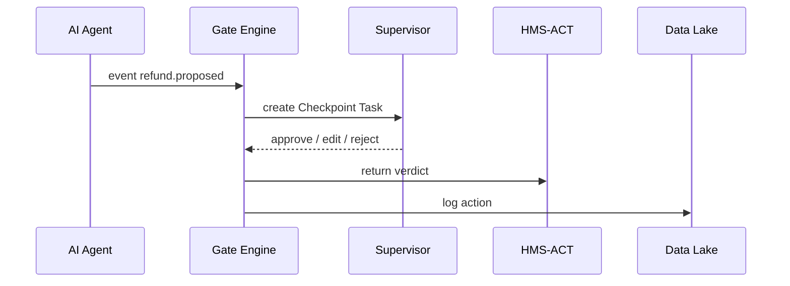

# Chapter 14: Human-in-the-Loop (HITL) Oversight Framework

[← Back to Chapter 13: HMS-MCP Model Context Protocol](13_hms_mcp_model_context_protocol_.md)

---

## 1. Why Do We Need a “Dual-Key” Safety Switch?

Imagine the **Internal Revenue Service (IRS)** releases an AI aide that:

1. Reads millions of tax returns.  
2. Suggests refund adjustments.  
3. Pushes changes straight to Treasury for payment.  

Great—until the bot proposes a **$9 000 000 refund** to the *“Lucky Llama Alpaca Farm”* at 3 a.m. 😱  
Congress, the media, and the public will ask:

> “Which *human* signed off on that?”

The **HITL Oversight Framework** makes sure **no matter how smart the AI, a human remains the accountable officer**.  
It inserts **gates**—think military “dual-key” launch protocol—where a real official must **approve, edit, or reject** an action before it goes live.

---

## 2. Key Concepts (Plain-English Cheatsheet)

| Word | Think of It As | 1-Sentence Meaning |
|------|---------------|--------------------|
| Gate | 🔒  Lock on a door | A checkpoint in a workflow where AI must stop. |
| Clearance Level | 🛂  Badge color | Who is allowed to approve the gate (`FOIA`, `Secret`, `Top-Secret`). |
| Checkpoint Task | 📬  To-do card | The task that appears in the approver’s inbox. |
| Dual-Key Rule | 🔑🔑  Two keys | Some gates need **two** different roles to turn their keys (e.g., Legal + Budget). |
| Time-Box | ⏰  Shot clock | If nobody decides in time, gate escalates or auto-rejects. |
| Audit Trail | 📜  Paper tape | Immutable record of every click (links to [Activity Logging & Auditing](15_activity_logging___auditing__within_hms_act___ops__.md)). |

Remember these six words and you already speak 80 % of HITL.

---

## 3. Guided Walk-Through: “Approve a Mega Refund”

### 3.1 Declare the Gate (YAML – 10 lines)

```yaml
# hitl/refund_gate.yaml
whenEvent: refund.proposed
rule: amount > 1000000                 # $1 000 000+
dualKey:                               # two different roles
  - IRS-Auditor
  - Treasury-Budget
timeBoxMinutes: 120
clearance: SECRET
```

What it says:  
• If an AI proposes a refund > $1 M, stop.  
• Need **one auditor** *and* **one budget officer** within 2 hours.  
• Both must hold `SECRET` clearance (mirrors real security badges).

### 3.2 Register the Gate (CLI – 1 line)

```bash
hms-hitl add-gate hitl/refund_gate.yaml
```

Console: `✅ Gate refund.proposed › amount>1M registered`

### 3.3 See It in Action

1. AI agent (see [AI Representative Agent](04_ai_representative_agent__hms_agt___agx__.md)) proposes a `$9 000 000` refund.  
2. Gate fires → two **Checkpoint Tasks** appear:

```
🔒 [#CK-12] Mega Refund $9,000,000 
    • Awaiting: IRS-Auditor, Treasury-Budget
```

3. Auditor opens the task, inspects the **MCP replay log** (Chapter 13) and clicks **Approve**.  
4. Budget officer edits the amount to `$8 500 000` and clicks **Approve**.  
5. Gate unlocks → HMS-ACT resumes workflow, Treasury pays new amount.  
6. Every click is logged to the audit trail.

---

## 4. Using HITL in Code (Wrap a Step – 15 Lines)

```ts
import { hitlGuard } from '@hms/hitl-sdk'

export async function proposeRefund(data) {
  // 1) AI calculates recommended amount
  const amount = await calcRefund(data)

  // 2) Build the event the gate watches
  const event = { type:'refund.proposed', amount, citizenId:data.cid }

  // 3) Guard it!
  await hitlGuard(event, data.agentContext)   // throws until gate cleared

  // 4) If we get here, humans approved (and maybe edited)
  await treasury.issuePayment(event.amount, data.cid)
}
```

Explanation  
1. `calcRefund()` is pure AI.  
2. `event` must match a gate’s `whenEvent`.  
3. `hitlGuard()` pauses the code and opens checkpoint tasks.  
4. Edited fields (like reduced amount) come back in `event.amount`.

---

## 5. What Happens Under the Hood?



Five actors—easy to trace!

---

## 6. Peek Inside the Gate Engine (Core Loop – 18 Lines)

_File `hitl/src/gateRunner.ts`_

```ts
import bus from './eventBus'
import { gates } from './registry'

bus.on('*', async (evt) => {
  // 1) Find matching gate
  const gate = gates.find(g => g.whenEvent === evt.type && evalRule(g.rule, evt))
  if (!gate) return

  // 2) Create checkpoint tasks
  const cks = createTasks(gate, evt)

  // 3) Wait for all keys (Promise.race with time-box)
  try {
    const verdict = await waitForKeys(cks, gate.timeBoxMinutes)
    if (verdict.edits) Object.assign(evt, verdict.edits)
    bus.emit('gate.passed', evt)
  } catch {
    bus.emit('gate.failed', evt)
  }
})
```

Line-by-line:  
1-4  • Looks for a gate matching the event + rule.  
5-6  • Creates tasks in approvers’ inboxes.  
8-12 • Waits until all required keys turn or clock expires.  
13-14 • Merges human edits, emits `gate.passed` or `gate.failed`.

---

## 7. Where HITL Fits in the HMS Universe

Component | Interaction
----------|------------
[HMS-ACT Orchestration Engine](08_hms_act_orchestration___workflow_engine_.md) | Pauses workflows on `gate.*` events.  
[MCP Model Context Protocol](13_hms_mcp_model_context_protocol_.md) | Checkpoint UI shows the **replay log** so humans see every step.  
[HMS-ESQ Legal Scanner](10_security__compliance___legal_reasoning__hms_esq__hms_sys__.md) | Suggests gates for high-risk rules.  
[HMS-GOV Admin Portal](05_hms_gov_admin___policy_maker_portal_.md) | Hosts the **Checkpoint Inbox** and clearance management.  
[Activity Logging & Auditing](15_activity_logging___auditing__within_hms_act___ops__.md) | Reads `gate.passed/failed` events for investigators.

---

## 8. 60-Second Playground

```bash
# 1. Start dev stack
npm run dev --workspace=hms-hitl

# 2. Fire a safe refund (no gate)
hms-hitl fire refund.proposed --amount 2000

# 3. Fire a mega refund (triggers gate)
hms-hitl fire refund.proposed --amount 5000000
# ➜ Check your browser at http://localhost:4400/inbox
#    Approve as two demo users and watch the gate unlock.
```

---

## 9. Recap

You learned to:

• Explain the **dual-key** concept that keeps humans in control.  
• Declare a gate with 10 lines of YAML and register it in one command.  
• Wrap AI actions with `hitlGuard()` so they pause until humans speak.  
• Trace the simple engine that creates checkpoint tasks and enforces time-boxes.  
• See how HITL ties together with MCP, ACT, ESQ, and the audit log.

Ready to see how every click, approval, and rejection is captured for eternity?  
Jump to [Activity Logging & Auditing (within HMS-ACT / OPS)](15_activity_logging___auditing__within_hms_act___ops__.md) →

---

Generated by [AI Codebase Knowledge Builder](https://github.com/The-Pocket/Tutorial-Codebase-Knowledge)