# Chapter 14: Human-in-the-Loop (HITL) Oversight Mechanism  

*(Follow-up to [Agent Marketplace (HMS-MKT)](13_agent_marketplace__hms_mkt__.md))*  

---

## 1. Why Do We Need a “Supervisory Brake Pedal”?

Picture this **real-life** morning at the *Judicial Panel on Multidistrict Litigation (JPML)*:

1. An AI agent you installed yesterday proposes to **merge 37 opioid lawsuits** into one mega-case.  
2. Statutes say **no software may decide** that kind of consolidation without a judge’s signature.  
3. If the bot pushed the change straight into PACER, chaos (and appeals) would follow.

**HITL** is that *big red brake pedal*:

* The agent *may draft* an action.  
* A **human official** *must* read, tweak, or veto it.  
* Every click is logged so auditors can rewind the tape.

---

## 2. Key Concepts (Plain English)

| Term                | Beginner Meaning |
|---------------------|------------------|
| **Proposal**        | The agent’s suggested change (JSON or document). |
| **Review Ticket**   | Wrapper that tracks a proposal’s life-cycle.     |
| **States**          | `DRAFT → IN_REVIEW → APPROVED / REJECTED`.       |
| **Escalation Rule** | If no human acts in *X* hours, ping a supervisor.|
| **Audit Log**       | Uneditable list of every action + timestamp.     |
| **Break-Glass**     | Emergency override requiring 2-factor + reason.  |

Remember: *Proposal* sits **inside** a *Review Ticket*, which moves through *States* while the *Audit Log* records everything.

---

## 3. 60-Second Walk-Through

```mermaid
sequenceDiagram
    participant AGT as AI Agent
    participant HITL as HITL Service
    participant JDG as Judge
    AGT->>HITL: createProposal(merge_cases.json)
    HITL-->>JDG: 📮 New Review Ticket #458
    JDG->>HITL: approve(ticket #458)
    HITL-->>AGT: ✅ goAhead
```



If Judge clicks **Reject**, HITL returns `❌ vetoed` and nothing changes upstream.

---

## 4. Using HITL in Your Code (17 Lines)

```javascript
// case-bot.js  – inside your agent
import { submitProposal, waitDecision } from 'hms-hitl-sdk'

async function tryMerge(data){
  // 1) draft proposal
  const ticket = await submitProposal({
    title:  "Merge opioid dockets",
    payload: data              // JSON list of 37 cases
  })

  // 2) pause until human rules
  const decision = await waitDecision(ticket.id)

  if(decision === 'APPROVED')
        proceedWithMerge(data)
  else  console.log('Judge said no.')
}
```

Explanation  
1. `submitProposal` makes a **Review Ticket** in `DRAFT` state.  
2. `waitDecision` long-polls until a human flips the state.  
3. Your agent acts *only* on `APPROVED`.

---

## 5. What Does the Judge See?

```
┌──────────────────────────────────────────┐
│ Review Ticket #458   🕒 14 min old       │
├──────────────────────────────────────────┤
│ Title:  Merge opioid dockets (37 cases)  │
│ Draft by:  case-bot@jpml.gov             │
│ Attachment: merge_cases.json             │
│                                          │
│ [View Diff]   [Approve ✅]   [Reject ❌]  │
└──────────────────────────────────────────┘
```

Buttons map to simple REST calls:

```http
POST /api/hitl/ticket/458/approve
POST /api/hitl/ticket/458/reject
```

---

## 6. Under the Hood – Five Steps


No ticket leaves `DRAFT` without a human PATCH.

---

## 7. Peeking Inside the Code (All ≤ 20 Lines)

### 7.1 Ticket Model (`models/ticket.js`)

```javascript
export const STATES = ['DRAFT','IN_REVIEW','APPROVED','REJECTED']

export function newTicket({title,payload,actor}){
  return db.insert('tickets',{
    title, payload, actor,
    state:'DRAFT', created:Date.now()
  })
}
```

### 7.2 REST Route (`routes/proposals.js`)

```javascript
router.post('/proposals', async (req,res)=>{
  const t = await newTicket({...req.body, actor:req.user.id})
  notifyReviewers(t)          // WebSocket push
  res.json(t)                 // returns {id:458,…}
})
```

### 7.3 Approve / Reject (`routes/ticket.js`)

```javascript
router.patch('/ticket/:id', async (req,res)=>{
  const { state } = req.body           // APPROVED or REJECTED
  if(!['APPROVED','REJECTED'].includes(state)) return res.status(400)
  await db.update('tickets', req.params.id, { state })
  audit.log(req.user.id, state, req.params.id)
  pingAgent(req.params.id, state)      // webhook back to agent
  res.json({ ok:true })
})
```

---

## 8. Custom Escalation Rules (YAML)

```yaml
# hitl_rules.yaml
- match:  "Merge opioid dockets*"
  timeout: 4h
  escalateTo: "chief-judge@jpml.gov"
- match:  "*ACH refund*"
  timeout: 24h
  escalateTo: "treasury-ops@fiscal.treasury.gov"
```

The scheduler checks every minute; unmet tickets trigger an e-mail and Slack DM.

---

## 9. Safety Rails You Get Automatically

1. **Immutable Audit Log** stored in WORM S3 bucket.  
2. **MCP Envelope Check** (see [Model Context Protocol](12_model_context_protocol__hms_mcp__.md)) ensures proposals don’t leak data.  
3. **Role-Based Access Control** via [API Gateway](02_backend_api_gateway__hms_svc___hms_api__.md) → only authorized reviewers may click.  
4. **Break-Glass**: typing `override 911` prompts for YubiKey + reason; all overrides are SMS-alerted to compliance.

---

## 10. Frequently Asked (Beginner) Questions

**Q: Can we auto-approve simple stuff (e.g., $5 refunds)?**  
Yes—add a rule: `autoApproveIf: payload.amount < 500`. HITL skips the queue.

**Q: How long are tickets stored?**  
Forever by default. Configure `retentionDays` in `hitl_config.yaml`.

**Q: What if two reviewers click at once?**  
The first PATCH wins; the second gets HTTP 409 “already decided.”

---

## 11. What You Learned

• HITL is the **supervisory brake pedal** that keeps humans in charge of sensitive AI decisions.  
• Agents create **Proposals** → humans review **Tickets** → actions run only after **Approval**.  
• Every step is logged, time-boxed, and escalated if ignored.  

Ready to see how approved proposals flow into formal **legislation and rulemaking pipelines**? Head to [Legislative Workflow Engine (HMS-CDF)](15_legislative_workflow_engine__hms_cdf__.md).

---

Generated by [AI Codebase Knowledge Builder](https://github.com/The-Pocket/Tutorial-Codebase-Knowledge)