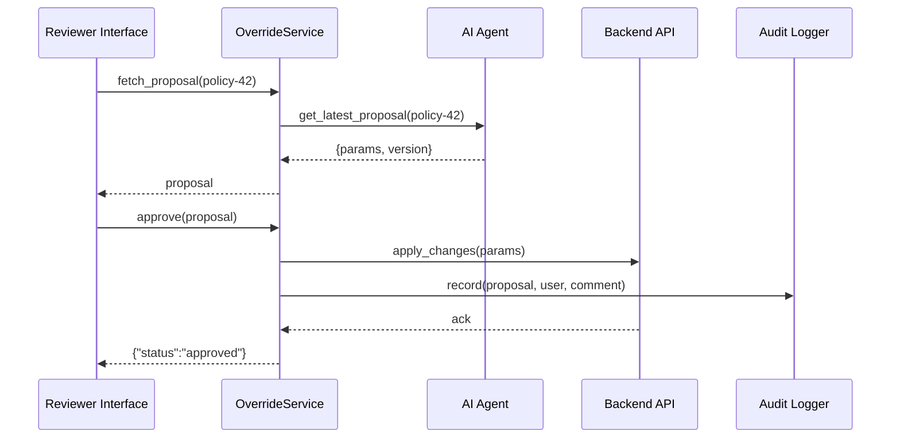

# Chapter 14: Human-in-the-Loop Override

Welcome back! In [Chapter 13: AI Representative Agent](13_ai_representative_agent_.md) we saw how the AI Representative Agent drafts policy and process proposals. Now we’ll introduce **Human-in-the-Loop Override**, an abstraction that makes sure every AI-generated recommendation gets a human sign-off before it’s applied.

---

## 1. Why Human-in-the-Loop Override?

Imagine the Commodity Futures Trading Commission (CFTC) uses an AI agent to propose new fraud-detection thresholds. AI can suggest fast changes, but managers need to:

- **Review** the numbers  
- **Tweak** parameters with local context  
- **Approve** or reject the proposal  

This layer balances AI speed with human accountability. It keeps an audit trail, lets you add comments, and versions every change—just like a congressional committee vetting a bill before it becomes law.

---

## 2. Key Concepts

- **AI Proposal**  
  A package of suggested changes (e.g., new policy thresholds).

- **Review Workspace**  
  A UI or API where decision-makers inspect and modify proposals.

- **Approval Workflow**  
  Tracks proposal states: `pending` → `approved` or `rejected`.

- **Audit Trail & Version Control**  
  Records who changed what, when, and why, so you can always roll back.

- **Comments & Feedback**  
  Attach notes explaining adjustments or rejection reasons.

---

## 3. Using Human-in-the-Loop Override

Below is a minimal example showing how a manager might fetch, adjust, and approve an AI proposal.

```python
from hms_ops.override import OverrideService

override = OverrideService()

# 1. Fetch the latest AI proposal for a policy
proposal = override.fetch_proposal(policy_id="policy-42")
print("Suggested max_amount:", proposal.params["max_amount"])

# 2. Adjust the parameter and add a comment
proposal.params["max_amount"] = 80000
proposal.comment = "Increase based on updated budget forecast"

# 3. Approve the proposal
result = override.approve(proposal)
print("Status:", result.status)  # -> "approved"
```

Explanation:
1. `fetch_proposal` loads the AI’s recommendation.  
2. You change `params` and add a human `comment`.  
3. `approve` applies the change and logs everything.

---

## 4. What Happens Under the Hood



1. **fetch_proposal**: OverrideService gets the AI’s suggestion.  
2. Reviewer **approves** with edits.  
3. OverrideService calls the **Backend API** to apply changes.  
4. It logs the action in the **Audit Logger**.  
5. Reviewer sees the final status.

---

## 5. Internal Implementation

### File: hms_ops/override/service.py

```python
class OverrideService:
    def __init__(self):
        self.ai = AIProposalEngine()
        self.api = PolicyAPIClient()
        self.audit = AuditLogger()

    def fetch_proposal(self, policy_id):
        return self.ai.get_proposal(policy_id)

    def approve(self, proposal):
        # 1. Push changes to backend
        result = self.api.update_policy(proposal.id, proposal.params)
        # 2. Log who approved and why
        self.audit.log(
            action="approve",
            proposal_id=proposal.id,
            user=proposal.approved_by,
            comment=proposal.comment
        )
        return result
```

### File: hms_ops/override/audit.py

```python
class AuditLogger:
    def log(self, action, proposal_id, user, comment):
        # Stub: write to secure audit store with timestamp
        print(f"AUDIT: {action} by {user} on {proposal_id}: {comment}")
```

- **AIProposalEngine** retrieves AI suggestions.  
- **PolicyAPIClient** calls the [Backend API](08_backend_api_.md) to enact changes.  
- **AuditLogger** records every approval with user info and comments.

---

## 6. Analogy & Takeaways

Think of **Human-in-the-Loop Override** like a congressional committee:

- AI drafts a “bill” (proposal).  
- The committee members review, debate, and amend the text.  
- They vote to adopt or reject the bill.  
- All amendments and votes are recorded in the Congressional Record (audit trail).

This ensures speed from AI but accountability from people.

---

## Conclusion

You’ve learned how **Human-in-the-Loop Override** lets managers:

- Review and tweak AI proposals  
- Track approvals with version control  
- Maintain an unbroken audit trail  

Next up, we’ll explore how HMS-OPS measures performance and health in the [Monitoring & Metrics Engine](15_monitoring___metrics_engine_.md).

---

Generated by [AI Codebase Knowledge Builder](https://github.com/The-Pocket/Tutorial-Codebase-Knowledge)