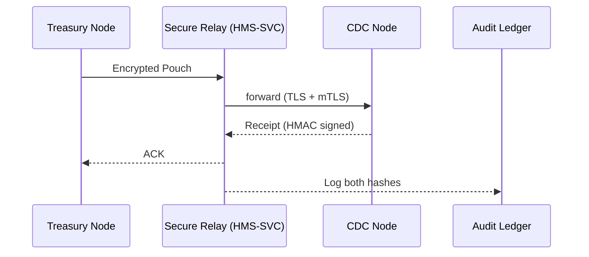

# Chapter 14: Inter-Agency Data Exchange (HMS-A2A)

[← Back to Chapter&nbsp;13: External System Sync Bridge](13_external_system_sync_bridge_.md)

---

## 1 Why Do We Need a “Diplomatic Pouch” for Data?

Picture a **Friday-evening e-mail** in the Treasury inbox:

> “URGENT: We need county-level opioid death numbers to finalize the FY budget table by Monday.”

The numbers live at **CDC**, but the spreadsheet must travel through:

1. Treasury’s firewalls.  
2. CDC’s firewalls.  
3. Three federal encryption and audit rules (FIPS-140-3, M-19-23, OMB-A-130).  

A normal e-mail chain will leak PII, break schemas, and leave no authoritative receipt.

**HMS-A2A** is the answer—think of it as the *State Department’s diplomatic pouch* for digital government:

* **Encrypted** end-to-end.  
* **Schema-standardized** (so “County” means the same in both agencies).  
* **Receipt-tracked** (Treasury can prove CDC received it at 17:03:12 UTC).  
* **Audit-ready** for OIG and GAO.

One push, and the stats arrive intact—no late-night panic calls.

---

## 2 Key Concepts (Beginner Friendly)

| A2A Term | Plain English | Analogy |
|----------|--------------|---------|
| **Pouch** | The encrypted ZIP of data + metadata. | Diplomatic bag with wax seal. |
| **Manifest** | JSON index that lists every file & schema. | Customs declaration form. |
| **Receipt** | Signed proof of delivery. | Courier’s signature log. |
| **Node** | One agency endpoint that can send/receive pouches. | Embassy mailbox. |
| **Schema Registry** | Shared catalog of table layouts. | A bilingual dictionary both embassies use. |

Keep these five words in mind; all of A2A is built on them.

---

## 3 Three-Step “Hello Pouch” Demo (≤ 20 Lines Each)

Goal: Treasury requests opioid stats; CDC replies with a **pouch**; Treasury verifies the **receipt**.

> Requirements: `pip install hms-a2a` and the sandbox token used in earlier chapters.

### 3.1 Treasury Sends a Request

```python
from hms_a2a import Node, Pouch

treasury = Node(token="demo-sandbox-token",
                name="Treasury",
                partner="CDC")

# Build an empty pouch that just asks for data
req = Pouch(
    purpose="REQUEST_OPIOID_STATS_2023",
    files=[],                     # no payload yet
    manifest={"schema": "CDC.OPIOID_REQUEST.V1"}
)

pouch_id = treasury.send(req)
print("Request ID:", pouch_id)
```

* We create a **Node** that knows its partner agency.  
* `.send()` encrypts & ships the pouch; it returns a tracking ID.

---

### 3.2 CDC Receives and Replies

```python
cdc = Node(token="demo-sandbox-token", name="CDC", partner="Treasury")

incoming = cdc.inbox.next()             # blocks until pouch arrives
print(incoming.purpose)                 # → REQUEST_OPIOID_STATS_2023

# Prepare reply
reply = incoming.reply(
    files=["opioid_stats_2023.parquet"],
    manifest={"schema": "CDC.OPIOID_STATS.V2",
              "row_count": 3142}
)

cdc.send(reply)                         # auto-links to original request
```

* `cdc.inbox.next()` dequeues and decrypts the request.  
* `incoming.reply()` keeps the **conversation ID** for traceability.  
* CDC attaches a Parquet file that follows the agreed schema.

---

### 3.3 Treasury Confirms Receipt

```python
receipt = treasury.track(pouch_id)
print(receipt.status)   # → "DELIVERED"
print(receipt.signed_at)  # exact UTC timestamp
```

* `.track()` polls the **Receipt Ledger** (HMS-OPS writes to it automatically).  
* Status turns `DELIVERED` when CDC’s Node signs the receipt.

---

## 4 What Happens Behind the Scenes?



1. **Secure Relay** is just the [Backend Service Gateway](10_backend_service_gateway__hms_svc___hms_api__.md) in *relay* mode.  
2. CDC’s Node signs a **Receipt** (HMAC of pouch hash + timestamp).  
3. Gateway writes both hashes to the **Observability & Operations Center** for immutable audit.

---

## 5 Tiny Code Tour (Core Loop ≤ 18 Lines)

_File: `a2a/core/node.py`_

```python
class Node:
    def __init__(self, token, name, partner):
        self.token, self.name, self.partner = token, name, partner

    # 1) Outbound
    def send(self, pouch):
        pouch.encrypt(for_=self.partner)
        resp = _post("/relay/send", pouch.bytes(), self.token)
        return resp["pouch_id"]

    # 2) Inbound
    def inbox(self):
        return _Inbox(self.token)

class _Inbox:
    def __init__(self, token): self.token = token
    def next(self):
        raw = _get("/relay/pull", self.token)  # waits until pouch ready
        return Pouch.decrypt(raw)
```

Beginner notes:  
• `pouch.encrypt()` uses the partner’s public key (auto-fetched from the **Node Directory**).  
• `_post` & `_get` go through HMS-SVC; no direct Node-to-Node socket.  
• Decryption happens only inside `Pouch.decrypt(raw)`—not in transit.

---

## 6 How A2A Talks to Other HMS Modules

| Module | Interaction |
|--------|-------------|
| Model Context Protocol (MCP) | The *inside* of each pouch can be any MCP message; A2A doesn’t care. |
| Central Data Repository (HMS-DTA) | Large attachments are stored once in DTA; A2A passes only reference hashes. |
| Observability & Operations Center (HMS-OPS) | Stores the **Receipt Ledger** and latency dashboards. |
| Activity Orchestrator (HMS-ACT) | Can launch follow-up tasks when a pouch arrives (e.g., auto-validate CSV). |

---

## 7 Common Troubleshooting

| Symptom | Cause | Quick Fix |
|---------|-------|-----------|
| `ERR_KEY_NOT_FOUND` | Partner has no public key in directory | Run `node.exchange_keys()` once. |
| Receipt stuck at **SENT** | Partner Node offline | Check `cdc.health()` or contact partner’s OPS team. |
| `SCHEMA_MISMATCH` error | File doesn't validate against registry | `schema.validate(file)` before `send()`. |
| Large files time-out | >2 GB attachment | Store in DTA and include `dta://` link in manifest. |

---

## 8 Recap & Next Steps

You just:

1. Learned why cross-agency files need a **diplomatic pouch** approach.  
2. Sent a request from Treasury to CDC, received stats back, and verified the **Receipt**.  
3. Peeked at the 18-line core loop that powers every pouch.  
4. Saw where encryption, schema validation, and audit logs hook into the broader HMS world.

Your data is now crossing federal borders safely and traceably.

Ready to watch those pouches—and every other micro-service—on a real-time dashboard?  
Head to [Chapter 15: Observability & Operations Center (HMS-OPS)](15_observability___operations_center__hms_ops__.md).

---

---

Generated by [AI Codebase Knowledge Builder](https://github.com/The-Pocket/Tutorial-Codebase-Knowledge)