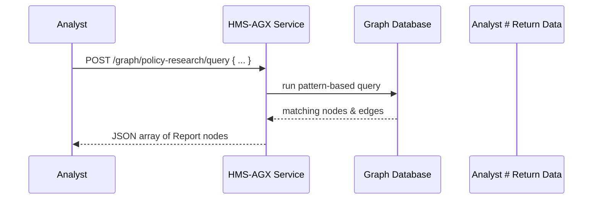

# Chapter 14: Knowledge Graph System (HMS-AGX)

In [Chapter 13: Legislative Engine (HMS-CDF)](13_legislative_engine__hms_cdf__.md) we saw how bills are drafted, voted on, and published. Now we’ll learn how to build a **Knowledge Graph System**—HMS-AGX—that connects all your policy research, statutes, precedents, and reports into a single, queryable graph. Instead of hunting through PDFs, agents can ask the graph for related laws or studies in seconds.

---

## 14.1 Why a Knowledge Graph? A Real-World Analogy

Imagine a law library with thousands of books. To find every reference to “basic income,” you’d flip through indexes and cross-references. A **Knowledge Graph** is like a digital librarian that already knows which pages mention basic income, which statutes cite those pages, and which reports analyze them.  

**Central Use Case**  
A policy analyst drafting a new "Poverty Reduction Act" needs to:
1. Find all statutes mentioning “income threshold.”  
2. Retrieve precedent cases where thresholds were challenged.  
3. See recent academic reports on basic-income pilots.  

With HMS-AGX, an agent runs one graph query instead of dozens of manual searches.

---

## 14.2 Key Concepts

1. **Graph**  
   A named collection of **nodes** (entities) and **edges** (relationships).

2. **Schema**  
   Defines node types (e.g., `Statute`, `Case`, `Report`) and possible relations (e.g., `cites`, `analyzes`).

3. **Ingestion**  
   Process of importing documents into the graph—extracting entities and creating nodes/edges.

4. **Query**  
   A declarative request (e.g., “find all Reports that analyze Statutes citing ‘Section 5’”).

5. **Agents**  
   AI or human actors that call the graph to get insights for drafting or citizen support.

---

## 14.3 Defining and Using HMS-AGX

Here’s a minimal example of setting up a graph called `policy-research`:

```js
// 1. Import the KnowledgeGraph class
import { KnowledgeGraph } from 'hms-cdf/graph/knowledgeGraph'

// 2. Configure the graph schema
const policyGraph = new KnowledgeGraph({
  id: 'policy-research',
  nodeTypes: ['Statute','Case','Report'],
  edgeTypes: ['cites','analyzes']
})

// 3. Initialize: register schema and endpoints
policyGraph.initialize()

// 4. Ingest documents (Statutes, Cases, Reports)
await policyGraph.ingest([
  { type: 'Statute', id: 'sec5', text: '...' },
  { type: 'Report', id: 'bk1', text: '...' }
])
```
Explanation:  
- We import and instantiate `KnowledgeGraph` with `nodeTypes` and `edgeTypes`.  
- `initialize()` sets up storage and REST routes.  
- `ingest()` parses text, creates nodes and edges under the hood.

Once the data is in, agents can query:

```js
// Example: find Reports analyzing Statutes cited by sec5
const results = await policyGraph.query({
  startNode: 'Statute:sec5',
  path: ['cites','analyzes'],
  returnType: 'Report'
})
// → Array of matching Report nodes with metadata
```
Explanation:  
- We start from `Statute:sec5`, follow `cites` then `analyzes`, and return `Report` nodes.

---

## 14.4 Runtime Flow

Below is a simple sequence when an agent requests related reports:



1. **Analyst** sends a query to HMS-AGX.  
2. **Graph Service** translates it into DB operations.  
3. **GraphDB** returns matching subgraphs.  
4. Results are forwarded as JSON.

---

## 14.5 Under the Hood

### 14.5.1 KnowledgeGraph Implementation (`graph/knowledgeGraph.ts`)

```ts
export class KnowledgeGraph {
  constructor(private cfg: GraphConfig) {}

  initialize() {
    // 1) Save schema in config store
    Database.save('graphs', this.cfg)
    // 2) Register HTTP endpoints
    ApiRouter.post(
      `/graph/${this.cfg.id}/ingest`,
      (req, res) => this.handleIngest(req.body, res)
    )
    ApiRouter.post(
      `/graph/${this.cfg.id}/query`,
      (req, res) => this.handleQuery(req.body, res)
    )
  }

  async handleIngest(records, res) {
    // parse and write nodes/edges
    await GraphDB.bulkIngest(this.cfg.id, records)
    res.send({ status: 'ok' })
  }

  async handleQuery(q, res) {
    const data = await GraphDB.runQuery(this.cfg.id, q)
    res.send(data)
  }
}
```

Explanation:  
- **initialize()** stores your schema and exposes `/ingest` and `/query` routes.  
- **handleIngest()** calls a `GraphDB` utility to extract entities and relations.  
- **handleQuery()** delegates complex pattern matching to `GraphDB`.

### 14.5.2 GraphDB Module (`graph/graphDB.ts`)

```ts
export const GraphDB = {
  async bulkIngest(graphId, records) {
    // For each record: create node; extract edges via simple NLP
  },
  async runQuery(graphId, { startNode, path, returnType }) {
    // Translate to Cypher or Gremlin and execute
    return db.execute(/* ... */)
  }
}
```

Explanation:  
- A thin wrapper that hides database-specific calls (Neo4j, JanusGraph, etc.).  
- You can swap implementations without changing the service code.

---

## 14.6 Recap & Next Steps

In this chapter you learned how **HMS-AGX**:

- Defines a **Knowledge Graph** with `nodeTypes` and `edgeTypes`.  
- Ingests documents into a graph store via `/ingest`.  
- Answers complex relationship queries via `/query`.  
- Powers agents drafting legislation or helping citizens by surfacing connected data.

Next we’ll look at storing and exposing system-wide documentation and metadata in [Chapter 15: System-Level Info Repository (HMS-NFO)](15_system_level_info_repository__hms_nfo__.md).

---

Generated by [AI Codebase Knowledge Builder](https://github.com/The-Pocket/Tutorial-Codebase-Knowledge)