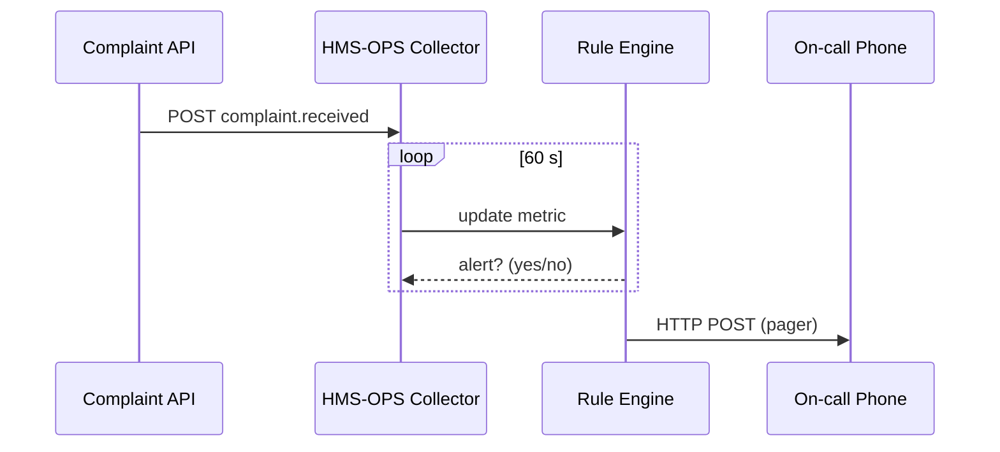

# Chapter 14: Metrics & Monitoring (HMS-OPS / HMS-ACT telemetry) 📈❤️‍🩹  

➡️ *Arriving from* [Inter-Agency Communication Bus (HMS-A2A)](13_inter_agency_communication_bus__hms_a2a__.md)

---

## 0. Why Do We Need a “Heart-Monitor” for Government Software?

Think of **HMS-GOV** as a vast digital hospital:  
• **Policies** are the patients,  
• **Agents & Workflows** are the nurses,  
• **Citizens** are the family waiting in the lobby.

When a rule update spikes *case-processing time* or an AI agent suddenly returns 40 % errors, we need to know **immediately**, not next quarter’s audit.

HMS-OPS is the **ICU monitor** that constantly measures:

| Vital Sign                | Real-world meaning                          |
|---------------------------|---------------------------------------------|
| Throughput                | “How many claims processed per minute?”     |
| Error Rate                | “How many workflows failed?”                |
| Stakeholder Satisfaction  | “What do citizens or clerks think?”         |

One glance at the dashboard = instant pulse check.

---

## 1. Key Concepts (Plain English)

| Term              | Beginner explanation |
|-------------------|----------------------|
| Metric            | A number that changes over time (`errorRate = 0.02`). |
| Telemetry Event   | One data point sent from code (“Workflow X failed”). |
| Dashboard Widget  | Little graph, gauge, or list on the screen. |
| Alert Rule        | “If errorRate > 5 % for 3 min, page on-call.” |
| Sink              | Where raw data is stored (`/var/metrics.db` or Prometheus). |

*(If you can read a Fitbit, you can read HMS-OPS metrics.)*

---

## 2. Walk-Through: Detecting a Sudden Spike in Citizen Complaints

Scenario:  
The **Bureau of Justice Statistics (BJS)** just published a new *Crime Reporting* form. Right after deploy, citizen complaints jump from **3/day → 50/day**.

Goal: raise an alert within 60 seconds.

### 2.1  Emit Telemetry from the API (Node, 8 lines)

```js
// File: api/routes/complaint.js
import { emit } from '../ops.js'

router.post('/complaints', async (req,res)=>{
  saveComplaint(req.body)          // ✂️ DB logic skipped
  emit('complaint.received')       // 1️⃣ tiny ping
  res.status(201).end()
})
```

Explanation:  
`emit()` is only one line; call it anywhere you want to count things.

### 2.2  ops.js – Tiny Client (10 lines)

```js
// File: ops.js
import fetch from 'node-fetch'
export function emit(name, fields={}){
  fetch('http://ops:7070/ingest', {
    method:'POST',
    body: JSON.stringify({ name, ts: Date.now(), ...fields }),
    headers:{'Content-Type':'application/json'}
  }).catch(()=>{})  // we never crash the real service
}
```

Sends a JSON packet to HMS-OPS. **Never** throws if the ops server is down.

### 2.3  Counting Events (Go, 14 lines)

```go
// File: ops/collector.go
var counter = map[string]int64{}

func ingest(w http.ResponseWriter, r *http.Request){
    var e struct{ Name string }
    json.NewDecoder(r.Body).Decode(&e)
    counter[e.Name]++
}
```

Every POST bumps an in-memory counter. A real deployment would push to **Prometheus**, but this demo keeps things readable.

### 2.4  Auto-Alert Rule (YAML, 9 lines)

```yaml
# File: ops/rules/complaints.yaml
metric: complaint.received
window: 1m           # look at last 1 minute
threshold: 30        # >30 events triggers
action: pager        # call on-call number
```

HMS-OPS scans rules every 10 sec. When the metric breaches, it calls `/api/alert/pager`.

### 2.5  Pager Webhook (Node, 6 lines)

```js
// File: ops/actions/pager.js
export default function(msg){
  console.log('📞 Dialing on-call…', msg)
  // integrate with Twilio / Gov internal system here
}
```

If the spike persists, the on-call engineer’s phone rings.

---

## 3. What Happens Behind the Curtain?



*Five moving parts, all <20 lines of code in this demo.*

---

## 4. Adding a Dashboard Widget (Vue, 15 lines)

```vue
<!-- components/ComplaintsGauge.vue -->
<template>
  <div>Complaints Today: {{ count }}</div>
</template>

<script setup>
import { ref, onMounted } from 'vue'
const count = ref(0)
onMounted(async ()=>{
  const r = await fetch('/ops/api/metric?name=complaint.received&range=today')
  count.value = (await r.json()).value
})
</script>
```

Drop `<ComplaintsGauge/>` onto the [Policy Management Dashboard](01_policy_management_dashboard_.md). No back-end edits.

---

## 5. How to Instrument Your Own Service (Checklist)

1. `npm i @hms/ops-client`  
2. Add `emit('your.metric')` near the interesting line of code.  
3. Create a YAML rule under `ops/rules`.  
4. (Optional) Add a widget to show the metric.  
5. Push code → metric becomes visible within seconds.

---

## 6. Relationship to Other HMS-GOV Layers

* **HMS-ACT** automatically emits `workflow.success`, `workflow.error`, and `step.duration`—no extra code.  
* **Security Layer** (Chapter 9) logs `auth.denied` vs `auth.ok` so you can spot brute-force attacks.  
* **HITL** pushes `hitl.pending` and `hitl.latency` (avg review time).  
* **A2A Bus** streams `a2a.success` / `a2a.fail`, helping trace lost “diplomatic pouches”.  
* **Central Data Repository** (next chapter) stores rolled-up metrics for long-term policy research.

---

## 7. Quick FAQ

**Q:** *Does emitting telemetry slow down my API?*  
A: The client is non-blocking and fire-and-forget. Worst case: the metric is dropped, your API keeps serving citizens.

**Q:** *Can I use Grafana instead of the built-in dashboard?*  
A: Yes—HMS-OPS exposes Prometheus-compatible `/metrics` so you can plug in Grafana or any tool.

**Q:** *What about PII?*  
A: By default the client only sends **metric names & counts**. If you need richer fields, run them through the **PII scrubber** helper first.

---

## 8. Summary & Next Steps

You now know how HMS-OPS turns raw events into live graphs and 3 a.m. phone calls:

1. Tiny `emit()` pings from any service.  
2. Collector counts and stores data.  
3. Rule engine triggers alerts.  
4. Dashboard shows trend lines for non-tech stakeholders.

Next we’ll learn where **all those millions of events** live once they roll off today’s screen: the federated yet query-friendly  
[Central Data Repository (HMS-DTA)](15_central_data_repository__hms_dta__.md).

---

Generated by [AI Codebase Knowledge Builder](https://github.com/The-Pocket/Tutorial-Codebase-Knowledge)