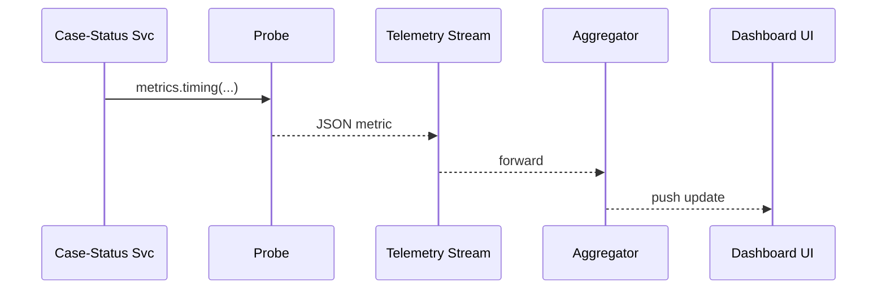

# Chapter 14: Metrics & Monitoring Telemetry
[← Back to Chapter 13: Auditing & Traceability Ledger](13_auditing___traceability_ledger_.md)

---

## 1. Why Bother Measuring in the First Place?

The U.S. Court of Federal Claims just launched an online “Case Status” portal.  
Within days citizens complain:

> “The website feels slow after lunch!”

Feelings aren’t evidence.  
To fix (or defend) the site, we need **numbers**:

* How many requests per second at noon?  
* Which API is the bottleneck?  
* Did yesterday’s deployment double the AWS bill?

Real-time **Telemetry** answers those questions—exactly the way **FEMA** watches river-level gauges during a hurricane.

---

## 2. Key Concepts (Plain-English Cheat-Sheet)

| Term               | Friendly Analogy                                   |
|--------------------|----------------------------------------------------|
| Probe              | A Fitbit strapped to a micro-service               |
| Metric             | One vital sign (e.g., heart-rate = 88 bpm)         |
| Telemetry Stream   | An ambulance radio sending vitals to the hospital  |
| Aggregator         | The ER nurse writing vitals on the whiteboard      |
| Dashboard          | The big monitor above every patient bed            |
| Alert              | The beeping monitor when vitals cross a threshold  |
| AI Watcher         | A resident doctor (see [HMS-A2A](11_ai_representative_agent__hms_a2a__.md)) who reads the same vitals |

---

## 3. Five-Minute Quick-Start

### 3.1 Add a Probe to Your Service

```bash
npm i @hms/metrics      # 1) add SDK
```

```js
// file: server.js  (≤15 lines)
import { metrics } from "@hms/metrics";
metrics.init({ service: "case-status-svc" });     // 2) start probe

app.get("/status/:id", async (req, res) => {
  const start = Date.now();

  const data = await db.fetch(req.params.id);     // business work
  res.json(data);

  metrics.timing("db.latency", Date.now() - start); // 3) emit metric
});
```

Beginner notes  
1. `metrics.init` auto-captures CPU, RAM, and request counts.  
2. `timing` sends a custom latency metric—no extra infrastructure code.  

### 3.2 Fire Up a Local Dashboard

```bash
hms-telemetry dev-dashboard
```

Opens `http://localhost:4000` → live charts appear within seconds 🎉.

---

## 4. Creating an Alert in One Line

```bash
hms-telemetry alert create \
   --metric "case-status-svc.db.latency_p95" \
   --above 500ms \
   --notify "teams://court-it-ops"
```

Result: IT Ops gets a Teams ping if the 95ᵗʰ-percentile DB latency exceeds 500 ms.

---

## 5. Feeding Data to the AI Watcher

No code needed—the **AI Representative Agent** from  
[Chapter 11](11_ai_representative_agent__hms_a2a__.md) subscribes automatically.

* You add probes →  
* Telemetry Stream broadcasts numbers →  
* AI Watcher spots patterns & drafts optimizations.

---

## 6. What Happens Under the Hood?

### 6.1 Step-by-Step Flow



1. **Probe** packs each metric into a tiny JSON payload.  
2. **Stream** (NATS) moves ~50 000 msgs/sec without back-pressure.  
3. **Aggregator** rolls 1-second buckets and stores hourly summaries in ClickHouse.  
4. **Dashboard UI** & **AI Watcher** read the same feed.

### 6.2 Peek at the Probe Code (Go ≤ 18 lines)

```go
// file: probe/probe.go
func Timing(name string, ms int64) {
    m := Metric{Name: name, Value: float64(ms), Ts: time.Now().Unix()}
    buf, _ := json.Marshal(m)
    conn.Publish("telemetry", buf)   // fire-and-forget
}
```

Simple: build JSON → publish to topic `"telemetry"`.

---

## 7. Common Pitfalls & Quick Fixes

| Symptom                           | Likely Cause           | Quick Fix |
|-----------------------------------|------------------------|-----------|
| Dashboard empty                   | Probe not initialized  | Call `metrics.init` early in `main`   |
| Burst of “dropped metric” logs    | Network hiccup         | Probe queues 10 k msgs; increase with `bufferSize` |
| Alert fires too often (noise)     | Threshold too tight    | Use percentile metric (`p95` not `avg`) or add `for=2m` hold |

---

## 8. FAQ

**Q: Does telemetry data go to the public cloud?**  
Only if your [Security & Compliance Envelope](06_security___compliance_envelope_.md) policy allows.  
Default is in-house ClickHouse cluster with at-rest AES-256 encryption.

**Q: How much overhead does the probe add?**  
≈ 1 µs per metric; probes batch send every second to keep traffic minimal.

**Q: Can I tag metrics by federal program?**  
Yes—pass `tags: { program: "VETS-TRAINING" }` in `metrics.init`.

---

## 9. Recap

You now know how to:

1. Strap a **probe** onto any micro-service in two lines.  
2. See live charts & set alerts with one CLI.  
3. Feed the exact same numbers to both humans (dashboards) **and** the AI Watcher for auto-optimizations.

Numbers beat anecdotes—telemetry turns “it feels slow” into “p95 latency jumped from 120 ms → 680 ms after build #412”.

Next we’ll package all this goodness into an automated release train in  
[Chapter 15: Deployment & Versioning Pipeline](15_deployment___versioning_pipeline_.md).

---

Generated by [AI Codebase Knowledge Builder](https://github.com/The-Pocket/Tutorial-Codebase-Knowledge)