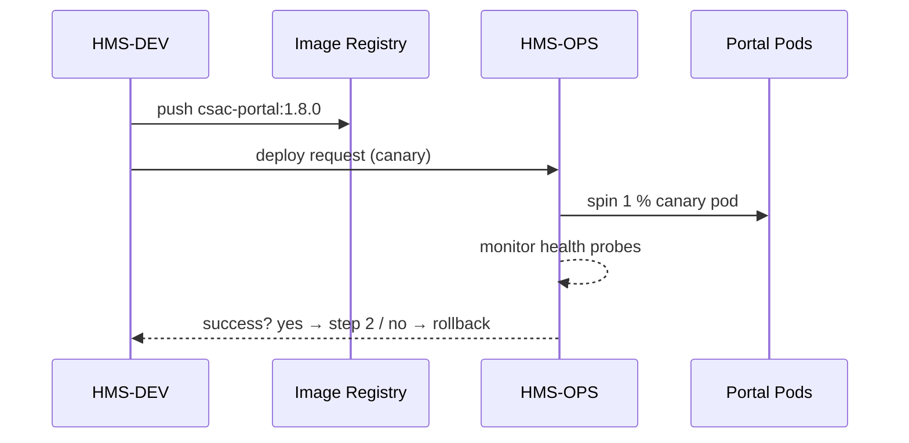

# Chapter 14: Monitoring, Operations & DevSecOps (HMS-OPS / HMS-DEV)

[← Back to Chapter 13: Marketplace & Discovery Platform (HMS-MKT)](13_marketplace___discovery_platform__hms_mkt__.md)

---

## 1. Why Do We Need an “FAA Control Tower” for Code?

Picture the **Citizens’ Stamp Advisory Committee (CSAC)** running an online portal where citizens submit commemorative-stamp ideas.  
A new rule arrives:

*“The portal must stay **99.9 %** available and roll back in 30 seconds if a deployment breaks authentication.”*

Without a **control tower** the scene quickly turns into chaos:

1. A Friday-night code push breaks log-in.  
2. Thousands of stamp proposals vanish from dashboards.  
3. Angry calls hit the help-desk before anyone notices the outage.  

**HMS-OPS / HMS-DEV** are the tower crew that keep planes (services) flying:

* **HMS-DEV** – builds, tests, and deploys every release with security gates.  
* **HMS-OPS** – watches servers, alerts humans, and auto-rolls back if the runway cracks.

---

## 2. Key Concepts (Sticker-Note Simple)

| Concept | Air-Traffic Analogy | Beginner Definition |
|---------|---------------------|---------------------|
| Canary Release | Test plane | Deploy to 1 % of users first. |
| Health Probe | Transponder ping | Small HTTP/GRPC check every few seconds. |
| Rollback | Emergency runway | Auto-return to the last good image. |
| Telemetry | Radar blip | Real-time metrics + logs + traces. |
| Runbook | Pilot checklist | Markdown page: “If X alert, do Y.” |

Remember these five stickers—nothing else is magic.

---

## 3. 90-Second Tour: Safe Deployment of the CSAC Portal

### 3.1 Developer Pushes Code

```bash
git push origin main
```

1. HMS-DEV runs unit & security scans.  
2. Builds Docker image `csac-portal:1.8.0`.

### 3.2 Canary Roll-Out (code <20 lines)

```yaml
# file: dev/cd/canary.yaml
service: csac-portal
image: csac-portal:1.8.0
strategy:
  type: canary
  steps:
    - weight: 1      # 1 % traffic, 5 min
    - weight: 25     # 25 % traffic, 5 min
    - weight: 100    # full if healthy
healthChecks:
  - path: /api/v1/health
    threshold: 3 fails/60 s
```

**Explanation**

* Canary steps gradually raise traffic.  
* If `/health` fails ≥ 3 times in 60 s, HMS-OPS halts the upgrade.

### 3.3 Auto-Rollback Example

```yaml
# file: ops/policies/rollback.yaml
detect:
  metric: auth_fail_rate
  when:  > 5 % for 2 min
action: rollback
notify: oncall@csac.gov
```

If the new auth code explodes, HMS-OPS:

1. Scales traffic back to `csac-portal:1.7.3`.  
2. Fires PagerDuty + email.

---

## 4. What Happens Behind the Curtain?



Only **four participants** keep the flow beginner-friendly.

---

## 5. Peeking at the Engine Room

### 5.1 Health Probe Handler (Go, 15 lines)

```go
// file: portal/cmd/health.go
package main
import "net/http"

func main() {
  http.HandleFunc("/api/v1/health", func(w http.ResponseWriter, r *http.Request) {
     if db.Ping() == nil && cache.OK() {
         w.Write([]byte("ok"))
     } else {
         http.Error(w, "unhealthy", 500)
     }
  })
  http.ListenAndServe(":8080", nil)
}
```

HMS-OPS just curls this endpoint.

### 5.2 Tiny Metrics Exporter (Python, 18 lines)

```python
# file: portal/metrics.py
from prometheus_client import Counter, start_http_server

auth_fail = Counter("auth_fail_total", "Failed log-ins")
def record_login(ok: bool):
    if not ok:
        auth_fail.inc()

if __name__ == "__main__":
    start_http_server(9100)   # /metrics
```

Telegraph, Prometheus, or CloudWatch scrapes `/metrics`; alerts fire from there.

### 5.3 Rollback Controller Loop (12 lines)

```python
# file: ops/controllers/rollback.py
def watch():
    while True:
        bad = metrics.rate("auth_fail_total", 120) > 0.05
        if bad and deploy.is_canary("csac-portal"):
            deploy.rollback("csac-portal")
            notify("Rollback done")
        sleep(30)
```

Runs as a sidecar; nothing fancy.

---

## 6. Linking to Earlier HMS Layers

| Layer | Why It Cares | Example |
|-------|-------------|---------|
| [HMS-OMS / HMS-ACT](07_workflow_orchestration___task_queues__hms_oms___hms_act__.md) | SLA alerts pipe into the same Ops dashboard | `task_overdue` events become red bars. |
| [HMS-MKT](13_marketplace___discovery_platform__hms_mkt__.md) | Each marketplace asset auto-registers its probes | Ops shows a tile per asset. |
| [HMS-ACH](11_financial_transaction___clearinghouse__hms_ach__.md) | Ledger audit alerts surface next to infra alerts | Compliance and uptime share one pager. |

Everything still obeys the 3-floor rule from [Chapter 1](01_multi_layered_system_architecture_.md):  
OPS/DEV live on the **basement + middle floors**; dashboards appear on the **top floor**.

---

## 7. Hands-On Lab (2 Minutes)

```bash
git clone hms-utl
cd hms-utl/demo
docker compose up ops dev portal

# 1. Push a bad build (fails health probe)
./scripts/push_bad_build.sh

# 2. Watch logs
docker logs ops | grep rollback
# → "Rollback to csac-portal:1.7.3 completed"
```

Open `http://localhost:3000` (Grafana) → you’ll see red → green transition.

---

## 8. Runbooks: “If X, Do Y”

```md
# runbooks/csac/LOGIN-DOWN.md
Symptom: Alert auth_fail_rate > 5 %
Steps:
1. Confirm rollback succeeded (`kubectl get deploy csac-portal`)
2. Merge hot-fix into branch `patch/login`
3. Run `gitlab pipeline patch/login`
4. Watch canary again
```

Runbooks live in the repo so on-call staff have a single source of truth.

---

## 9. Recap & What’s Next

You now know:

✔ Why **HMS-DEV** (build → deploy) and **HMS-OPS** (observe → heal) act like an FAA control tower.  
✔ Five core concepts: Canary Release, Health Probe, Rollback, Telemetry, Runbook.  
✔ How a CSAC portal can auto-rollback in under 30 seconds with <20 lines of YAML.  
✔ Tiny internals: probe endpoint, Prometheus counter, rollback loop.  
✔ How Ops dashboards unify alerts from workflows, payments, and marketplace assets.

Ready to **practice** all this in a safe playground before touching production?  
Jump into [Chapter 15: Training & Simulation Sandbox (HMS-ESR / HMS-EDU)](15_training___simulation_sandbox__hms_esr___hms_edu__.md).

---

---

Generated by [AI Codebase Knowledge Builder](https://github.com/The-Pocket/Tutorial-Codebase-Knowledge)