# Chapter 14: Multi-Layered Microservices Architecture

[↠Back to Chapter 13: External System Synchronization](13_external_system_synchronization_.md)

---

## 0. Why Another “Architecture”?
It’s midnight on **April 15** (tax-day).  
•  2.1 million citizens are filing returns in **HMS-MFE**.  
•  An AI agent is bulk-updating deduction rules.  
•  Fifty state revenue systems – some running COBOL – are pulling data every few minutes.

If everything lived in **one** mega-service, a single slow query could freeze the whole nation’s refund flow.  
Instead, HMS is laid out like a **multi-story city**:

```
 ┌───────────────┐  Citizens & staff (edge)
 │  API Gateway  │  — “City gates”
 └───────────────┘
 ┌───────────────┐  Domain micro-blocks
 │  Tax Service  │  │  Benefits Service  │ ...
 └───────────────┘
 ┌───────────────┐  Cross-cutting utilities
 │ Auth • Ledger │  — “Public works”
 └───────────────┘
 ┌───────────────┐  Infra
 │  Databases    │  Queues • Object-Store │
 └───────────────┘
```

You can rebuild one floor without closing the whole city.

---

## 1. Four Key Layers (Plain-English Cheatsheet)

| Layer | Think of it like… | Typical Services | Why It Exists |
|-------|------------------|------------------|---------------|
| 1. Edge | Toll booths on every highway | API Gateway, BFFs | Single URL, rate-limits, versioning |
| 2. Domain | Specialized buildings | `/tax`, `/grants`, `/permits` | Encapsulate business logic |
| 3. Shared | City utilities | Auth, RBAC, Metrics, ACH | Re-usable by *all* domains |
| 4. Infra | Power & roads | Postgres, Kafka, Redis | State & plumbing, managed by ops |

Keep these four in your back-pocket—90 % of HMS diagrams reduce to them.

---

## 2. Use Case Walk-Through  
“Ella” submits her **Child Tax Credit** in the mobile app.

### 2.1 Tiny Front-End Call (Edge Layer)
```js
// MFE – 7 lines
fetch('/v1/tax/credits', {
  method: 'POST',
  headers: { 'Authorization': token },
  body: JSON.stringify({ ssn: '123…', year: 2024 })
})
.then(r => r.json())
.then(console.log);            // { claimId: 'c_89', status:'PENDING' }
```
Edge duties: HTTPS terminate, JWT validate, forward to the **Tax Service**.

### 2.2 Tax Service (Domain Layer)
```ts
// svc/tax/credits.ts  (≤15 lines)
import { ach } from '../shared/ach.js';
import { rules } from '../shared/policy.js';

export async function claim(req, res) {
  const ok = await rules.check('tax_credit', req.body);
  if (!ok) return res.status(403).send('Not eligible');

  const id = await db('credits').insert(req.body).returning('id');
  await ach.reserve(id, 2000_00);    // schedule future payment
  res.status(201).json({ claimId: id, status: 'PENDING' });
}
```
Domain service focuses *only* on tax rules—no auth code, no SFTP code.

### 2.3 Shared Utility Calls ACH (Shared Layer)  
Code lives in [Chapter 12: Financial Transaction Hub (HMS-ACH)](12_financial_transaction_hub__hms_ach__.md).

---

## 3. What Actually Happens? (5-Step Diagram)

```mermaid
sequenceDiagram
    participant MFE as 📱 MFE
    participant EDGE as 🚏 API Gateway
    participant TAX as 🏢 Tax Service
    participant ACH as 💸 HMS-ACH
    participant DB as 🗄️ Postgres

    MFE->>EDGE: POST /v1/tax/credits
    EDGE->>TAX: /credits (JWT ok)
    TAX->>DB: INSERT credit
    TAX->>ACH: reserve $2 000
    ACH-->>TAX: "QUEUED"
    TAX-->>MFE: 201 PENDING
```



Each hop stays within its own layer; congestion in **ACH** never blocks the gateway.

---

## 4. Why Beginners ❤️ Layers

1. One mental box at a time (Edge vs. Domain).  
2. Safer deploys – patch Auth utility, no need to retest Tax code.  
3. Clear on-call ownership – Ops handles Infra, Program teams own Domain.

---

## 5. Building Your First Multi-Layer Service

### 5.1 Scaffold Folders
```
tax-service/
 ├─ edge/          # optional BFF
 ├─ src/
 │   └─ claim.ts   # business logic
 └─ shared/        # imported utilities
```

### 5.2 Edge Router (≤12 lines)
```ts
// edge/router.ts
import express from 'express';
import { claim } from '../src/claim';
import { auth } from '@hms/shared-auth';

const r = express.Router();
r.use(auth.jwt());
r.post('/tax/credits', claim);
export default r;
```

### 5.3 Dockerfile Per Layer (trimmed)
```
# Edge
FROM node:18-alpine
COPY edge/ .
CMD ["node","router.js"]

# Domain
FROM node:18-alpine
COPY src/ .
CMD ["node","claim.js"]
```

Deploy each image separately; roll back one without touching the other.

---

## 6. How Layers Communicate Safely

| From → To | Protocol | Guard-Rails |
|-----------|----------|-------------|
| Edge → Domain | HTTP/2 mTLS | JWT, rate-limit |
| Domain → Shared | Local library call *or* gRPC | Static typing |
| Shared → Infra | Native driver (psql, redis) | Connection pool, retries |

These contracts live in **OpenAPI** specs stored under `/contracts/`; CI fails if a Domain service breaks the spec.

---

## 7. Ties to Earlier Chapters

* Edge JWT validation imports the RBAC helper from  
  [Role-Based Access Control & Accountability Ledger](09_role_based_access_control___accountability_ledger_.md).  
* Domain logic reuses policy checks from  
  [Policy & Process Management API](08_policy___process_management_api_.md).  
* Shared utilities emit metrics captured by  
  [Real-Time Metrics & Monitoring](10_real_time_metrics___monitoring_.md).  
* Cross-domain calls (e.g., Tax → DMV) go through the connectors you built in  
  [External System Synchronization](13_external_system_synchronization_.md).

---

## 8. Folder Blueprint of the Whole City

```
hms/
 ├─ edge-gateway/         # Layer 1
 ├─ services/
 │   ├─ tax/              # Layer 2
 │   ├─ grants/
 │   └─ permits/
 ├─ shared/               # Layer 3
 │   ├─ auth/
 │   ├─ ach/
 │   └─ policy/
 └─ infra/                # Layer 4
     ├─ postgres/
     ├─ redis/
     └─ kubernetes/
```

One glance tells ops **where** to look when something breaks.

---

## 9. Mini-FAQ

**Q:** Do I *have* to split every project into four deploys?  
A: Start monolithic; split only when traffic or org charts demand it.

**Q:** How do services discover each other?  
A: Each registers its URL in the **Service Catalog** inside Layer 3; Edge and Domain services resolve names via DNS.

**Q:** What about transactions across multiple Domain services?  
A: Use the **Saga pattern** – orchestrated by a Shared utility; compensating actions log to the ledger.

---

## 10. Recap & Next Steps
In this chapter you:

1. Met the four-layer “city” that keeps HMS resilient.  
2. Followed Ella’s tax credit through Edge → Domain → Shared → Infra.  
3. Built a toy Tax service in <20 lines per file.  
4. Saw how layers isolate failures and clarify ownership.

Next we’ll zoom even further down to the streets & sewers—the **servers, queues, and Kubernetes clusters** that power everything:  
[Chapter&nbsp;15: Core Infrastructure (HMS-SYS)](15_core_infrastructure__hms_sys__.md)

---

---

Generated by [AI Codebase Knowledge Builder](https://github.com/The-Pocket/Tutorial-Codebase-Knowledge)