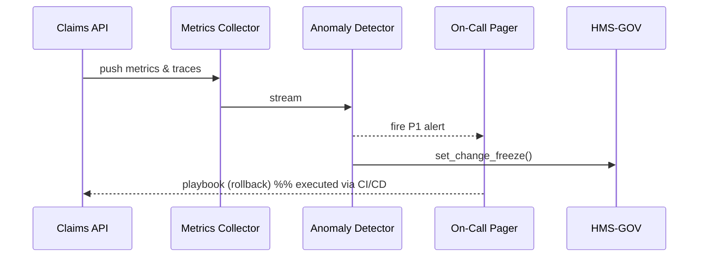

# Chapter 14: Observability & Continuous Monitoring  
*(File: 14_observability___continuous_monitoring_.md)*  

[← Back to Data Lake & Analytics Hub](13_data_lake___analytics_hub_.md)

---

## 1. Why Bother Watching the System 24 × 7? — A 60-Second Story  

The **Passport Renewal Portal** at the U.S. Department of State just opened at 9:00 a.m.  

09:03 – 500 veterans press “Submit.”  
09:04 – The server starts throwing **500 Internal Server Errors**.  
09:05 – Twitter erupts.  
09:06 – Congress member staffers begin calling.  

Without **dashboards, traces, and alerts** the team would first learn about the incident on the evening news.  
With **Observability & Continuous Monitoring (OCM)** the story instead goes like this:

1. A spike in 500s triggers an **anomaly alert**.  
2. An **automated playbook** rolls back the last deploy and freezes further changes.  
3. Engineers see a single **trace ID** pointing to a mis-configured DB pool.  
4. Users see the portal healthy again by 09:15.

---

## 2. Key Concepts (Plain English)  

| Term | What it really means | Friendly analogy |
|------|----------------------|------------------|
| Metric | Numeric time-series (`errors=42`) | Thermometer reading |
| Log | Text record of an event | Page in a ship’s logbook |
| Trace | End-to-end timeline of one request | USPS tracking slip |
| Dashboard | Live graph of metrics | Air-traffic radar screen |
| SLO / SLI | “Promise” & “actual” (e.g., 99.9 % uptime) | Delivery guarantee / delivery rate |
| Alert | Machine-sent notification when SLO is breached | Smoke alarm |
| Playbook | Pre-written steps to fix an alert | Fire-drill sheet behind glass |
| Change Freeze Flag | Global toggle that blocks new deploys | “Do Not Enter” ribbon |
| Anomaly Detector | Code that spots unusual spikes | TSA behavior-detection officer |

---

## 3. Quick-Start — Add Observability in 3 Steps  

We’ll instrument the **Claims API** (from [Backend API Gateway](09_backend_api_gateway__hms_api__.md)).

### Step 1 — Emit Metrics & Traces (≤15 lines)

```python
# file: claims_api.py  (snippet)
from prometheus_client import Counter, start_http_server
from opentelemetry import trace, baggage

REQS  = Counter("claims_requests_total", "Total claim requests")
ERROR = Counter("claims_errors_total",  "Total errors")

start_http_server(8001)          # metrics endpoint

def submit_claim():
    span = trace.get_tracer(__name__).start_span("submit_claim")
    try:
        REQS.inc()
        ...business_logic...
        return "OK"
    except Exception as e:
        ERROR.inc()
        span.record_exception(e)
        raise
    finally:
        span.end()
```

What happened?  
• Every call bumps `REQS`; failures bump `ERROR`.  
• A **trace** follows the request across services using W3C headers.

### Step 2 — Create a Dashboard & Alert (YAML, 8 lines)

```yaml
# file: alerts/claims_error_rate.yml
dashboard: "Claims-API"
metric:    "rate(claims_errors_total[5m]) / rate(claims_requests_total[5m])"
threshold: 0.05          # 5 % error rate
for:       "3m"
alert:     "P1_Claims_Errors"
playbook:  "rollback_and_freeze.sh"
```

Meaning: if >5 % of requests fail for 3 minutes, fire **P1** alert and run the playbook.

### Step 3 — Write the Playbook (bash, 12 lines)

```bash
#!/usr/bin/env bash
# file: playbooks/rollback_and_freeze.sh
set -e
echo "🔄 Rolling back last deploy..."
kubectl rollout undo deploy/claims-api

echo "🚫 Freezing new changes..."
echo "FREEZE" > /tmp/change_freeze.flag   # read by CI/CD

echo "✅ Done — ops on call, please investigate."
```

Now one misbehaving release can’t snowball into morning-news chaos.

---

## 4. What Happens Behind the Curtain?  



1. **API** pushes numbers every 10 s.  
2. **Detector** compares against SLO; if breached, sends a page **and** flips a **change-freeze** flag via Governance.  
3. CI/CD (next chapter) reads that flag and blocks deploys until cleared.

---

## 5. Mini Internal Modules (≤20 Lines Each)  

### 5.1 Metrics Collector (`collector.py`)

```python
from prometheus_client import start_http_server, Summary
import time, requests

PULL_TARGETS = ["http://claims-api:8001/metrics"]
REQ_TIME = Summary("collector_scrape_seconds", "Scrape time")

start_http_server(9090)      # Prometheus style

while True:
    with REQ_TIME.time():
        for t in PULL_TARGETS:
            requests.get(t, timeout=1)
    time.sleep(10)
```

Scrapes `/metrics` from each service and exposes its own endpoint that Grafana or Prometheus can read.

### 5.2 Simple Anomaly Detector (`detector.py`)

```python
import prometheus_api_client as pc, subprocess, time
api = pc.PrometheusConnect(url="http://collector:9090")

RULE = 'rate(claims_errors_total[5m]) / rate(claims_requests_total[5m])'

def loop():
    while True:
        val = float(api.custom_query(RULE)[0]['value'][1])
        if val > 0.05:                              # 5 %
            subprocess.run(["./playbooks/rollback_and_freeze.sh"])
        time.sleep(60)
```

• Fetches the alert expression every minute.  
• Runs the playbook if the threshold is exceeded.

### 5.3 Governance Change-Freeze Hook (`hms_gov/change.py`)

```python
def set_change_freeze(on: bool):
    open("/tmp/change_freeze.flag", "w").write("FREEZE" if on else "")
```

Other layers (CI/CD, [Deployment Pipeline](15_deployment_pipeline___sandbox_environments_.md)) check for this flag.

---

## 6. Linking Observability With Other Layers  

| Concern | How OCM Deals With It | Related Chapter |
|---------|----------------------|-----------------|
| Who can view PHI in logs? | Logs pass through [Governance Layer](01_governance_layer__hms_gov__.md) tag checks | Governance |
| Correlating a trace with a policy decision | Use the same `trace_id` added by [Policy & Process Engine](10_policy___process_engine_.md) | PPE |
| Storing long-term metrics | Forward to [Data Lake & Analytics Hub](13_data_lake___analytics_hub_.md) | Data Lake |
| Blocking deploys during outage | Change-freeze flag read by [Deployment Pipeline & Sandbox Environments](15_deployment_pipeline___sandbox_environments_.md) | Next Chapter |

---

## 7. Common Pitfalls & Quick Fixes  

| Pitfall | Symptom | Quick Fix |
|---------|---------|-----------|
| Forgetting to emit metrics | Dashboard flat-lines at zero | Add the `Counter` lines shown in Step 1 |
| Alert too sensitive | Pager fatigue | Raise threshold or add `for: 5m` delay |
| Playbook missing error handling | Rollback script exits silently | `set -e` and log every step |
| Change freeze ignored | New deploy still goes live | Ensure CI/CD reads `/tmp/change_freeze.flag` before deploy |

---

## 8. Try It Yourself  

1. Clone repo and `cd examples/ocm`.  
2. Run `python claims_api.py` and `python collector.py` in two terminals.  
3. Send 50 failing requests:  
   ```bash
   for i in {1..50}; do curl -s -o /dev/null http://localhost/boom || true; done
   ```  
4. Start `python detector.py` — watch it trigger rollback and write the freeze flag.  
5. Attempt a new deploy script—notice it aborts because `FREEZE` exists.  
6. Remove the flag (`rm /tmp/change_freeze.flag`), retry deploy—the pipeline proceeds.

---

## 9. What You Learned  

✓ How **metrics, logs, and traces** paint a live picture of your platform.  
✓ Setting a **5 % error-rate alert** and wiring it to an **auto-rollback playbook**.  
✓ How a one-line **change-freeze** protects citizens during incidents.  
✓ Tiny (<20-line) modules that beginners can skim yet cover the full loop: collect ➜ detect ➜ act ➜ govern.  

Next we’ll see how deployments respect that freeze and how you can test new code safely in **sandbox environments**.

➡️ [Deployment Pipeline & Sandbox Environments](15_deployment_pipeline___sandbox_environments_.md)

---

Generated by [AI Codebase Knowledge Builder](https://github.com/The-Pocket/Tutorial-Codebase-Knowledge)