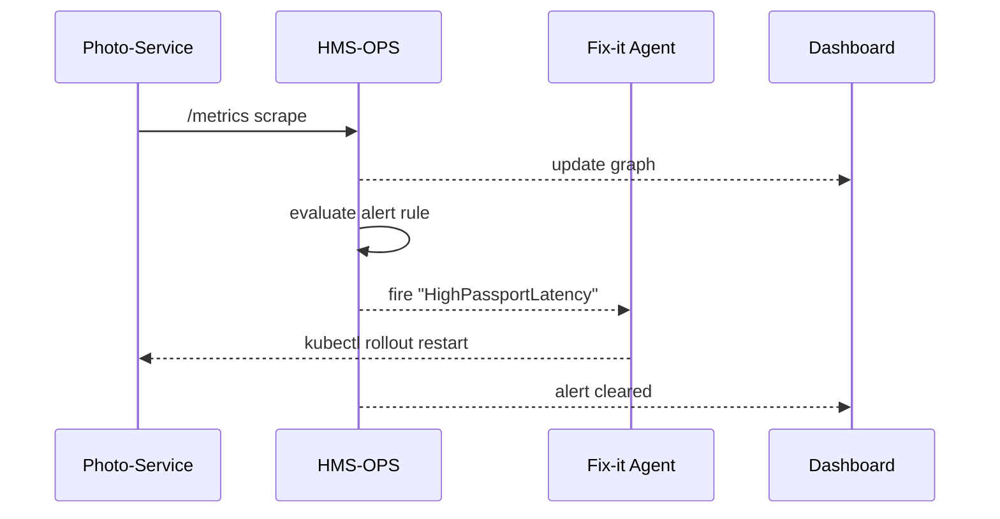

# Chapter 14: Observability & Ops (HMS-OPS)

*(Coming from [AI Performance & Accountability Loop](13_ai_performance___accountability_loop_.md) where we learned how to score and judge our AI.  Scores are useless, though, if no one sees a problem until Twitter blows up.  HMS-OPS is the “public-safety radio” that lets every micro-service, policy engine, and AI bot yell **“Smoke in the server room!”** before citizens feel the heat.)*

---

## 1. Why Do We Need a “NORAD Command Center” for Software?

**Use-case – “Passport Panic at 4 p.m.”**

1. At 15:55 the **Photo-Validation Service** in the online passport portal starts taking 9 seconds instead of 400 ms.  
2. Citizens press *Submit* and stare at a spinner.  
3. A fix-it **Agent** (see [HMS-AGT](09_hms_agt___core_agent_framework__.md)) notices the latency spike, rolls the pod, and latency drops to 300 ms by 16:02.  
4. Most applicants never know anything happened.

This auto-response is impossible without:

* live **metrics** (“latency = 9 s”),  
* **alerts** (“threshold breached”),  
* and an **auto-healing playbook** (“restart the pod”).

Those three ingredients live in **HMS-OPS**.

---

## 2. Key Concepts (One-by-One)

| Concept | Beginner Analogy                                   | Meaning in HMS-OPS |
|---------|----------------------------------------------------|--------------------|
| Metric  | Car’s speedometer                                  | Numeric time-series (e.g., `http_latency_ms`) |
| Log     | Plane’s black box                                  | Text events (“user X uploaded photo”) |
| Trace   | Package tracking number                            | End-to-end journey of one request |
| Dashboard | Air-traffic radar screen                         | Real-time graph panel in Grafana-lite UI |
| Alert Rule | Smoke detector threshold                        | “If latency > 5 s for 2 min → page on-call” |
| Auto-Healing Script | Fire-sprinkler                         | Code that runs automatically when an alert fires |
| Service-Level Objective (SLO) | Agency performance pledge    | “99 % of passport submissions < 1 s per month” |

---

## 3. A 60-Second “Hello World” for Metrics, Logs & Alerts

Below are three **tiny** code snippets you can copy into any micro-service.

### 3.1 Expose a Metric (Python, 12 lines)

```python
# file: metrics.py
from prometheus_client import Counter, start_http_server

REQUESTS = Counter("passport_requests_total",
                   "Total passport submissions")

def record_request():
    REQUESTS.inc()

if __name__ == "__main__":
    start_http_server(9100)   # /metrics endpoint
    while True:
        record_request()      # pretend work
```

Explanation:  
• One import, one counter, one HTTP endpoint—Prometheus compatible.  
• HMS-OPS will scrape `http://svc:9100/metrics` every 30 s.

### 3.2 Emit a Structured Log (Node, 9 lines)

```js
// file: logger.js
const pino = require("pino")({level:"info"});
function logUpload(user, size) {
  pino.info({evt:"photo_upload", user, size});
}
module.exports = {logUpload};
```

Explanation:  
Logs are already JSON; HMS-OPS reads them via Fluent-Bit and stores them in Loki-lite.

### 3.3 Define an Alert Rule (YAML, 8 lines)

```yaml
# file: alerts/passport_latency.yaml
alert: HighPassportLatency
expr:  histogram_quantile(0.95, rate(http_latency_ms_bucket[5m])) > 5
for:  2m
labels: {severity: "critical"}
```

Explanation:  
If the **95 th percentile** latency stays above 5 s for 2 min, HMS-OPS fires *HighPassportLatency*.

---

## 4. What Actually Happens When Latency Spikes?



1. HMS-OPS scrapes metrics & evaluates rules every 30 s.  
2. When a rule fires, an **AlertManager** emits a webhook to a **fix-it Agent** (registered in [HMS-AGT](09_hms_agt___core_agent_framework__.md)).  
3. The agent runs the auto-healing playbook and posts the result back.  
4. Dashboards turn red → yellow → green, all within minutes.

---

## 5. Auto-Healing Playbooks (≤ 18 Lines)

```python
# file: playbooks/restart_pod.py
import subprocess, sys, json, httpx

alert = json.loads(sys.stdin.read())
pod   = alert["labels"]["pod"]

print(f"🚑 Restarting {pod}")
subprocess.run(["kubectl","rollout","restart","deployment",pod], check=True)

# Notify OPS so the alert history shows action taken
httpx.post("http://ops/api/note",
           json={"alert": alert["fingerprint"],
                 "action": "pod restarted"})
```

Bind this script in **AlertManager**:

```yaml
receivers:
  - name: autoheal
    webhook_configs:
      - url: http://fixit-agent/run/restart_pod.py
```

---

## 6. A Beginner-Friendly Dashboard (JSON, 14 Lines)

```json
{
  "title": "Passport Portal",
  "panels": [
    {"type":"graph","expr":"rate(passport_requests_total[5m])",
     "title":"Requests / min"},
    {"type":"graph","expr":"histogram_quantile(0.95, rate(http_latency_ms_bucket[5m]))",
     "title":"Latency p95 (ms)"}
  ]
}
```

Save it as `dashboard_passport.json`. HMS-OPS UI automatically discovers dashboards in the `/dashboards` folder.

---

## 7. Under the Hood – Service Discovery in 5 Bullets

1. **Sidecar scrapers** (Envoy or cAdvisor) auto-add `/metrics` endpoints to a central scrape file.  
2. **Fluent-Bit** tails every container log and ships it to **Loki-lite**.  
3. **Tempo-lite** attaches a trace-id header to every HTTP hop (no code change if you use the mesh from [HMS Micro-services Backbone](03_hms_micro_services_backbone_.md)).  
4. **AlertManager** fans out alerts to Slack, PagerDuty, or fix-it bots.  
5. **Grafana-lite** reads from Prometheus, Loki, Tempo—one UI for all.

_All of these pieces are pre-wired; you only write metrics & alerts._

---

## 8. Connecting HMS-OPS to Other Chapters

```mermaid
graph TD
  OPS["🔭 HMS-OPS"] --> API["🌐 HMS-API"]
  OPS --> AGT["🤖 HMS-AGT"]
  OPS --> ACT["📒 HMS-ACT"]
  OPS --> ESQ["🛡️ HMS-ESQ"]
  OPS --> DTA["🗄️ HMS-DTA"]  %% next chapter
```

• **API Gateway** emits request counts and auth failure logs.  
• **Agents** report success/failure counters.  
• **Workflows (ACT)** sprinkle trace-id so a whole passport flow can be followed end-to-end.  
• **Legal Oversight (ESQ)** consumes OPS logs for compliance evidence.  
• **Data Core (HMS-DTA)** will archive long-term logs—see next chapter.

---

## 9. Common Beginner Questions

| Question | Fast Fix |
|----------|----------|
| “Dashboard is blank.” | Verify the scrape job: `kubectl port-forward prometheus 9090`, open `/targets`; your service must be **UP**. |
| “Metric names collide.” | Prefix with service name, e.g., `photo_http_latency_ms`. |
| “Alert fires repeatedly even after fix.” | Add `for: 2m` in the rule so it waits for the metric to clear. |
| “Trace shows ‘unknown service’.” | Set `SERVICE_NAME` env variable in your pod; the mesh inserts it. |

---

## 10. Hands-On Mini Checklist

1. **Add a metric** (`Counter`, `Histogram`) – 5 min.  
2. **Run `hms ops reload`** – Prometheus scrapes your service.  
3. **Write one alert rule** – your first fire drill.  
4. **Watch the fix-it Agent auto-heal** – grin as latency plummets.  
5. **Commit dashboard JSON** – managers see shiny graphs.

---

## 11. Summary & Next Steps

In this chapter you:

1. Saw why HMS-OPS is the **eyes, ears, and first-aid kit** of the platform.  
2. Learned the essential trio: **metrics, alerts, auto-healing**.  
3. Added a metric, wrote an alert, and wired a playbook in < 40 total lines.  
4. Peeked inside the pipeline—Prometheus, Loki, Tempo, Grafana-lite—all pre-configured.  
5. Noted how OPS integrates with API, Agents, Workflows, Legal, and upcoming Data Lake.

Ready to move those time-series and logs into deep, query-able storage for decade-long audits and big-data insight?  
Jump to [Data Core & Lake (HMS-DTA)](15_data_core___lake__hms_dta__.md).

---

---

Generated by [AI Codebase Knowledge Builder](https://github.com/The-Pocket/Tutorial-Codebase-Knowledge)