# Chapter 14: Process Optimization Workflow
*(“The Continuous-Improvement Assembly Line for Government Services”)*  

[← Back to Chapter 13: AI Agent Lifecycle Management](13_ai_agent_lifecycle_management_.md)

---

## 1. Motivation — The “Passport Backlog in 7 Days” Story  
Last summer the U.S. Department of State faced a **passport-renewal backlog** of 1 million applications.  
Citizens were furious, call-centers melted, and Congress demanded results *yesterday*.

The fix was **not** a single patch. It required a **repeatable loop** that:

1. Listened to complaints & performance metrics,  
2. Found the top bottleneck (manual ID checks),  
3. Deployed a new AI photo validator,  
4. Got a quick thumbs-up from a supervisor,  
5. Rolled the change out through the platform,  
6. Synchronized legacy mainframe status files,  
7. Watched metrics to make sure the backlog vanished—then started again.

That loop is our **Process Optimization Workflow (POW)**.  
POW turns “citizen pain” into “policy gain” with minimal human friction.

---

## 2. The 7-Step POW, Explained for Humans  

| # | Name | One-Line Rookie Definition | Analogy |
|---|------|----------------------------|---------|
| 1 | Collect Complaints & Telemetry | Grab angry emails + error logs + wait-times | Customer-service inbox |
| 2 | Diagnose Bottlenecks | Rank which step wastes most time | Doctor reading X-rays |
| 3 | Generate New Policy / Flow | Draft config or journey fix | Mechanic replacing a part |
| 4 | HITL Approval (Optional) | Human signs off if impact ≥ threshold | Supervisor’s rubber-stamp |
| 5 | Deploy via API Gateway | Push change through [HMS-API](07_backend_api_gateway__hms_api__.md) | Shipping the new part |
| 6 | Sync External Systems | Update COBOL, Excel sheets, etc. via adapters (Ch. 9) | Faxing the memo to old offices |
| 7 | Monitor Metrics | Confirm the fix works; roll back if worse | Nurse checking vital signs |

POW is a conveyor-belt—once the last sensor says “all green,” the belt loops back to step 1.

---

## 3. A 30-Second Peek at the Control File  

Every optimization loop lives in a mini YAML stored in Git:

```yaml
# file: pow/passport_backlog.yml
id: PASSPORT_BACKLOG
watch_feeds: [ "complaints.passport", "metrics.passport.wait_time" ]
bottleneck_rule: "max(wait_time) > 20_days"
fix_recipe:
  journey_patch: "journeys/passport_renewal@v2"
  service_patch: 
    service: PHOTO_VALIDATOR
    config: { max_blur_px: 4 }
hitl_threshold: MEDIUM      # see Ch. 15 for levels
success_metric: "wait_time < 7_days for 3_days"
rollback_on: "error_rate > 5%"
```

*If you can read a cooking recipe, you can read POW YAML.*

---

## 4. Hands-On — Fix the Passport Photo Bottleneck in < 50 Lines  

### 4.1  Detect the Bottleneck (Python 14 lines)

```python
# detect.py
import statistics, requests, json
logs = json.loads(requests.get("https://metrics.gov/passport/wait").text)
waits = [r["days"] for r in logs[-1000:]]             # last 1 000 renewals
if statistics.mean(waits) > 20:
    print("🚨  Bottleneck detected: avg wait > 20 days")
```
Beginners’ view: download recent wait-times, average them, raise an alert if over the rule.

---

### 4.2  Draft the Fix (YAML ≤ 10 lines)

```yaml
# fix.yml
service: PHOTO_VALIDATOR
changes:
  accept_blur_px: 4        # old value was 2
```
Tells the validator to accept slightly blurrier selfies—cuts 40 % of manual reviews.

---

### 4.3  Submit & (Auto-)Approve (Python 16 lines)

```python
# submit.py
import yaml, requests, os, json
fix = yaml.safe_load(open("fix.yml"))
ticket = requests.post(
  "https://gov/api/pow/submit",
  json={ "pow_id": "PASSPORT_BACKLOG", "patch": fix },
  headers={ "Authorization": f"Bearer {os.getenv('JWT')}" }
).json()
print("📝  POW ticket:", ticket["id"])
```
The POW service records the ticket and checks if `hitl_threshold` = MEDIUM → routes to supervisor for one-click approval via [Human-in-the-Loop Override](15_human_in_the_loop__hitl__override_.md).

---

### 4.4  Auto-Deploy & Sync (Shell 2 commands)

```bash
# executed by POW engine after approval
curl -X POST https://mgt.hms/api/patch -d @fix.yml      # Ch. 5
curl -X POST https://adapter.va/sync/PASSPORT_PHOTO      # Ch. 9
```
One line to [Management Layer](05_management_layer__hms_mgt___hms_svc__.md), another to the VA mainframe adapter—done.

---

### 4.5  Monitor & Close the Loop (Python 12 lines)

```python
# monitor.py
import time, requests
while True:
    wt = requests.get("https://metrics.gov/passport/wait/avg").json()["days"]
    if wt < 7:
        print("🎉  Success: wait-time < 7 days")
        break
    if requests.get("https://metrics.gov/passport/error").json()["pct"] > 5:
        print("❌  Rollback!")
        # call HMS-MGT rollback endpoint…
        break
    time.sleep(3600)   # check hourly
```
Keeps watching until success or rollback condition arises, then loops back to **Collect**.

---

## 5. What Happens Behind the Curtain?  

```mermaid
sequenceDiagram
participant Feed as Complaints+Metrics
participant POW as POW Engine
participant HITL as Supervisor UI
participant MGT as HMS-MGT
participant Dash as Metrics Dashboard

Feed-->>POW: high wait_time
POW->>HITL: approve patch?
HITL-->>POW: ✅
POW->>MGT: deploy fix
MGT-->>Dash: new config live
Dash-->>POW: wait_time improved?
POW-->>Feed: loop repeats
```



Only five players—easy to grasp, easy to audit.

---

## 6. Tiny Tour of Internal Files  

```
hms-pow/
 ├─ engine.py           # orchestrates 7 steps
 ├─ detect.py           # example detector (step 2)
 ├─ submit.py           # example patch generator (step 3)
 ├─ monitor.py          # success/rollback watcher (step 7)
 └─ passport_backlog.yml
```

### 6.1  Engine Skeleton (18 lines)

```python
# engine.py
import yaml, detect, monitor, submit
cfg = yaml.safe_load(open("passport_backlog.yml"))
while True:
    if detect.run(cfg):
        patch = submit.build(cfg)
        if hitl_ok(cfg):          # calls HITL API
            deploy(patch)         # via HMS-MGT
            monitor.watch(cfg)
    time.sleep(300)              # re-scan every 5 min
```
Less than 20 lines glue the entire conveyor-belt.

---

## 7. How POW Talks to the Rest of HMS-MCP  

| Layer / Chapter | POW Touch-Point |
|-----------------|-----------------|
| [AI Representative Agent](12_ai_representative_agent__hms_a2a__.md) | A2A can *trigger* POW loops automatically. |
| [Governance Layer](02_governance_layer__hms_gov__.md) | Validates every patch and stores audit logs. |
| [HITL Override](15_human_in_the_loop__hitl__override_.md) | Step 4 approval / rejection UI. |
| [Monitoring Dashboard](16_monitoring___metrics_dashboard_.md) | Supplies success & rollback metrics. |
| [External System Sync Adapter](09_external_system_sync_adapter_.md) | Powers Step 6 legacy updates. |

---

## 8. Tips & Gotchas  

1. **Small, Fast Loops Win** – Patch one bottleneck at a time; measure; repeat.  
2. **Automate Data, Human-Check Impact** – Let code find problems; let people bless big changes.  
3. **Version Your Recipes** – `backlog@v3` tells auditors exactly what ran last month.  
4. **Use Clear Success Metrics** – “< 7 days wait for 3 days” beats vague “improve speed.”  
5. **Rollback Plans Are Non-Negotiable** – Define them *before* deployment, not after midnight.

---

## 9. Recap  

You now own a **7-step conveyor-belt** that:

1. Feels citizen pain,  
2. Diagnoses the worst step,  
3. Generates a concrete fix,  
4. Routes for human OK (when needed),  
5. Deploys through the safe channels,  
6. Updates even dinosaur systems,  
7. Confirms success—then starts again.  

Together with A2A, ALM, and the previous layers, POW turns HMS-MCP into a self-healing public-service factory.

Ready to see how those **human approvals** actually work in practice?  
Jump to [Chapter 15: Human-in-the-Loop (HITL) Override](15_human_in_the_loop__hitl__override_.md).

---

Generated by [AI Codebase Knowledge Builder](https://github.com/The-Pocket/Tutorial-Codebase-Knowledge)