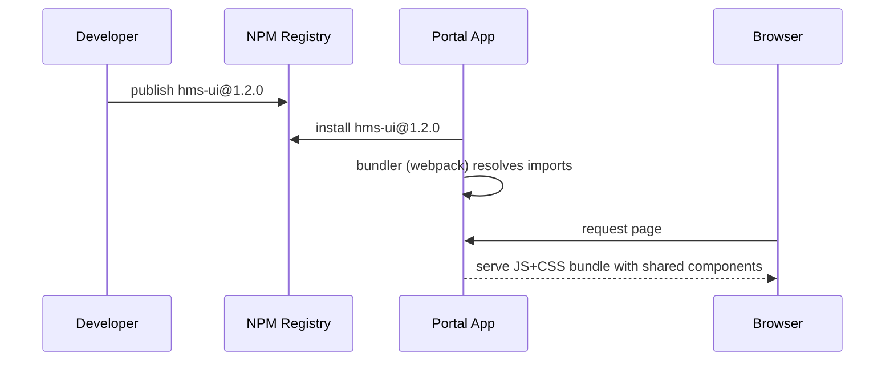

# Chapter 14: Shared Frontend Component Library

In [Chapter 13: Micro Frontend Interface (HMS-MFE)](13_micro_frontend_interface__hms_mfe__.md) we learned how to assemble small widgets into a portal. Now let’s make sure every widget—whether on the citizen site or the admin dashboard—shares the same look, feel, and behavior. That’s the role of our **Shared Frontend Component Library**.

## 1. Why a Shared Component Library?

Imagine every federal agency had its own badge, letterhead, and signage system. One office’s form fields look different from another’s—confusing citizens and staff alike. A shared library of UI elements—buttons, tables, modals—guarantees:

- Consistency: Forms in the citizen portal match the admin console.  
- Speed: Teams reuse pre-built components instead of reinventing them.  
- Accessibility: All elements comply with WCAG out of the box.  

### Concrete Use Case: Permit Application Portal

A state portal needs:

1. A **Form** for citizens to enter personal data  
2. A **Table** listing submitted permits  
3. A **Modal** to confirm deletion  
4. A **Badge** showing permit status  

Rather than each team styling these from scratch, they import from `hms-ui`—our shared component library.

## 2. Key Concepts

1. **Component**  
   A reusable UI element (e.g., Button, Table, Modal).  
2. **Theme**  
   A set of colors, fonts, and spacing values applied globally.  
3. **Variant**  
   A style option for a component (e.g., `primary`, `secondary` for buttons).  
4. **Accessibility**  
   Built-in keyboard support, proper ARIA roles, and color contrast.  
5. **Responsive Design**  
   Components adapt to mobile, tablet, and desktop layouts.

## 3. Using the Library

Below is a minimal React example showing a permit list and a delete confirmation.

```javascript
import React from 'react'
import {
  Button,
  Table,
  Modal,
  Badge
} from 'hms-ui'

function PermitList({ permits, onDelete }) {
  return (
    <>
      <Table columns={['ID','Owner','Status']}>
        {permits.map(p => (
          <tr key={p.id}>
            <td>{p.id}</td>
            <td>{p.owner}</td>
            <td><Badge status={p.status} /></td>
          </tr>
        ))}
      </Table>

      <Modal id="confirmDelete">
        <Modal.Header>Confirm Deletion</Modal.Header>
        <Modal.Body>Delete this permit?</Modal.Body>
        <Modal.Footer>
          <Button variant="secondary" onClick={() => Modal.close()}>Cancel</Button>
          <Button variant="primary" onClick={onDelete}>Delete</Button>
        </Modal.Footer>
      </Modal>
    </>
  )
}
```

Explanation:
- We import `Table`, `Badge`, `Modal`, and `Button` from `hms-ui`.  
- `Badge` applies a color based on `status`.  
- `Modal` has header, body, footer slots.  
- Variants (`primary`/`secondary`) ensure consistent color usage.

## 4. What Happens Under the Hood?

When you install and use `hms-ui`:



1. You publish `hms-ui` to NPM.  
2. Your portal app installs and bundles it.  
3. At runtime, the browser downloads a unified JS+CSS bundle.  
4. Each component renders with the same theme, spacing, and accessibility features.

## 5. Inside the Library: Peek at Core Code

### 5.1 Button Component

```javascript
// file: hms-ui/button.js
export function Button({ variant='primary', children, ...props }) {
  const cls = `hms-btn hms-btn--${variant}`
  return (
    <button className={cls} {...props}>
      {children}
    </button>
  )
}
```
- `hms-btn` is the base class.  
- `hms-btn--primary` or `hms-btn--secondary` controls color.

### 5.2 Shared CSS Variables

```css
/* file: hms-ui/styles.css */
:root {
  --hms-color-primary: #0058a3;
  --hms-color-secondary: #f0f0f0;
  --hms-padding: 0.5rem 1rem;
}
.hms-btn {
  padding: var(--hms-padding);
  border: none;
  border-radius: 4px;
}
.hms-btn--primary {
  background-color: var(--hms-color-primary);
  color: white;
}
.hms-btn--secondary {
  background-color: var(--hms-color-secondary);
  color: #333;
}
```
- Themes are defined as CSS custom properties.  
- Every component references these variables for consistency.

## 6. Summary

In this chapter you learned:

- **Why** a shared component library keeps UI consistent across portals.  
- **Key concepts**: components, themes, variants, accessibility, responsiveness.  
- **How to use** `hms-ui` with minimal code (tables, badges, modals, buttons).  
- **What happens under the hood**: publishing to NPM, bundling, and CSS variables.  
- **A peek at core implementation** for `Button` and shared styles.

Next up, we’ll explore how intelligent agents can automate tasks using our UI and data services in [Chapter 15: AI Agents Framework (HMS-A2A)](15_ai_agents_framework__hms_a2a__.md).

---

Generated by [AI Codebase Knowledge Builder](https://github.com/The-Pocket/Tutorial-Codebase-Knowledge)