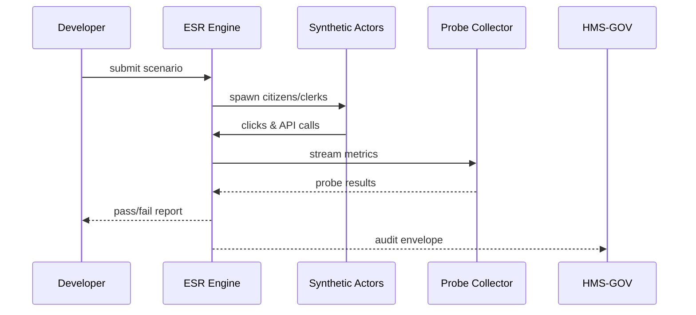

# Chapter 14: Simulation & Training Sandbox (HMS-ESR)
*(“Fire-drills for software, before real people walk in.”)*  

[← Back to Chapter 13: Human-in-the-Loop Oversight Console (HMS-GOV)](13_human_in_the_loop_oversight_console__hms_gov__.md)

---

## 0. Why Do We Need ESR? — The Benefit-Form Blunder That Never Happened  

The **Administration for Community Living (ACL)** is about to launch an online form that helps seniors apply for home-care benefits.  
Before going live, the team wants to be sure:

1. The form **doesn’t overwhelm** clerks if 50 000 citizens file at once.  
2. The AI helper treats **all disability types fairly**.  
3. The UI text is clear for screen-reader users.  

Instead of gambling on production traffic, ACL loads the form into **HMS-ESR**. Within minutes the sandbox:

* Spawns 50 000 **synthetic citizens** with diverse disabilities and device settings.  
* Spins up **synthetic clerks** that mirror real processing speeds.  
* Replays the entire workflow through every HMS layer—logging, policy checks, UI clicks—exactly as it would happen live.  
* Surfaces bottlenecks and bias **before** a single real citizen is affected.

That’s the super-power of ESR: run a full-scale *fire-drill* for any new rule, agent, or interface.

---

## 1. Key Concepts — Five Words to Learn Once  

| Term | One-Line Definition | Analogy |
|------|--------------------|---------|
| Scenario | YAML recipe for a test | “Fire-drill playbook” |
| Synthetic Actor | Fake citizen or clerk | Crash-test dummy |
| Workload Script | Sequence of clicks & API calls | Choreography sheet |
| Probe Metric | Data collected during run | Thermometer |
| Fail Gate | Pass/Fail rule (`p95 < 500 ms`) | Exam grading rubric |

Keep this chain in mind: **Scenario → Actors → Workload → Probes → Gates**.

---

## 2. 3-Step Mental Model  


If every gate passes, you’re green-lit to ship. If not, you iterate safely inside ESR.

---

## 3. “Hello ESR” — Testing the ACL Form in 18 Lines  

### 3.1 Write a Scenario (`acl_form.yaml` — 14 lines)

```yaml
scenario:
  name: "ACL Home-Care Form Load Test"
  actors:
    citizens: 50000     # synthetic users
    clerks: 50          # synthetic back-office staff
  workload: "fill_and_submit_form.py"   # script (see next)
  probes:
    - "ui.response_time"      # ms
    - "agent.bias_score"      # 0-1
  fail_gates:
    ui.response_time.p95: 1200   # ms
    agent.bias_score.max_diff: 0.05
```

Beginner notes  
1. **Actors** say who participates.  
2. **Workload** points to a tiny Python script.  
3. **Probes** list what we’ll measure.  
4. **Fail Gates** declare “red lines.”

### 3.2 Tiny Workload Script (`fill_and_submit_form.py` — 10 lines)

```python
# pseudo-code; ESR injects helpers
for citizen in actors.citizens:
    page = ui.open("/acl/form")
    page.fill(citizen.profile)        # name, age, disability
    answer = agent.chat("Need help?")
    page.submit()
```

Explanation  
* Each synthetic citizen opens the page, chats with the helper agent, and submits the form—just like real life.

### 3.3 Run It (4 lines)

```bash
$ hms-esr run acl_form.yaml
Scenario queued ➜ job #92
⏳ Running … (2m 13s)
❌ FAILED  — ui.response_time.p95 = 1850 ms (gate 1200 ms)
```

ESR aborted the shipment; we now know the UI is too slow.

---

## 4. What Happens Under the Hood?  



5 actors, 7 steps—every message is an MCP envelope, so it’s traceable across the platform.

---

## 5. Tiny Peek Inside ESR Core (≤ 18 Lines)

```python
# hms_esr/core.py  (simplified)
def run(scenario_path):
    cfg = yaml.safe_load(open(scenario_path))
    job = _new_job(cfg["scenario"]["name"])
    actors = _spawn_actors(cfg["scenario"]["actors"])
    probes = _start_probes(cfg["scenario"]["probes"])

    for action in load_script(cfg["scenario"]["workload"]):
        _dispatch(action, actors)          # UI clicks, API calls

    results = probes.collect()
    failed = _check_gates(results, cfg["scenario"]["fail_gates"])
    _audit(job, results, failed)
    return failed
```

Line-by-line  
1. Parse YAML, create a **job** record.  
2. **Spawn actors** as lightweight containers.  
3. **Start probes** (latency, bias, etc.).  
4. **Dispatch** workload actions (re-using [HMS-MFE](12_micro_frontend_library__hms_mfe__.md) components & [Service Mesh](10_backend_service_mesh__hms_svc___hms_api__.md) calls).  
5. After run, **collect** metrics, check **gates**, and write an immutable audit row visible in [HMS-OPS](11_operational_nerve_center__hms_ops__.md).

---

## 6. Inspecting Results — One Command  

```bash
$ hms-esr report 92 --graph
```

Outputs:

```
📊 ui.response_time  p95=1850 ms   ❌ >1200
📊 agent.bias_score  max_diff=0.02 ✅ <0.05

Bottleneck: 97 % of delay in svc_identity.verify.v1
```

You now know exactly which Micronode to optimize before re-running the scenario.

---

## 7. Linking ESR to Other HMS Layers  

Layer | How It Interacts
------|------------------
[HMS-AGT](05_hms_agt_core_agent_framework_.md) | Synthetic citizens reuse existing agents to test dialogue under load.  
[HMS-MFE](12_micro_frontend_library__hms_mfe__.md) | Workload scripts drive real UI widgets in headless browsers.  
[HMS-OPS](11_operational_nerve_center__hms_ops__.md) | ESR tags probe metrics so they don’t pollute production SLOs.  
[HMS-GOV](13_human_in_the_loop_oversight_console__hms_gov__.md) | Officers can **pause** or **fast-forward** a running simulation.  

---

## 8. Common Pitfalls (and How ESR Prevents Them)

Problem | Life Without ESR | With HMS-ESR
--------|------------------|-------------
Launch day overload | Site crashes at 9 a.m. | Bottleneck found at 3 a.m. in sim run
Hidden algorithmic bias | PR disaster in press | Bias probe fails gate; fixed quietly
UI only tested by devs | Screen-reader bugs | Synthetic visually-impaired actors catch issues
Policy approved, ops unready | Clerks overwhelmed | Synthetic clerks expose queue times

---

## 9. Recap & What’s Next  

You now know how **HMS-ESR** lets you:

• Define a **Scenario** with YAML.  
• Spawn **Synthetic Actors** running real workloads.  
• Measure performance & fairness with **Probes** and **Fail Gates**.  
• Iterate safely before citizens ever touch the system.

Ready to connect HMS to *external* partners—credit agencies, state databases, or third-party vendors—once your simulation is green?  
Jump to the final chapter: [External System Synchronizer](15_external_system_synchronizer_.md).

---

Generated by [AI Codebase Knowledge Builder](https://github.com/The-Pocket/Tutorial-Codebase-Knowledge)