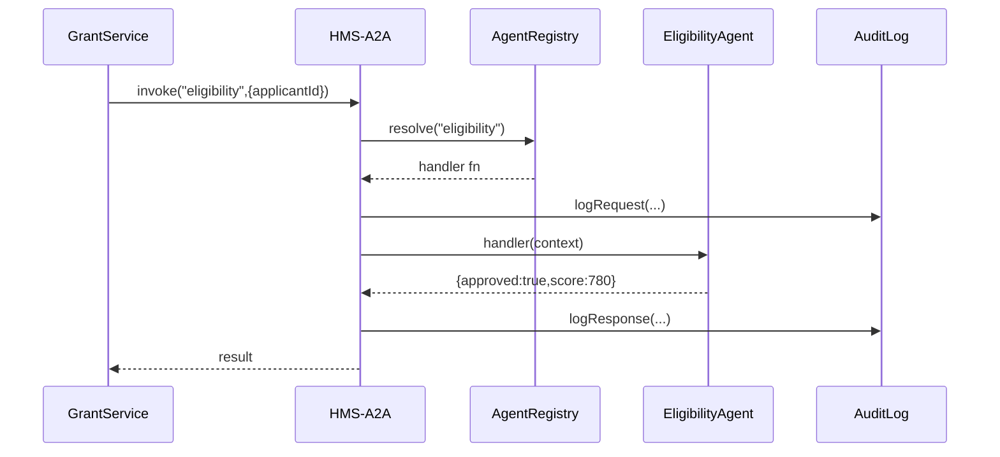

# Chapter 15: AI Agents Framework (HMS-A2A)

_In the previous chapter, we built a consistent set of UI building blocks in our [Shared Frontend Component Library](14_shared_frontend_component_library_.md). Now we’ll add a “team of expert advisors” inside our platform with the AI Agents Framework._

## 1. Motivation & Use Case

Imagine you run a **Federal Grant Disbursement Service** that needs to:

1. Check applicant eligibility  
2. Verify spending compliance  
3. Schedule fund release  

Rather than one giant AI, picture three specialized agents:

- **Eligibility Agent** checks income and credit scores  
- **Compliance Agent** reviews documents against regulations  
- **Scheduler Agent** finds the next available funding date  

**HMS-A2A** (Agents-to-Agents) standardizes how these experts are registered, invoked, and governed, so your service can just say “Invoke Agent X” and get back a safe, auditable result.

## 2. Key Concepts

1. **Agent Registration**  
   Agents announce themselves with a name and handler function.

2. **Agent Invocation**  
   Services call agents by name, passing a context object.

3. **Agent Context**  
   The data block (`{ applicantId, batchData }`) that informs the agent’s logic.

4. **Governance & Policy**  
   Before and after each call, policies from the [Governance Layer](08_governance_layer_.md) ensure privacy, ethics, and safety.

5. **Audit & Monitoring**  
   Every request and response is logged for transparency and compliance.

## 3. Using the Framework

Here’s a minimal example for a **GrantService**:

```javascript
// file: grant-service/index.js
const a2a = require('hms-a2a').init({ serviceName: 'GrantService' })

// 1) Register an Eligibility Agent
a2a.registerAgent('eligibility', async ({ applicantId }) => {
  // (Imagine calls to credit score API, income DB…)
  return { approved: true, score: 780 }
})

// 2) Later, invoke the agent
async function checkApplicant(id) {
  const result = await a2a.invoke('eligibility', { applicantId: id })
  console.log('Eligibility result:', result)
}
checkApplicant('app-123')
```

Explanation:

- `init` wires in logging, policy checks, and agent registry.  
- `registerAgent(name, handler)` registers a handler function.  
- `invoke(name, context)` runs governance checks, calls the handler, logs everything, and returns the result.

## 4. What Happens Under the Hood?



1. **Invoke**: Your service calls `a2a.invoke`.  
2. **Resolve**: The framework looks up the agent handler.  
3. **Governance**: Policies check permissions and data sensitivity.  
4. **Execute**: The agent’s handler runs with your context.  
5. **Audit**: Request and response are saved to an immutable log.  
6. **Return**: You get back the agent’s structured result.

## 5. Inside HMS-A2A: Core Implementation

```javascript
// file: hms-a2a/core.js
exports.init = ({ serviceName }) => {
  const agents = {}
  return {
    registerAgent: (name, handler) => {
      agents[name] = handler
    },
    invoke: async (name, context) => {
      // 1) Policy check (via [Governance Layer](08_governance_layer_.md))
      await policyEngine.check('invoke_agent', { name, context })
      // 2) Call the agent
      const result = await agents[name](context)
      // 3) Audit log
      await auditLog.write({ serviceName, name, context, result })
      return result
    }
  }
}
```

- **agents**: a map of `name → handler`.  
- **policyEngine.check**: enforces ethics, privacy, safety.  
- **auditLog.write**: records every call for compliance.

## 6. Summary

In this chapter you learned how **HMS-A2A**:

- Lets you register specialized AI agents by name.  
- Standardizes invocation with context objects.  
- Applies governance checks via the [Governance Layer](08_governance_layer_.md).  
- Logs every request and response for auditability.  

With these building blocks, your services can leverage expert AI advisors—scheduling, compliance, process optimization—without worrying about wiring, policy enforcement, or logging.  

This completes our deep dive into the HMS platform’s AI capabilities!

---

Generated by [AI Codebase Knowledge Builder](https://github.com/The-Pocket/Tutorial-Codebase-Knowledge)