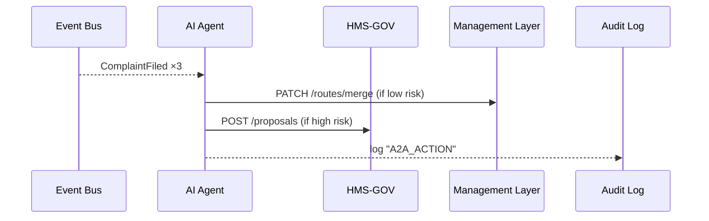

# Chapter 15: AI Representative Agent (HMS-A2A)

*(Coming from [External System Synchronization](14_external_system_synchronization_.md).)*  

---

## 1. Why Bother? – A 2-Minute Story  

The **U.S. Department of Agriculture** has a small **Noxious-Weed Committee**.  
Every spring, inspectors drive thousands of miles to check farms for invasive weeds.  
This year field staff started complaining in the portal:

> “Route 12 makes me back-track 40 miles!”  

One analyst could open spreadsheets, read GPS logs, and craft a better route—but that takes **weeks**.  
**HMS-A2A** is like a tireless *policy analyst on autopilot*:

1. Reads every route complaint as it appears.  
2. Mines telemetry to find wasted miles.  
3. Drafts a *“Consolidate Route 12 & 15”* proposal in seconds.  
4. Either auto-deploys the change **or** sends it to a human for sign-off.

Citizens and staff never see the AI directly—they just enjoy faster service.

---

## 2. Big Picture in Plain English  

| Real-World Analogy | A2A Part | One-Line Description |
|--------------------|----------|----------------------|
| Complaint box at city hall | **Signal Listener** | Subscribes to events (`ComplaintFiled`, `KPIAlarm`) flowing through HMS. |
| Detective with a magnifier | **Pattern Miner** | Runs quick stats / ML to spot inefficiencies or rule breaches. |
| Speech writer | **Proposal Generator** | Drafts JSON or Markdown change proposals ready for governance review. |
| Robotic arm | **Auto-Fixer** | If the fix is risk-free, calls APIs to patch configs immediately. |
| Red line editor | **Human Handoff** | Sends risky proposals to [HMS-GOV](02_governance_layer__hms_gov__.md) for approval by real people. |

Keep these five pieces in mind—everything else is wiring.

---

## 3. Guided Walk-Through: “Fix the Bad Route”  

Goal:  
Within **5 minutes** of a new complaint, the AI should:

1. Detect a cluster of “Route 12” complaints.  
2. Draft a **Policy Proposal** that merges Route 12 & 15.  
3. Push the proposal to HMS-GOV.  
4. If the change is low-risk (<10 % extra fuel), auto-apply; else, wait for a human.

We’ll build a runnable toy version in **< 60 lines** of code.

### 3.1 The Event That Starts It All

```python
# complaint_service.py  (snippet used back in Ch. 6)
ev = {"type":"ComplaintFiled","route":"12","text":"too long","id":"C-901"}
BUS.basic_publish(exchange="events", routing_key="", body=json.dumps(ev))
```

Whenever a staffer files a complaint, an event enters the bus—no extra code needed.

---

### 3.2 AI Signal Listener (12 lines)

```python
# listener.py
import pika, json, collections
BUS = pika.BlockingConnection().channel()
BUF = collections.Counter()

def on_msg(_c,_m,_p,body):
    ev=json.loads(body)
    if ev.get("type")=="ComplaintFiled":
        BUF[ev["route"]]+=1
        if BUF[ev["route"]]>=3:          # simple “cluster” rule
            import agent; agent.handle(ev["route"])

BUS.basic_consume(queue="events", on_message_callback=on_msg, auto_ack=True)
BUS.start_consuming()
```

**Beginner notes**  
• Counts complaints per route.  
• When Route 12 hits 3 complaints, it calls `agent.handle("12")`.

---

### 3.3 Pattern Miner & Proposal Generator (18 lines)

```python
# agent.py
import requests, json, random, datetime

def km_saved(route):             # fake ML/heuristic
    return random.randint(10,40)

def handle(route_id):
    savings = km_saved(route_id)
    prop = {
      "id": f"opt-route-{route_id}-{int(datetime.time().time())}",
      "title": f"Merge Route {route_id} & 15",
      "summary": f"Save ~{savings} km per week by merging.",
      "action": {"type":"MERGE_ROUTES","routes":[route_id,"15"]},
      "riskScore": 0.07           # 7 % extra fuel risk
    }
    submit(prop)

def submit(prop):
    if prop["riskScore"] < 0.10:                 # safe → auto-fix
        requests.post("https://svc.hms.gov/routes/merge",
                      json=prop["action"])
    else:                                        # unsafe → proposal
        requests.post("https://gov.hms.gov/proposals",
                      json={"policy":prop, "comment":"AI draft"})
```

Explanation in plain words:  
1. `km_saved()` is a stub that “estimates” fuel savings.  
2. If risk < 10 %, the AI calls the **Management Layer** API directly to merge routes.  
3. Otherwise it sends a proposal to **HMS-GOV** for human review.

---

### 3.4 What Happens Under the Hood?



Only **five** actors—easy to debug.

---

## 4. Internal Implementation Peek

### 4.1 Risk Scorer (optional, 10 lines)

```python
# risk.py
def score(action):
    if action["type"]=="MERGE_ROUTES":
        overlap = len(set(action["routes"]))-1
        return 0.05 + 0.02*overlap     # tiny heuristic
```

### 4.2 Auto-Fixer API Stub (Management Layer, 14 lines)

```python
# routes_service.py
from fastapi import FastAPI
app = FastAPI(); ROUTES = {"12":[...], "15":[...]}

@app.patch("/routes/merge")
def merge(act: dict):
    a,b = act["routes"]
    ROUTES[a]+=ROUTES[b]; del ROUTES[b]
    return {"status":"merged","routes":list(ROUTES)}
```

Even a 14-line stub shows how easy it is for the AI to patch configs via standard APIs.

---

## 5. How A2A Respects Earlier Guard-Rails

1. **RBAC** – The AI’s service account carries the `ai_agent` role from [Role-Based Access Control](10_role_based_access_control__rbac__.md).  
2. **Audit** – Every auto-fix emits `A2A_ACTION` into the Audit Log Bus for inspectors.  
3. **Policy Checks** – Proposals flow through [Governance Layer](02_governance_layer__hms_gov__.md); no bypass.  
4. **Change Management** – Auto-fixes still create a change entry in [Change Management & Versioning](04_change_management___versioning_.md) so we can roll back.

---

## 6. Extending the Agent

| Add-On | What It Does |
|--------|--------------|
| **Natural-Language Summary** | Uses GPT-4 to attach a human-readable paragraph. |
| **Simulation Sandbox** | Runs the proposed change on yesterday’s data to predict KPIs. |
| **Multi-Domain Expertise** | Loads separate “skill plugins” (budget optimizer, accessibility checker) depending on event type. |

All plug-ins follow the same contract: `handle(event_or_route_id)`.

---

## 7. Debugging Tips for Beginners  

* **Print every proposal ID**—easy grep in logs.  
* Use a **“dry-run” flag** in `agent.handle()` to see JSON without sending APIs.  
* Check the Audit Log first if something changes “magically”—you’ll find `actor":"A2A"`.  
* Keep risk thresholds low at first (e.g., 1 %) and raise gradually.

---

## 8. Key Takeaways  

• **HMS-A2A** watches the stream of events, spots pain points, and drafts **policy-level fixes**.  
• Safe changes auto-deploy; risky ones wait for human approval—handled next chapter.  
• Less than **60** lines turned raw complaints into real operational improvements.  
• The agent never breaks existing guard-rails; it *uses* them.

---

## 9. What’s Next?

Humans still have the last word on certain changes (high risk, political sensitivity, budget impact).  
Let’s see how the platform blends AI speed with human wisdom in  
[Human-in-the-Loop (HITL) Oversight](16_human_in_the_loop__hitl__oversight_.md).

---

Generated by [AI Codebase Knowledge Builder](https://github.com/The-Pocket/Tutorial-Codebase-Knowledge)