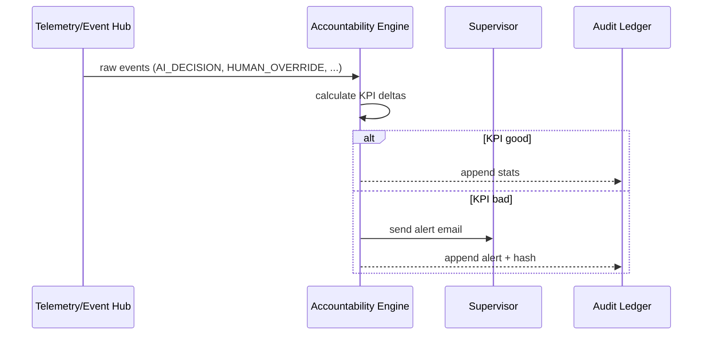

# Chapter 15: Autonomous Accountability Engine
[← Back to Chapter 14: Audit & Compliance Ledger](14_audit___compliance_ledger_.md)

---

## 0. Why Do We Need a “Score-Keeper With Teeth”?

Picture the **Department of State** launching the new “30-Minute Online Passport Renewal.”  
After two months the analytics team notices:

* The AI auto-approver (“HMS-A2A”) green-lights 88 % of renewals in **under 5 minutes**.  
* Yet the published “average processing time” is **18 hours**.  
* Digging deeper, they find one manual reviewer in the Midwest office who **rejects almost every AI suggestion**, pushing all those passports into a 12-hour human queue.

This is not malice—maybe it’s training, maybe burnout—but citizens now tweet “Government AI is useless.”

Enter the **Autonomous Accountability Engine (AAE)**:

1. **Continuously scores** every *human* and *AI module* on accuracy, speed, and user happiness.  
2. **Flags anomalies** (“Reviewer #534 rejects 5× more than peers”).  
3. **Escalates** to supervisors with concrete next steps—extra coaching or temporary reassignment.  
4. Logs every action to the [Audit & Compliance Ledger](14_audit___compliance_ledger_.md) so nobody can hide poor performance or questionable overrides.

Result: “Accountability with teeth”—but driven by data, not office politics.

---

## 1. Key Concepts (Plain-English Cheat-Sheet)

| Concept             | Friendly Explanation                               | Analogy                            |
|---------------------|----------------------------------------------------|------------------------------------|
| KPI                 | A measurable goal (accuracy ≥ 95 %, SLA ≤ 1 h).    | Speed limit on a highway.          |
| Scorecard           | Rolling average of a worker/module’s KPIs.         | Driver’s license points.           |
| Escalation Rule     | “If KPI below X for Y days → alert supervisor.”    | Speeding ticket mailed to you.     |
| Accountability Profile | Bundle of scorecards per person/module.         | Student report card.               |
| Nudge vs. Escalate  | Gentle email first, formal notice later.           | Friendly reminder → Traffic court. |
| Remediation Plan    | Concrete fix: training, shadowing, auto-throttle.  | Defensive-driving course.          |

---

## 2. Walk-Through Use Case: “Passport Reviewer Blocks AI”

### 2.1 Raw Events Feeding the Engine

| Layer                             | Event Example                                       |
|-----------------------------------|-----------------------------------------------------|
| [HMS-A2A](04_ai_representative_agent__hms_a2a__.md)       | `AI_DECISION {id: a-99, verdict: APPROVE}`          |
| [HITL Override](05_human_in_the_loop__hitl__override_.md) | `HUMAN_OVERRIDE {id: a-99, verdict: REJECT, reviewer: 534}` |
| [Telemetry Hub](13_user_feedback___telemetry_hub_.md)     | `USER_RATING {flow: PASSPORT, score: 1/5}`          |
| [Audit Ledger](14_audit___compliance_ledger_.md)          | Immutable record of both events above               |

The AAE drinks this firehose and converts it into **daily scorecards**.

### 2.2 A Single Scorecard (JSON, 6 Lines)

```json
{
  "actor": "reviewer-534",
  "date": "2024-06-01",
  "ai_agreement_rate": 12,
  "avg_handle_time_min": 27,
  "citizen_rating": 2.1
}
```

Compare to team median:

```json
{ "ai_agreement_rate": 82, "avg_handle_time_min": 8, "citizen_rating": 4.6 }
```

Clearly off-track → escalation kicks in.

---

## 3. How To Use the Engine (5-Minute Quick-Start)

### 3.1 Send Raw Events (Any Service)

```python
from hms_aae import publish_event           # SDK helper

publish_event("HUMAN_OVERRIDE", {
  "reviewer": "534",
  "suggestionId": "a-99",
  "verdict": "REJECT",
  "latencySec": 72
})
```

Explanation  
* One-liner; works just like `track()` in the Telemetry Hub.  
* Under the hood, it writes to an internal Kafka/SQS topic `aae-events`.

### 3.2 Query Today’s Low Performers

```bash
curl https://aae.hms/api/v1/anomalies?date=2024-06-01
```

Sample response:

```json
[
  {
    "actor": "reviewer-534",
    "issue": "Low AI agreement rate (12 % vs 80 %)",
    "action": "ESCALATE",
    "notify": ["supervisor-jones@state.gov"]
  }
]
```

### 3.3 Supervisor Receives a Nudge Email

```
Subject: ⚠️ HMS Passport Reviewer Performance Alert

Reviewer #534 rejected 88 % of AI-approved renewals in last 7 days.
Suggested remediation: enroll in “AI Co-pilot Refresher” (90-min course).
Click to acknowledge ➜ https://aae.hms/ack?id=alert-123
```

AAE waits 48 h; if no acknowledgement, it emails the division chief.

---

## 4. Under the Hood – Step-By-Step



Only **4 actors** keep the mental model simple.

---

## 5. Peek Inside the Code (All Blocks ≤ 20 Lines)

### 5.1 Folder Map

```
autonomous-accountability/
├─ ingestor/        # pulls events from Kafka/SQS
│  └─ stream.py
├─ scorer/          # computes KPIs
│  └─ calc.py
├─ rules/           # YAML escalation policies
│  └─ passport.yaml
├─ notifier/        # sends emails / Teams / Slack
│  └─ mail.py
└─ api/             # read-only dashboards
   └─ app.py
```

### 5.2 KPI Calculator (`scorer/calc.py`, 15 Lines)

```python
def kpi(events):
    agree = [e for e in events if e['type']=='AGREEMENT']
    disagree = [e for e in events if e['type']=='DISAGREEMENT']
    ai_agreement_rate = round(100*len(agree)/(len(agree)+len(disagree)+0.1))
    
    handle_times = [e['latencySec'] for e in events if 'latencySec' in e]
    avg_handle_min = round(sum(handle_times)/len(handle_times)/60, 1) if handle_times else 0
    
    ratings = [e['score'] for e in events if e['type']=='USER_RATING']
    citizen_rating = round(sum(ratings)/len(ratings),1) if ratings else None
    
    return {
        "ai_agreement_rate": ai_agreement_rate,
        "avg_handle_time_min": avg_handle_min,
        "citizen_rating": citizen_rating
    }
```

Beginner notes:  
* Simple list comprehensions—no fancy math.  
* Protects against divide-by-zero with `+0.1`.

### 5.3 Escalation Rules (`rules/passport.yaml`, 10 Lines)

```yaml
actor_type: "reviewer"
kpis:
  ai_agreement_rate:
    warn_below: 70     # %
    escalate_below: 50
  citizen_rating:
    escalate_below: 3  # stars
window_days: 7
```

Non-technical managers can tweak numbers in plain YAML.

### 5.4 Escalation Engine (`ingestor/stream.py`, 19 Lines)

```python
import yaml, mail, ledger, calc
RULES = yaml.safe_load(open('rules/passport.yaml'))

def process(actor, events):
    scores = calc.kpi(events)
    bad = []
    for kpi, cfg in RULES['kpis'].items():
        if scores[kpi] < cfg.get('escalate_below', 0):
            bad.append(f"{kpi} {scores[kpi]} < {cfg['escalate_below']}")
    if bad:
        msg = "; ".join(bad)
        mail.alert(actor, msg)
        ledger.append({"type":"AAE_ALERT","actor":actor,"msg":msg})
```

Explanation  
1. Compute KPIs.  
2. Compare to thresholds.  
3. If any fail → email + ledger entry.

---

## 6. Connecting Dots to Other HMS-ACT Layers

| Related Chapter | How It Integrates |
|-----------------|-------------------|
| [User Feedback & Telemetry Hub](13_user_feedback___telemetry_hub_.md) | Supplies user satisfaction scores. |
| [Audit & Compliance Ledger](14_audit___compliance_ledger_.md) | Stores every scorecard + alert. |
| [Role-Based Matrix](07_role_based_access___entitlement_matrix_.md) | Grants “Supervisor” role the right to view alerts. |
| [Security Guardrails](08_security___privacy_guardrails_.md) | Scrubs PII from scorecards before storage. |
| [AI Representative Agent](04_ai_representative_agent__hms_a2a__.md) | Gets feedback to retrain or adjust confidence. |

---

## 7. Hands-On Lab (4 Commands)

```bash
git clone https://github.com/example/hms-act
cd autonomous-accountability && pip install -r requirements.txt
python ingestor/mock_feed.py   # sends demo events for 1 minute
python api/app.py              # opens dashboard at :7800/dashboard
```

Open the browser—you should see “Reviewer #534 ‑ Escalation Pending.”

*(`mock_feed.py` is a tiny script that sprays random good/bad events.)*

---

## 8. Frequently Asked Questions

**Q: Won’t employees feel “spied on”?**  
A: Only job-relevant metrics are tracked, aggregated over days, and visible to the employee plus their chain of command—no secret scoring.

**Q: Can the engine trigger automatic suspension?**  
A: HMS-ACT defaults to **“human-in-the-loop”** escalation; auto-suspension is off until an agency explicitly enables it via policy.

**Q: How is bias handled?**  
A: KPI formulas are open-source; unions and civil-rights officers can review them. Disparate-impact checks run nightly and alert if certain groups are disproportionately flagged.

**Q: What if a reviewer handles only edge cases?**  
A: Escalation rules can include *case difficulty weighting* to avoid penalizing specialists. Example: exclude “Complex Fraud” category from agreement KPI.

---

## 9. What You Learned

• The **Autonomous Accountability Engine** turns raw events into daily scorecards for both humans and AI modules.  
• Simple YAML rules decide when to nudge, escalate, or recommend training.  
• Every alert and metric is permanently stored in the tamper-proof ledger.  
• The engine closes the feedback loop across AI, humans, and supervisors—keeping the whole HMS-ACT ecosystem honest and performant.

---

🎉 **Congratulations! You’ve reached the end of the HMS-ACT Beginner Series.**

You now understand:

1. How citizens interact through shared MFEs.  
2. How policies, AI, security, audits, and accountability knit together.  
3. How to extend each layer with a few lines of code and clear governance.

Kick the tires, file issues, and help us build better public-sector technology!

---

Generated by [AI Codebase Knowledge Builder](https://github.com/The-Pocket/Tutorial-Codebase-Knowledge)