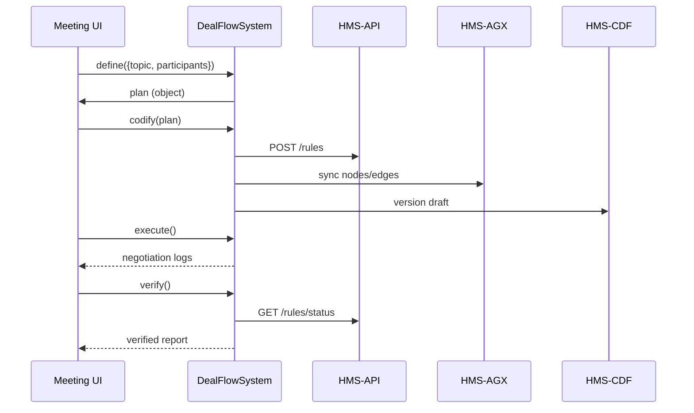

# Chapter 15: Deal Flow System

Continuing from [Chapter 14: HMS-MFE (Micro-Frontends)](14_hms_mfe__micro_frontends__.md), we now introduce the **Deal Flow System**, a simple 5-step framework to guide stakeholder negotiations—just like an agenda in a multi-agency meeting.

---

## 1. Motivation: Why a Deal Flow System Matters

Imagine a federal grant program where multiple agencies (Health, Education, Housing) and citizen advocates need to agree on funding rules. Without structure, meetings run long and decisions slip through the cracks.

**Central Use Case:**  
You’re chairing an interagency budget meeting. You need to:

1. Clarify **what** you’re funding.  
2. Turn that into concrete program requirements.  
3. Configure each HMS module (API, Knowledge Graph, Legislative Engine).  
4. Run the negotiation live.  
5. Check that all promises got encoded and deployed.

The **Deal Flow System** gives you five clear steps—**Define, Codify, Setup, Execute, Verify**—so every meeting ends with a documented, machine-readable outcome.

---

## 2. Key Concepts

1. **Define**  
   Agree on objectives, scope, stakeholders.  
   (e.g. “We fund affordable housing for low-income families.”)

2. **Codify**  
   Translate decisions into code or configuration.  
   (e.g. JSON rules for `incomeBracket`, `maxAward`.)

3. **Setup**  
   Wire up HMS modules: load rules into [HMS-API](06_hms_api__backend_api__.md), sync metadata in [HMS-AGX](07_hms_agx__knowledge_graph__.md), version in [HMS-CDF](11_hms_cdf__legislative_engine__.md).

4. **Execute**  
   Run the negotiation or pilot program—gather votes, feedback, and logs.

5. **Verify**  
   Confirm that modules reflect the agreed rules and audit logs are complete.

---

## 3. Using the Deal Flow System

Here’s a minimal script showing how you might run a negotiation for a “Housing Subsidy Pilot.”

### 3.1 Import the Steps

```js
// lib/dealFlow/index.js
const { define, codify, setup, execute, verify } = require('./steps');
```
*We load the five step functions.*

### 3.2 Run a Deal Flow

```js
async function runHousingDeal(input) {
  const plan = await define(input);   // Step 1: capture goals
  const rules = await codify(plan);   // Step 2: create JSON rules
  await setup(rules);                 // Step 3: configure HMS modules
  const result = await execute(rules);// Step 4: run negotiation
  return await verify(result);        // Step 5: check outcomes
}

// Example call:
runHousingDeal({ topic:'Housing Subsidy', agencies:['HHS','HUD'] })
  .then(final => console.log('Deal complete:', final));
```
*This code runs all five steps in order, returning a final status object.*

---

## 4. Under the Hood: Step Sequence



1. The **Meeting UI** calls **DealFlowSystem.define** to capture goals.  
2. **codify** pushes rule JSON to **HMS-API**, graph updates in **HMS-AGX**, and draft bills in **HMS-CDF**.  
3. **execute** runs the live negotiation, collecting logs.  
4. **verify** checks each module to ensure rules deployed correctly.

---

## 5. Internal Implementation Details

**File Structure:**

```
lib/dealFlow/
├── index.js
└── steps/
    ├── define.js
    ├── codify.js
    ├── setup.js
    ├── execute.js
    └── verify.js
```

### 5.1 define.js

```js
// lib/dealFlow/steps/define.js
async function define({ topic, participants }) {
  // In real life, prompt stakeholders for details
  return { topic, participants, timestamp: Date.now() };
}
module.exports = define;
```
*Captures the basic plan from meeting inputs.*

### 5.2 codify.js

```js
// lib/dealFlow/steps/codify.js
async function codify(plan) {
  // Transform plan into a rule set
  return { id: 'rule1', topic: plan.topic, stakeholders: plan.participants };
}
module.exports = codify;
```
*Converts the plan object into a simple rule configuration.*

### 5.3 setup.js

```js
// lib/dealFlow/steps/setup.js
const axios = require('axios');
async function setup(rules) {
  await axios.post('https://hms-api.gov/rules', rules);
}
module.exports = setup;
```
*Loads those rules into HMS-API (see [Chapter 6](06_hms_api__backend_api__.md)).*

### 5.4 execute.js

```js
// lib/dealFlow/steps/execute.js
async function execute(rules) {
  // Simulate negotiation logs
  return [{ stakeholder:'HHS', decision:'agree' },{ stakeholder:'HUD', decision:'agree' }];
}
module.exports = execute;
```
*Runs the negotiation round and returns decision logs.*

### 5.5 verify.js

```js
// lib/dealFlow/steps/verify.js
const axios = require('axios');
async function verify(logs) {
  // Check that all stakeholders agreed
  const ok = logs.every(l => l.decision==='agree');
  return { success: ok, logs };
}
module.exports = verify;
```
*Checks outcomes and ensures modules reflect the agreed rules.*

---

## Conclusion

You’ve learned how the **Deal Flow System** structures stakeholder negotiations into five clear steps—**Define, Codify, Setup, Execute, Verify**—and ties together [HMS-API](06_hms_api__backend_api__.md), [HMS-AGX](07_hms_agx__knowledge_graph__.md), and [HMS-CDF](11_hms_cdf__legislative_engine__.md). This lightweight framework ensures every agreement is captured, deployed, and audited across HMS modules, just like following a meeting agenda for transparent, consistent government decisions.

---

Generated by [AI Codebase Knowledge Builder](https://github.com/The-Pocket/Tutorial-Codebase-Knowledge)