# Chapter 15: Deployment Pipeline & Sandbox Environments  
*(File: 15_deployment_pipeline___sandbox_environments_.md)*  

[← Back to Observability & Continuous Monitoring](14_observability___continuous_monitoring_.md)

---

## 1. Why Another Layer? — A 60-Second Story  

The **Department of Agriculture** just updated its *Farm-Aid* benefit formula.  
A developer pushed the change at **2 p.m.**   At **2 : 05 p.m.** the portal went blank because:

* A SQL migration broke production.  
* The rollback playbook (see [Chapter 14](14_observability___continuous_monitoring_.md)) froze all further deploys.  
* Citizens could not file urgent drought claims.

What went wrong?  
The code never ran through the **full pipeline** and nobody tested it in a safe **sandbox**.  
Our fix: a **Deployment Pipeline & Sandbox Environment** that automatically:

1. Runs **static scans & unit tests** on every commit.  
2. Builds a **sandbox**—pre-loaded with **anonymized data**—within minutes.  
3. Performs a **blue-green** production deploy only if all green lights are on.  

Think of it as a **fire drill** every change must pass before touching real farmers’ data.

---

## 2. Key Concepts in Plain English  

| Term | What it really means | Friendly analogy |
|------|----------------------|------------------|
| CI Stage | “Continuous Integration” step (lint, test) | Teacher grading homework |
| CD Stage | “Continuous Delivery” step (deploy) | Mailing the graded paper home |
| Pipeline File (`pipeline.yml`) | Declarative recipe of stages | Baking recipe |
| Sandbox | Ephemeral copy of the system with scrubbed data | Pop-up practice DMV |
| Snapshot | Frozen DB image used to seed sandboxes | Photocopy of the city archive |
| Blue-Green Deploy | Two prod stacks (*Blue* live, *Green* dark) – flip traffic when ready | Two identical bridges; cars switch lanes |
| Change-Freeze Flag | File created by Chapter 14 playbook to block deploys | “Do Not Enter” tape |
| Gate | Automatic yes/no check (tests, policy, approvals) | TSA checkpoint |

---

## 3. Quick-Start — Ship a New Benefit Formula in 3 Steps  

### Step 1 · Describe Your Pipeline (8 lines)

```yaml
# file: pipeline.yml
stages:
  - static_scan      # 🔒 security lint
  - unit_tests       # ✅ business logic
  - build_sandbox    # 🏖️  spin temporary env
  - policy_gate      # ⚖️  governance check
  - blue_green_prod  # 🔵🟢 live rollout
```

*Even a non-coder can read it.*

---

### Step 2 · Push Code → Watch the Pipeline

```bash
git add benefits.py
git commit -m "Raise drought aid cap"
git push origin main               # pipeline auto-starts
```

Console output (abridged):

```
✔ static_scan ... OK (0 vulns)
✔ unit_tests   ... OK (64 tests)
✔ build_sandbox... OK  URL: https://sbx-42.agri.gov
✔ policy_gate  ... OK  (HMS-GOV)
✔ blue_green_prod... Switched traffic to GREEN
🎉 Deploy complete
```

---

### Step 3 · Invite Reviewers to the Sandbox

```bash
hms-sbx share https://sbx-42.agri.gov --role "PolicyAnalyst"
```

Reviewers log in, see **anonymized farm data**, verify payouts look right, and click **Approve**.  
If they find an issue, they **destroy** the sandbox:

```bash
hms-sbx destroy sbx-42
```

No lingering resources, no risk to production.

---

## 4. How the Pipeline Works – 5-Actor Overview  

```mermaid
sequenceDiagram
  participant Dev  as Developer
  participant CI   as Pipeline Runner
  participant SBX  as Sandbox Manager
  participant GOV  as HMS-GOV
  participant PRD  as Prod Cluster

  Dev->>CI: git push
  CI->>CI: static scan + tests
  CI->>SBX: build_sandbox()
  SBX-->>CI: sandbox_url
  CI->>GOV: policy_gate()
  alt all green & no freeze flag
      CI->>PRD: deploy_green()
      PRD-->>CI: health=OK
      CI->>PRD: switch_traffic()
  else freeze
      CI-->>Dev: "Deploy blocked – freeze in effect"
  end
```



Five participants, clear hand-offs.  
The **freeze flag** comes from the alert playbook in [Chapter 14](14_observability___continuous_monitoring_.md).

---

## 5. Under the Hood — Mini Code Tour (All <20 Lines)

### 5.1 Pipeline Runner (`ci.py` – 18 lines)

```python
import subprocess, os, sys
STAGES = ["static_scan", "unit_tests", "build_sandbox", "policy_gate", "blue_green_prod"]
FREEZE = "/tmp/change_freeze.flag"

for stage in STAGES:
    if os.path.exists(FREEZE):
        sys.exit("🚫 Freeze in effect – aborting")
    rc = subprocess.call(["python", f"stages/{stage}.py"])
    if rc != 0:
        sys.exit(f"❌ Stage {stage} failed")
print("✅ All stages passed")
```

*Checks freeze flag, runs each stage script, aborts on first failure.*

---

### 5.2 Build Sandbox Stage (`stages/build_sandbox.py` – 15 lines)

```python
import uuid, shutil, json, pathlib
SBX_ROOT = pathlib.Path("/sandboxes")

sbx_id = "sbx-" + uuid.uuid4().hex[:4]
path   = SBX_ROOT / sbx_id
shutil.copytree("/templates/base_stack", path)

# load anonymized snapshot
snapshot = json.load(open("/snapshots/farm_data.json"))
open(path/"db.json", "w").write(json.dumps(snapshot))

print(f"https://{sbx_id}.agri.gov")     # pipeline captures URL
```

*Clones a template stack, loads **scrubbed** data, prints URL.*

---

### 5.3 Policy Gate Stage (`stages/policy_gate.py` – 12 lines)

```python
from hms_gov import check_permission

if not check_permission(role="Pipeline",
                        action="deploy",
                        resource="drought_benefit"):
    raise SystemExit("❌ Governance deny")
print("✅ Governance ok")
```

*Uses the same check from [Governance Layer](01_governance_layer__hms_gov__.md).*

---

### 5.4 Blue-Green Deploy Stage (`stages/blue_green_prod.py` – 14 lines)

```python
import subprocess, json, time, pathlib
GREEN = pathlib.Path("/prod/green")
BLUE  = pathlib.Path("/prod/blue")

subprocess.check_call(["rsync","-a","./build/", GREEN])
health = subprocess.call(["curl","-f","http://green/health"])
if health != 0: raise SystemExit("❌ Green unhealthy")

open("/prod/active.txt","w").write("green")   # flip traffic
time.sleep(10)                                # buffer drain
print("🟢 Green live; blue idle")
```

*Copies build to *Green*, health-checks, flips a tiny text file read by the load balancer.*

---

## 6. Where Sandboxes Get Their Data  

1. Nightly **snapshot job** dumps production DB.  
2. **Scrubber script** replaces names, SSNs, and addresses with fakes (uses same tag rules as the [Security & Compliance Framework](03_security___compliance_framework_.md)).  
3. Result stored in `/snapshots/*.json` for sandbox seeding.  

No real PII/PHI ever leaves the vault.

---

## 7. How This Layer Plays With Others  

| Concern | Which Layer Handles It | Chapter |
|---------|------------------------|---------|
| Change-freeze flag | Set by Observability | [Observability & Continuous Monitoring](14_observability___continuous_monitoring_.md) |
| Role that may approve sandbox | RBAC | [Role-Based Access Control](04_role_based_access_control__rbac__.md) |
| Governance check before deploy | HMS-GOV | [Governance Layer](01_governance_layer__hms_gov__.md) |
| Security scans | SCF static analysis | [Security & Compliance Framework](03_security___compliance_framework_.md) |
| Sandbox event fan-out | Sync Bus | [External System Synchronization Bus](11_external_system_synchronization_bus_.md) |

---

## 8. Common Pitfalls & Quick Fixes  

| Pitfall | Symptom | Quick Fix |
|---------|---------|-----------|
| Forgetting anonymization | Real SSNs appear in sandbox | Run scrubber in snapshot job; add test that fails if pattern `\d{3}-\d{2}-\d{4}` found |
| Not cleaning up sandboxes | Cloud bill spikes | `hms-sbx destroy --all-older-than 24h` cron |
| Blue-green health check too shallow | Traffic switched but hidden bug | Call `/health` **and** run smoke tests before flip |
| Freeze flag ignored | Pipeline deploys during outage | Ensure `ci.py` checks for flag before **every** stage |

---

## 9. Try It Yourself  

1. Clone repo → `cd examples/pipeline`.  
2. Start a *fake* prod cluster: `./scripts/start_mock_prod.sh`.  
3. Run the pipeline: `python ci.py`.  
4. Visit the sandbox URL printed; confirm payout numbers look right.  
5. Touch `/tmp/change_freeze.flag`, re-run `python ci.py`; observe **abort**.  
6. Remove flag, edit `benefits.py` to introduce a failing unit test, push again—watch pipeline halt at **unit_tests** stage.

---

## 10. What You Learned  

✓ How a **5-stage pipeline** (scan→test→sandbox→policy→blue-green) keeps citizens safe.  
✓ One-command **sandbox** creation with anonymized snapshots.  
✓ How **change-freeze**, **governance gates**, and **blue-green** deploys integrate with every previous layer.  
✓ Minimal (<20 line) scripts you can adapt to GitHub Actions, Jenkins, or CircleCI.  

Congratulations—your HMS-EHR platform now ships changes **confidently and safely**.  
This is the final chapter of our beginner-friendly tour.  

Ready to build something mission-critical? You now have all the layers to do it. Good luck, and may your pipelines always be green!

---

Generated by [AI Codebase Knowledge Builder](https://github.com/The-Pocket/Tutorial-Codebase-Knowledge)