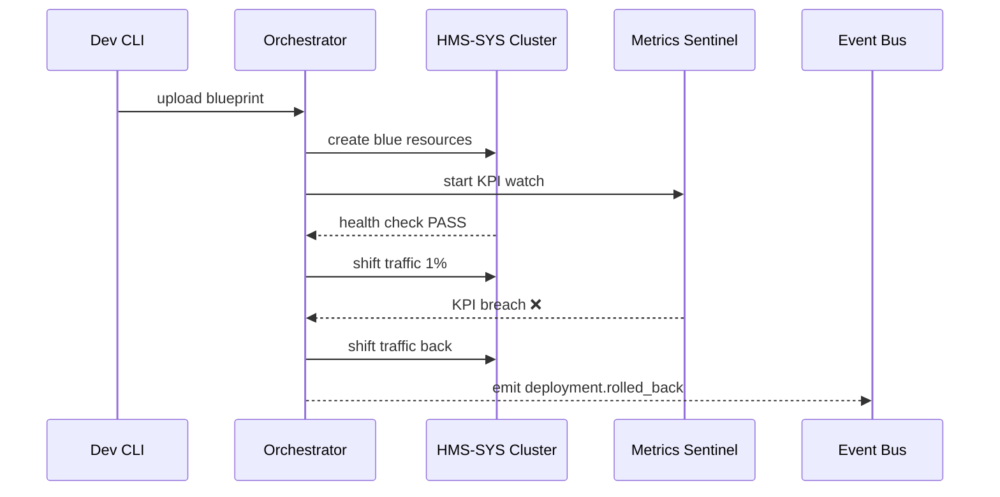

# Chapter 15: Deployment & Rollback Orchestrator
*(“Mission-Control for every code launch”)*  

[← Back to Chapter 14: Data Governance & Privacy Guardrails](14_data_governance___privacy_guardrails_.md)

---

## 1. Why do we need a Mission-Control?

### The *“Food-Delivery Licensing Rule”* story  

1. On Monday at 09:00 the Department of the Treasury publishes a new **“Instant-Pay for cafeteria vendors”** rule.  
2. Treasury’s MFE, micro-services, and IAM scopes must all update at once.  
3. If the change blocks even **2 %** of legitimate payments, Congress demands a rollback **in minutes**, not days.

Without a **Deployment & Rollback Orchestrator (DRO)** we would:

* manually push containers,  
* eyeball metrics,  
* wake a war-room when KPIs dip.

With DRO we click **“Launch”**.  
It:

1. Spins up a **blue** (new) environment beside the **green** (live) one.  
2. Runs smoke tests + live KPIs from [Metrics & Observability Pipeline](12_metrics___observability_pipeline_.md).  
3. Shifts traffic gradually.  
4. Flips back automatically if anything smells burning.

Citizens keep ordering lunch; auditors keep peace of mind.

---

## 2. Key Concepts (rocket-launch analogies)

| DRO Term | Rocket Analogy | Plain meaning |
|----------|----------------|---------------|
| Blueprint | Flight plan | YAML file that lists which images, configs, and tests make up the release. |
| Blue-Green | Two launchpads | Run new (**blue**) and old (**green**) versions side-by-side. |
| Smoke Test | “Can the engines ignite?” | Fast health check (e.g., `GET /healthz`). |
| Canary Slice | Small fuel injection | Route 1 % of real users to blue before full launch. |
| KPI Sentinel | Mission telemetry | Watches latency, error rate, revenue KPIs. |
| Rollback Switch | Abort handle | Instantly routes 100 % traffic back to green. |
| Promotion Gate | “Go/No-Go” call | Rule that must pass (tests, KPIs) before next phase. |

---

## 3. The 3-File Quick-Start

We’ll ship **v2 of “Food-Delivery Licensing Service”** safely.

### 3.1 Blueprint (`deploy/foodsvc_v2.yaml`) — *18 lines*

```yaml
id: foodsvc-v2
images:
  - svc: hms-svc-food    tag: "2.0.0"
  - mfe: food-delivery   tag: "2.0.0"
tests:
  - name: smoke
    cmd: curl -f http://blue.food-svc/healthz
kpi:
  error_rate: "< 0.5%"          # from Prometheus
  pay_success: "> 98%"
phases:
  - name: canary
    traffic: 1%
  - name: ramp-up
    traffic: 50%
  - name: full
    traffic: 100%
rollback: auto
```

What it says  
1. Which Docker tags to deploy.  
2. How to prove they’re healthy (`tests`, `kpi`).  
3. Traffic plan (1 % → 50 % → 100 %).  
4. If any test/KPI fails → **auto rollback**.

---

### 3.2 One-line launch command

```bash
hms-deploy launch deploy/foodsvc_v2.yaml
```

(The CLI is a thin wrapper for the orchestrator’s API.)

### 3.3 Real-time status (terminal output)

```
☑ Build images
☑ Spin up blue pods (2/2 ready)
☑ Smoke test PASS
→ Shift 1% traffic ...  ✅ KPIs steady
→ Shift 50% traffic ... ⚠️ error_rate 0.7% > 0.5%
⏪ Rolling back 100% traffic to green
🚨 Rollback complete (took 45 s)
```

No pager needed; policy reverted before citizens notice.

---

## 4. Life of a Deployment — Step-by-Step



Only **five actors**, clear responsibility.

---

## 5. Peek Inside the Orchestrator

### 5.1 Minimal promotion loop (15 lines)

```python
# dro/promoter.py
import time, yaml, k8s, metrics

def promote(plan_file):
    p = yaml.safe_load(open(plan_file))
    for phase in p['phases']:
        k8s.shift_traffic(p['id'], phase['traffic'])   # ①
        if not wait_healthy(p, phase):
            rollback(p['id'])
            return
    print("🎉 Deployment complete")

def wait_healthy(p, phase, t=120):
    for _ in range(t):
        if all(metrics.check(k, v)             # ②
               for k, v in p.get('kpi', {}).items()):
            return True
        time.sleep(1)
    return False
```

Explanation  
① Uses Kubernetes label switch or Istio routing to move traffic.  
② `metrics.check()` queries Prometheus for the live KPI numbers.

### 5.2 Auto-rollback helper (10 lines)

```python
def rollback(release_id):
    k8s.shift_traffic(release_id, 0)     # route 0 % to blue
    bus.publish('deployment.rolled_back', {'id': release_id})
    print("⏪ Rolled back")
```

The `deployment.rolled_back` event is picked up by:

* [HITL Console](04_human_in_the_loop__hitl__review_console_.md) → shows red banner.  
* [Compliance & Audit Trail](13_compliance___audit_trail_.md) → logs cause + hash chain.  

---

## 6. Where It Touches Other HMS Layers

| Layer | Interaction |
|-------|-------------|
| [Metrics & Observability Pipeline](12_metrics___observability_pipeline_.md) | Supplies live KPIs to Sentinels. |
| [Core Infrastructure & Service Mesh (HMS-SYS)](11_core_infrastructure___service_mesh__hms_sys__.md) | Provides Kubernetes & Istio primitives (traffic shifting, health checks). |
| [Event Bus / Service Mesh](10_event_bus___service_mesh_.md) | Broadcasts `deployment.started`, `deployment.rolled_back` events. |
| [HITL Review Console](04_human_in_the_loop__hitl__review_console_.md) | Staff can *pause* or *resume* a rollout mid-flight. |
| [Policy/Process Engine](09_policy_process_engine_.md) | New versions of policies are often packaged in the same Blueprint. |

---

## 7. Hands-On Exercise (7 min)

1. Start the playground:

```bash
docker compose up dro k8s-sim prometheus grafana
```

2. Launch v2:

```bash
hms-deploy launch samples/foodsvc_v2.yaml
```

3. Watch Grafana panel “FoodSvc Error Rate” spike → orchestrator auto-rolls back.  
4. Open the HITL console (`http://localhost:3000/hitl`) → notice the automatic pause entry.  
5. Tail the audit trail:

```bash
tail -n1 logs/audit.log
# 2024-06-15T14:11Z  action:deployment.rolled_back  id:foodsvc-v2
```

Rollback certified!

---

## 8. Best-Practice Cheat-Sheet

| Do | Why |
|----|-----|
| Keep smoke tests **< 1 s** | Fast feedback shortens rollback window. |
| Watch **business KPIs**, not just 200/500 | A green `/healthz` can hide a revenue drop. |
| Store blueprint YAML in Git | Auditable change history. |
| Roll forward, not patch in place | Fixes mean a new blueprint (`v2.1`). |
| Emit events | Other layers (Governance, Audit) stay in sync. |

---

## 9. Common Questions

**Q: How is this different from GitHub Actions or ArgoCD?**  
Those tools *push bits*; DRO adds:

* KPI sentinels wired to [Metrics & Observability Pipeline](12_metrics___observability_pipeline_.md)  
* Built-in rollback logic  
* Tight coupling with HITL & Audit layers.

**Q: Can I force a rollback manually?**  
Yes—click “Abort” in the [HITL Console](04_human_in_the_loop__hitl__review_console_.md) or run `hms-deploy abort <id>`.

**Q: How long do blue environments live after success?**  
Configurable. Default is 15 min for quick rollback, then garbage-collected.

---

## 10. What You Learned

✓ Wrote a **blue-green** blueprint in under 20 lines.  
✓ Launched, monitored, and auto-rolled-back a risky rule change **without downtime**.  
✓ Saw how DRO talks to Metrics, HITL, Audit, and Kubernetes.  
✓ Gained a mission-control tool that keeps citizens’ lunches on time!

Ready to **sync our shiny new deployments with external partner systems**?  
Jump to [Chapter 16: External System Sync Adapter](16_external_system_sync_adapter_.md).

---

Generated by [AI Codebase Knowledge Builder](https://github.com/The-Pocket/Tutorial-Codebase-Knowledge)