# Chapter 15: Deployment & Versioning Pipeline
[↠Back to Chapter 14: Metrics & Monitoring Telemetry](14_metrics___monitoring_telemetry_.md)

---

## 1. Why Do We Need Yet *Another* Pipeline?

Imagine the **Internal Revenue Service (IRS)** must push an emergency update to the *Child-Tax-Credit* API at 4 p.m. on April 14ᵗʰ:

* Tens of millions of parents depend on it by midnight.  
* Any bug could freeze refunds.  
* Security rules (FISMA-High) still apply.  

The answer is an **automated Deployment & Versioning Pipeline**—think of a **secure port** where every shipping container (code change) passes through X-ray, customs, and canine inspection *before* it hits store shelves (production).

---

## 2. Key Concepts (Plain-English Cheatsheet)

| Concept | Friendly Analogy |
|---------|------------------|
| Build Trigger | The cargo ship arriving at port (a Git push) |
| Lint Gate | Customs checks paperwork is filled in correctly |
| Test Gate | Inspectors make sure nothing is broken or leaking |
| Security Scan | K-9 unit sniffing for contraband (CVEs, secrets) |
| Canary Release | A tiny pilot store that sells the goods first |
| Version Tag | Barcode stuck on each container for tracking |
| Rollback Button | “Return shipment to sender” lever—one click |

---

## 3. 60-Second Mental Model


Every stage must **green-light** the container before it moves down the conveyor belt.

---

## 4. Hands-On Walk-Through: Shipping an IRS Hot-Fix

### 4.1 Pipeline File (`.hms-ci.yml`, 18 lines)

```yaml
stages: [build, test, scan, canary, prod]

build:
  image: node:18
  script: npm ci && npm run lint
  artifacts: dist/

test:
  image: node:18
  script: npm test

scan:
  image: hms/sec-scan:latest
  script: scan dist/ --fail-on high

canary:
  needs: [scan]
  script: hms-deploy --env canary --traffic 1%

prod:
  when: manual           # human eyeballs check canary first
  needs: [canary]
  script: hms-deploy --env prod --tag $CI_COMMIT_SHA
```

**What this does**

1. **Build & Lint:** compiles code and enforces style.  
2. **Test:** runs unit and contract tests generated from [Policy & Process Engine](02_policy___process_engine__backend_api__.md).  
3. **Scan:** uses the same scanner described in [Security & Compliance Envelope](06_security___compliance_envelope_.md).  
4. **Canary:** ships to **1 %** of users; metrics are watched via [Metrics & Monitoring Telemetry](14_metrics___monitoring_telemetry_.md).  
5. **Prod:** manual click once numbers look healthy.

### 4.2 Kicking Off the Pipeline

```bash
git add taxCalc.js
git commit -m "🐞 hot-fix: prevent negative credit"
git push origin main
```

Console output (trimmed):

```
▶ BUILD .....  ✔ 1m12s
▶ TEST  ...... ✔ 402 tests passed
▶ SCAN  ...... ✔ 0 high CVEs
▶ CANARY ..... ✔ 1% traffic healthy (p95=110 ms)
PROD waiting for manual approval …
```

Click **“Deploy to Production”** in the CI dashboard—done!

### 4.3 Instant Rollback (if Canary Misbehaves)

```bash
hms-deploy rollback --env canary
✔ Reverted to tag 8c4f2d3
```

Production never felt a bump.

---

## 5. What Happens Under the Hood?

### 5.1 Five-Participant Sequence

```mermaid
sequenceDiagram
    participant Dev as Developer
    participant CI as CI Server
    participant Scan as Sec Scanner
    participant Can as Canary Cluster
    participant Prod as Prod Cluster

    Dev->>CI: push code
    CI->>Scan: image scan
    Scan-->>CI: ✔ or ✖
    CI->>Can: deploy tag X (1%)
    Can-->>CI: health metrics
    CI->>Prod: deploy tag X (100%)  (only if green)
```



---

## 6. Tiny Peek at the Deploy Script (Bash, 14 lines)

```bash
# file: scripts/hms-deploy
env=$1          # canary | prod
tag=${2:-$CI_COMMIT_SHA}

kubectl set image deploy/irs-api irs-api=$REG/$tag --record
kubectl rollout status deploy/irs-api --timeout=60s || exit 1

if [ "$env" = "canary" ]; then
  kubectl annotate deploy/irs-api hms/traffic="1"
else
  kubectl annotate deploy/irs-api hms/traffic="100"
fi

echo "✔ Deployed $tag to $env"
```

Beginners:  
* Only **14 lines** control traffic percentages via Kubernetes annotations.  
* `--record` means each rollout revision is saved, enabling instant rollback.

---

## 7. Integrations with Other HMS Layers

* **Security Scan** step re-uses scanning engine from the [Security & Compliance Envelope](06_security___compliance_envelope_.md).  
* **Canary health** pulls **p95 latency** and **error-rate** from [Metrics & Monitoring Telemetry](14_metrics___monitoring_telemetry_.md).  
* Each deploy/rollback action is logged in the [Auditing & Traceability Ledger](13_auditing___traceability_ledger_.md) with the tag SHA.

---

## 8. Common Pitfalls & Quick Fixes

| Symptom | Likely Cause | Fix |
|---------|--------------|-----|
| Pipeline stuck at *SCAN* | New dependency has CVE | Bump or patch package; rerun |
| Canary never healthy | Bad env vars | Check secrets from [Data Privacy & Consent Vault](07_data_privacy___consent_vault_.md) |
| Rollback fails | Old tag GC’d | Keep last **5** tags via registry retention policy |

---

## 9. FAQ

**Q: Can I parallelize tests to speed up builds?**  
Yes—add `parallel: 4` under the `test` job.

**Q: How do I handle DB migrations?**  
Create a `migrate` stage *before* canary; mark it `when: manual` for reversible migrations.

**Q: Does the pipeline support on-prem clusters?**  
The `hms-deploy` CLI targets any kube-config; same YAML works.

---

## 10. What You Learned

• Every code change travels through a **secure, automated conveyor belt**: build → test → scan → canary → production.  
• Each stage blocks the next, guaranteeing that only healthy, compliant containers reach citizens.  
• Version tags + an immutable ledger make rollback a one-command safety net.  

Congratulations—you’ve completed the HMS-AGX beginner journey!  
From governance rules to the live deployment button, you now know how **federal-grade software** ships safely to millions.

*(No further chapters—go forth and deploy with confidence!)*

---

Generated by [AI Codebase Knowledge Builder](https://github.com/The-Pocket/Tutorial-Codebase-Knowledge)