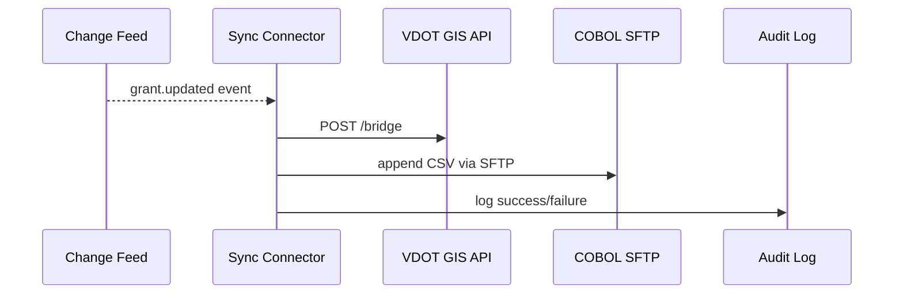

# Chapter 15: External System Sync Connector
*(A friendly sequel to [Human-in-the-Loop (HITL) Workflow](14_human_in_the_loop__hitl__workflow_.md))*  

---

## 1. Why Do We Need a “1-Minute Courier” Between Systems?

Imagine **Virginia’s Department of Transportation (VDOT)**.  
In HMS-DEV they maintain a *Bridge-Repair Grant* workflow.  
Every morning at **9 a.m.** the AI agent reallocates funds based on overnight sensor data.  

BUT … three external tools must see the change or chaos follows:

1. **Statewide GIS** map that colors bridges red / yellow / green.  
2. A **COBOL** mainframe that issues vendor payments.  
3. A **Scheduling** SaaS where field crews accept tasks.

If any tool lags behind, crews drive to the wrong bridge, payments misfire, and citizens tweet pictures of potholes at noon.

**External System Sync Connector (ESSC)** is the platform’s **1-minute courier**:

* Listens to change feeds in HMS-DEV.  
* Transforms data to each partner’s “dialect.”  
* Delivers updates within 60 seconds—and logs proof.

Think “FedEx® for data packages,” but inside the .gov network.

---

## 2. Key Concepts (Plain-English)

| Term | Beginner Explanation |
|------|----------------------|
| **Change Feed** | A stream of “something changed” events (e.g., `grant.updated`). |
| **Sync Recipe** | A YAML file that says *what* to copy, *where*, and *how often*. |
| **Adapter** | A small plug that speaks one external system’s language (REST, SFTP, flat-file, etc.). |
| **Idempotence** | Fancy word for “safe to replay”; the same update can run twice without double-paying money. |
| **Checkpoint** | A saved bookmark so the connector never re-reads the same event after a restart. |

---

## 3. Five-Minute Walk-Through  
### Use Case: Push Grant Updates to VDOT’s GIS & COBOL

### 3.1 Describe the Sync Recipe (YAML, 18 lines)

```yaml
# file: sync/bridge_grant.yaml
id: vdot.bridge_grant.sync
source:
  feed: grants.bridge_repair.updated
  fields: [grant_id, status, amount_usd, lat, lon]
targets:
  - name: vdot_gis
    adapter: rest
    url:  https://gis.vdot.gov/api/bridge
    auth: api_key
  - name: cobol_finance
    adapter: sftp
    host: finance.state.vt.gov
    path: /inbox/grants_{YYYYMMDD}.csv
    format: csv
schedule: every 60s
retries: 3
```

Explanation (plain words):

* Listen to **`grants.bridge_repair.updated`** feed.  
* Every 60 seconds send JSON to GIS **and** append a CSV line for COBOL.  
* Try up to 3 times if a target is down.

Apply it:

```bash
hms sync apply sync/bridge_grant.yaml
```

CLI shows:

```
✓ Sync recipe vdot.bridge_grant.sync enabled  (next run in 00:01:00)
```

### 3.2 See It Work (Simulate a Grant Change)

```bash
# Fire a fake event
hms ppe event publish grants.bridge_repair.updated \
  --data '{"grant_id":"GR-42","status":"Approved",
           "amount_usd":125000,"lat":37.5,"lon":-78.4}'
```

Within a minute:

* GIS API responds `200 OK`.  
* `grants_20240430.csv` appears on the COBOL server with one new row.  
* An audit line hits the Observability dashboard:  
  `sync.success.vdot.bridge_grant 1`

---

## 4. What Happens Behind the Curtain?



Five players—easy to picture!

---

## 5. Peeking Inside the Code (All <20 Lines)

### 5.1 Core Loop (Python, 19 lines)

```python
# file: essc/worker.py
from adapters import get_adapter
from feed import read_events, checkpoint

def run(recipe):
    while True:
        for ev in read_events(recipe['source'], checkpoint.load()):
            for tgt in recipe['targets']:
                adapter = get_adapter(tgt['adapter'])
                try:
                    adapter.send(ev, tgt)     # <12 C total lines below!
                    log('success', ev['grant_id'], tgt['name'])
                except Exception as e:
                    log('fail', ev['grant_id'], tgt['name'], str(e))
            checkpoint.save(ev['id'])
        sleep(recipe['schedule'].seconds)
```

Explanation:

1. Reads events newer than the last checkpoint.  
2. For each target, grabs the matching adapter and calls `send`.  
3. Logs outcome, then saves bookmark.

### 5.2 REST Adapter (Go, 12 lines)

```go
func SendREST(ev Event, cfg Target) error {
  body, _ := json.Marshal(ev.Data)
  req, _ := http.NewRequest("POST", cfg.URL, bytes.NewBuffer(body))
  req.Header.Set("X-API-Key", os.Getenv("GIS_KEY"))
  resp, err := http.DefaultClient.Do(req)
  if err != nil || resp.StatusCode >= 300 {
     return fmt.Errorf("REST fail: %v", err)
  }
  return nil
}
```

### 5.3 SFTP Adapter (Node.js, 14 lines)

```js
export async function sendSFTP(ev, cfg) {
  const row = `${ev.data.grant_id},${ev.data.amount_usd}\n`;
  const conn = await sftp.connect({ host: cfg.host, user:'sync', key:'key.pem'});
  const remote = cfg.path.replace('{YYYYMMDD}', today());
  await conn.append(row, remote);      // idempotent append
  await conn.end();
}
```

Each adapter stays tiny—swap in new ones as partners evolve.

---

## 6. How ESSC Uses Other HMS Layers

| Layer | Role in Sync |
|-------|--------------|
| [Governance Layer](03_governance_layer__hms_gov__.md) | Policies may forbid sending PII to a non-U.S. host—ESSC consults before each push. |
| [Data Privacy & Compliance](09_data_privacy___compliance_layer_.md) | Tokenizes sensitive fields if the target is classified as “external.” |
| [Observability & Metrics Pipeline](13_observability___metrics_pipeline_.md) | Streams `sync.success.*` and `sync.fail.*` metrics & traces. |
| [Policy & Process Engine](04_policy___process_engine_.md) | Emits the change feed events ESSC listens to. |
| [Human-in-the-Loop Workflow](14_human_in_the_loop__hitl__workflow_.md) | On repeated failures ESSC opens a HITL task for a human to investigate. |

---

## 7. Quick-Start Checklist

1. `pip install hms-sync`  
2. Draft a **Sync Recipe YAML** with `source`, `targets`, and `schedule`.  
3. `hms sync apply <file>` – enables the connector.  
4. Set environment secrets (`GIS_KEY`, SFTP keys, etc.).  
5. Watch `sync.*` metrics on the dashboard; add alert rules if needed.

You now have a 1-minute courier bridging HMS-DEV with any legacy or partner system—no more manual spreadsheets!

---

## 8. Beginner FAQ

**Q: What if an external system is down for hours?**  
ESSC backs off with exponential retries and raises a HITL ticket after the third failure.

**Q: Does it guarantee “exactly once” delivery?**  
Practically yes—events include unique IDs, and adapters must be idempotent. Replays overwrite or ignore duplicates.

**Q: Can I transform field names?**  
Sure. Add `map:` under the target:

```yaml
map: { grant_id: "id", amount_usd: "amt" }
```

**Q: How secure is SFTP?**  
Keys live in HMS secret storage; ESSC only loads them at runtime. Governance can enforce FIPS-validated ciphers.

---

## 9. Summary

In this final chapter you learned:

• The **External System Sync Connector** keeps third-party tools—GIS, COBOL, SaaS—in lock-step with HMS-DEV.  
• You wrote a 1-page YAML recipe, fired a test event, and watched data land in two very different systems.  
• Under the hood: change feed → adapter → audit log, all in <20 lines of code.  
• ESSC respects Governance, Privacy, Observability, Policy Engine, and HITL rules automatically.

Congratulations—you now possess the full toolkit to build, govern, observe, and **synchronize** modern government services!

---

Generated by [AI Codebase Knowledge Builder](https://github.com/The-Pocket/Tutorial-Codebase-Knowledge)