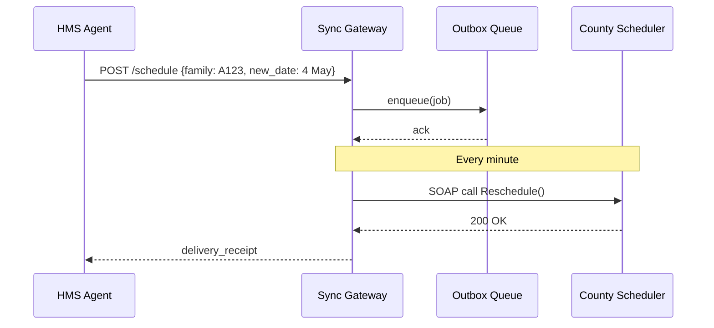

# Chapter 15: External System Sync Gateway (Inter-Agency Integration)
[← Back to Chapter 14: Agent Exchange Bus (HMS-A2A)](14_agent_exchange_bus__hms_a2a__.md)

---

## 1. Why Do We Need a “Sync Gateway”?

True story, simplified:

> An **HMS-CDF agent** at the Office of Refugee Resettlement (ORR) schedules medical screenings for 120 Afghan families.  
> The screening dates actually live in a **legacy scheduler** run by the local health department (built in 2003!).  
> If ORR’s AI reschedules a family but the county calendar never hears about it, doctors wait in empty rooms and refugees miss care.

The **External System Sync Gateway** is the diplomatic courier that:

1. Converts HMS events into the strange dialect spoken by *any* legacy API (CSV via SFTP? SOAP? you name it).  
2. Queues the message until the partner system is awake.  
3. Confirms delivery—or retries, escalates, and logs the failure.

Without this courier, modern AI can only help *inside* HMS-CDF.  With it, every county, state, or federal system stays in lock-step.

---

## 2. Central Use-Case – “ORR ↔ County Scheduler”



Outcome: the doctor’s calendar updates in seconds, ORR’s dashboard shows a green checkmark, and an auditor sees every hop.

---

## 3. Key Concepts (Beginner-Friendly)

| Piece | Quick Analogy | What It Does |
|-------|---------------|--------------|
| Connector | Language interpreter | Knows the external system’s protocol (REST, SOAP, CSV). |
| Outbox Queue | Airport cargo hold | Stores jobs until the next flight. |
| Delivery Receipt | Certified-mail slip | Carries status = `sent`, `failed`, or `retrying`. |
| Retry Policy | Alarm clock | Wakes the courier every *n* minutes until success. |
| Dead Letter Box | Lost-and-found | Holds jobs that exceeded retry limit for human review. |

---

## 4. Using the Gateway in Three Lines

```python
# file: orr_reschedule.py  (15 lines)
from syncgw import Gateway, Job

gw = Gateway("county_scheduler")    # choose a connector

job = Job(topic="reschedule",
          payload={"family":"A123", "new_date":"2024-05-04"})

receipt = gw.send(job)
print("Status:", receipt.state)     # PENDING → SENT/FAILED
```

Explanation  
1. `Gateway("county_scheduler")` loads the right connector.  
2. `send()` stores the job in the local Outbox and returns a **PENDING** receipt.  
3. A background worker will push it to the county SOAP endpoint and update the receipt.

---

## 5. What Happens Behind the Curtain?

```mermaid
flowchart LR
    A[Your Code] -->|send()| O(Outbox Queue)
    O --> W[Worker<br/>every 1 min]
    W --> C[Connector<br/>SOAP/CSV]
    C -->|success| R(Update receipt)
    C -->|error|  O
    O -->|>3 fails| D[Dead Letter Box]
```

Only **four** moving parts; easy to debug and monitor.

---

## 6. Inside the Code (All Snippets ≤ 20 Lines)

### 6.1 `Job` & `Receipt`

```python
# file: syncgw/core.py
import uuid, time, enum

class State(enum.Enum): PENDING='P', SENT='S', FAILED='F'

class Job:
    def __init__(self, topic, payload):
        self.id = uuid.uuid4().hex
        self.topic = topic
        self.payload = payload
        self.state = State.PENDING
        self.attempts = 0
        self.ts = time.time()

class Receipt:
    def __init__(self, job): self.id, self.state = job.id, job.state
```

### 6.2 Outbox & Worker

```python
# file: syncgw/outbox.py
BOX = []                            # in-memory; real life → DB

def add(job): BOX.append(job); return job

def next_job():
    for j in BOX:
        if j.state==State.PENDING: return j
```

```python
# file: syncgw/worker.py
import time, syncgw.core as c, syncgw.outbox as ob, connectors

def loop():
    while True:
        j = ob.next_job()
        if not j: time.sleep(30); continue
        conn = connectors.get("county_scheduler")
        ok = conn.push(j.payload)
        j.attempts += 1
        j.state = c.State.SENT if ok else c.State.PENDING
        if j.attempts>3 and j.state!=c.State.SENT: j.state=c.State.FAILED
```

### 6.3 A Tiny SOAP Connector

```python
# file: connectors/county_scheduler.py
import requests, textwrap

URL = "https://county.gov/scheduler.wsdl"

def push(data):
    xml = textwrap.dedent(f"""
        <soap:Envelope>
          <Body>
            <Reschedule family="{data['family']}"
                        date="{data['new_date']}"/>
          </Body>
        </soap:Envelope>
    """)
    r = requests.post(URL, data=xml, timeout=10)
    return r.status_code==200
```

Connectors speak the partner’s dialect so your app never has to.

---

## 7. 60-Second Lab

1. Copy `syncgw/` and `connectors/` snippets into files.  
2. Run the sender:

```python
from syncgw import Gateway, Job
gw = Gateway("county_scheduler")
print( gw.send(Job("reschedule", {"family":"X1","new_date":"2024-05-10"})).state )
```

3. In another shell start the worker loop:

```python
from syncgw.worker import loop
loop()          # Ctrl-C to stop after you see “SENT”
```

4. Observe console logs: first **PENDING**, then **SENT**.  
5. Temporarily unplug internet or change `URL` to force retries; after 3 attempts the job moves to **FAILED** (dead-letter).

---

## 8. How the Gateway Integrates with Other HMS Layers

| Layer | Interaction |
|-------|-------------|
| [Activity Orchestrator (HMS-ACT)](13_activity_orchestrator__hms_act__.md) | Emits `external.sent` or `external.failed` events when a receipt updates, so workflows can continue or escalate. |
| [Compliance Guardrail Framework (HMS-ESQ)](05_compliance_guardrail_framework__hms_esq__.md) | Scans every payload before it leaves—PII or export-restricted data is blocked. |
| [Human-in-the-Loop Oversight](02_human_in_the_loop__hitl__oversight_mechanism_.md) | A **FAILED** job drops into the HITL queue for manual intervention. |
| [System Observability & Ops Center](19_system_observability___ops_center__hms_ops__.md) | Gateway publishes metrics: queue length, retry rate, partner uptime. |

---

## 9. Cheat-Sheet

| Need… | Call / Setting |
|-------|----------------|
| Send data to legacy REST API | `Gateway("rest_partner").send(Job(...))` |
| Custom retry (e.g., 10 tries) | `job.max_attempts = 10` before `send()` |
| Encrypt payload in transit | Implement `Connector.push()` with HTTPS; ESQ ensures TLS required. |
| Pause all jobs for partner X | `Gateway("X").pause()` (not shown in mini-code). |
| Inspect failed jobs | `gw.failed()` → list for HITL review. |

---

## 10. Recap & What’s Next

You learned:

* Why **real-time sync** with legacy or partner systems is mission-critical.  
* The five simple parts: **Connector, Outbox, Worker, Retry, Receipt**.  
* How to queue a job, run the worker, and watch it turn **PENDING → SENT**.  
* Where the Gateway plugs into Governance, Compliance, HITL, and Ops.

With external sync solved, it’s time to see how HMS-CDF’s *internal* micro-services talk to each other at high speed.  Continue to → [Chapter 16: Backend Service Mesh (HMS-SVC & APIs)](16_backend_service_mesh__hms_svc___apis__.md)

---

---

Generated by [AI Codebase Knowledge Builder](https://github.com/The-Pocket/Tutorial-Codebase-Knowledge)