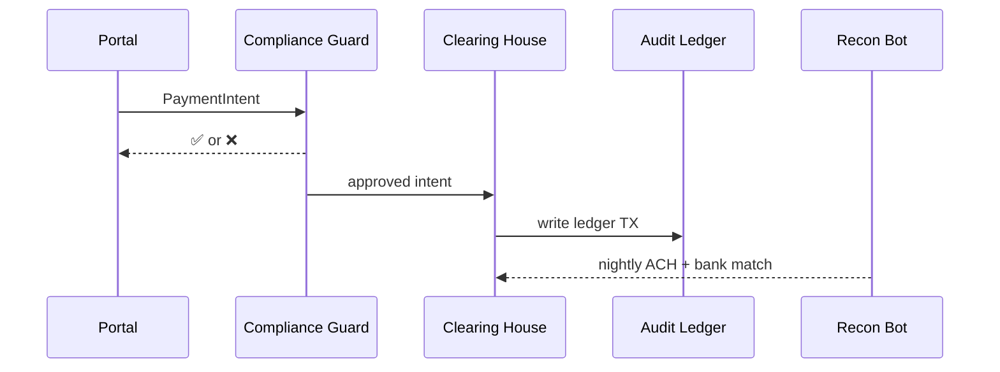

# Chapter 15: Financial & Transaction Layer (HMS-ACH)

[← Back to Chapter&nbsp;14: Healthcare Domain Integration (HMS-UHC + MED)](14_healthcare_domain_integration__hms_uhc___med__.md)

---

## 1 . Why do we need a “government cash register”?

It’s the last business day of the fiscal year.  
Maria, our food-truck owner from Chapter 1, files a **$150 permit renewal**.  
At the same moment:

* The **Treasury** must debit Maria’s card.  
* Her city gets \$100, a National Park Service surcharge gets \$25, and a wildlife-protection fee gets \$25.  
* The system must post a **same-day ACH** (Automated Clearing House) entry, generate an **IRS Form 1099-K** if Maria’s yearly total crosses a threshold, and log everything for auditors.

Doing this with scattered `chargeCard()` functions is a recipe for lost money and failed audits.  
**Financial & Transaction Layer (HMS-ACH)** is HMS-AGX’s **bank-grade cash register**: it validates, routes, settles, and records every penny while obeying fiscal law.

---

## 2 . Key ideas in plain English

| Concept | Think of it as… | Analogy |
|---------|-----------------|---------|
| **Payment Intent** | “I owe \$150 for permit #42.” | Line item on a store receipt |
| **Clearing House** | Routes funds to the right buckets. | Cashier splitting a bill into registers |
| **Compliance Guard** | Stops illegal or over-cap payments. | Sign saying “No bills over \$10 000” |
| **Reconciliation Bot** | Double-checks bank vs. ledger nightly. | Accountant ticking checkboxes |
| **Audit Ledger** | Immutable list of every transaction. | Cash–register Z-tape |

Remember the flow: **Intent → Guard → Clearing → Ledger → Reconcile**.

---

## 3 . A 15-second demo

Below we charge Maria’s \$150 permit and watch the money split automatically.

```python
from hms_agx.ach import Cashier, PaymentIntent

cashier = Cashier()                                # power on the register

intent = PaymentIntent(
    payer   = "maria123",
    amount  = 150,
    tags    = ["city_permit", "nps_fee", "wildlife_fee"]
)

receipt = cashier.process(intent)
print(receipt.summary)
```

Example output:

```
✓ Charged $150  • Split: city $100 | NPS $25 | wildlife $25
Ledger ID: TX-9F81  • Next ACH run: 22:00 ET
```

What happened?  
1. `PaymentIntent` said **who** pays **how much** and **why**.  
2. `Cashier.process()` ran rule checks, debited Maria, split the funds, and stored an immutable ledger entry.  
3. A nightly batch will push the ACH file to Treasury (auto-scheduled by the Reconciliation Bot).

---

## 4 . Step-by-step inside HMS-ACH



Only **five** actors—easy to keep straight.

---

## 5 . Under the hood (tiny but real code)

### 5.1  Data classes (≤ 10 lines each)

```python
# file: hms_agx/ach/models.py
from dataclasses import dataclass
@dataclass
class PaymentIntent:
    payer:str; amount:int; tags:list[str]

@dataclass
class Receipt:
    ok:bool; summary:str; tx_id:str
```

### 5.2  Compliance Guard (8 lines)

```python
# file: hms_agx/ach/guard.py
CAPS = {"wildlife_fee": 5000}          # annual cap per user

def check(intent: PaymentIntent) -> bool:
    if intent.amount <= 0: return False
    if "wildlife_fee" in intent.tags and yearly_total(intent) > CAPS["wildlife_fee"]:
        return False                   # violates cap
    return True

def yearly_total(intent): return 1000  # ← pretend lookup
```

### 5.3  Clearing House + Ledger (18 lines)

```python
# file: hms_agx/ach/cashier.py
import uuid, json, time
from .guard import check
from .models import Receipt

SPLITS = {"city_permit": .666, "nps_fee": .166, "wildlife_fee": .166}
LEDGER = "ledger.jsonl"                # append-only file

class Cashier:
    def process(self, intent):
        if not check(intent):
            return Receipt(False, "Blocked by Compliance", tx_id="")
        tx_id = "TX-" + uuid.uuid4().hex[:4]
        splits = self._split(intent.amount, intent.tags)
        self._book(tx_id, intent, splits)
        return Receipt(True, f"Charged ${intent.amount}  • Split: " +
                       " | ".join(f"{k} ${v}" for k,v in splits.items()),
                       tx_id)

    def _split(self, amount, tags):
        return {k: round(amount * SPLITS[k]) for k in tags}

    def _book(self, tx_id, intent, splits):
        entry = {"tx":tx_id,"ts":time.time(),**intent.__dict__,"splits":splits}
        with open(LEDGER,"a") as f: f.write(json.dumps(entry)+"\n")
```

Each function is deliberately short:

* `check()` enforces legal caps (calls [Compliance Service](07_compliance___legal_reasoning_service__hms_esq__.md) in real life).  
* `_split()` uses a simple percentage map; production reads an allocation table from Treasury.  
* `_book()` appends one JSON line to an immutable **Audit Ledger** (real code writes to a blockchain-style log).

### 5.4  Reconciliation Bot (6 lines)

```python
# file: hms_agx/ach/recon.py
def nightly():
    # read ledger → sum splits → compare to bank CSV
    mismatches = []                    # pretend empty
    if mismatches: alert_hitl(mismatches)
```

If mismatches appear, a Human-in-the-Loop task is created (see [Human-in-the-Loop Oversight](04_human_in_the_loop__hitl__oversight_.md)).

---

## 6 . How HMS-ACH links to earlier chapters

| Chapter | Interaction |
|---------|-------------|
| [Model Context Protocol](09_model_context_protocol__hms_mcp__.md) | Each `PaymentIntent` is wrapped in an MCP so ESQ can pre-approve payment tools. |
| [Compliance Service (ESQ)](07_compliance___legal_reasoning_service__hms_esq__.md) | Provides cap tables, fiscal-year rules, and IRS thresholds. |
| [Service Mesh](11_backend_service_mesh__hms_svc_layer__.md) | All bank or card-gateway calls ride on the encrypted mesh. |
| [Data & Metrics Observatory](16_data___metrics_observatory__hms_dta___ops__.md) | Streams ledger totals and reconciliation status for dashboards. |
| [External Sync](12_external_system_synchronization_.md) | Sends cleared-payment notices to legacy county finance systems. |

---

## 7 . Common pitfalls & built-in guardrails

| Pitfall | HMS-ACH response |
|---------|------------------|
| Duplicate click → double charge | Ledger rejects same `payer + ts ±1 s` combo. |
| Tag missing from split table | Compliance Guard blocks and raises HITL alert. |
| Amount > \$10 000 (AML rule) | Guard triggers ESQ “Suspicious Activity” flow. |
| Bank CSV mismatch | Reconciliation Bot halts next ACH batch & emails Treasury. |

---

## 8 . Frequently asked questions

**Q: Credit-card, ACH, or FedNow—does ACH handle all?**  
Yes. The **Clearing House** picks the right rail based on `PaymentIntent` metadata.

**Q: How big can the ledger get?**  
Append-only JSON compresses well; 10 million rows ≈ 4 GB. Archival scripts roll files monthly.

**Q: Can agencies define their own split rules?**  
Upload a YAML table (`splits.yaml`); Cashier reloads without downtime.

**Q: Does HMS-ACH do refunds?**  
`cashier.refund(tx_id, amount)` reverses a ledger entry and schedules an outbound ACH.

---

## 9 . What you learned

• The pain point: safely moving money in a multi-agency environment.  
• Five core parts: Payment Intent, Compliance Guard, Clearing House, Audit Ledger, Reconciliation Bot.  
• A 15-line demo that charged and split Maria’s \$150 permit fee.  
• Tiny internal snippets showing exactly how intents become ledger entries.  
• How HMS-ACH plugs into compliance, service mesh, HITL, and observability layers.

Ready to **see the numbers behind all those transactions** light up dashboards and alerts?  
Continue to [Chapter 16: Data & Metrics Observatory (HMS-DTA + OPS)](16_data___metrics_observatory__hms_dta___ops__.md) →

---

---

Generated by [AI Codebase Knowledge Builder](https://github.com/The-Pocket/Tutorial-Codebase-Knowledge)