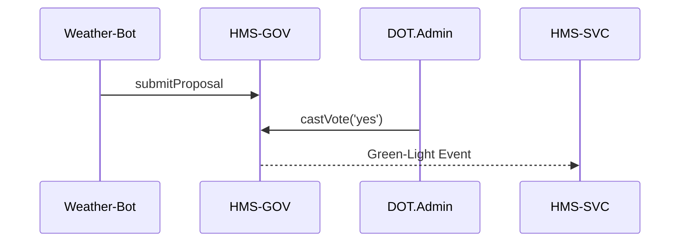

# Chapter 15: Governance Layer (HMS-GOV)
*(The “city-hall” web console where humans stay firmly above the robots)*  

[← Back to Chapter 14: Policy Deployment Pipeline (HMS-SVC)](14_policy_deployment_pipeline__backend_api___hms_svc__.md)

---

## 1 • Why Do We Need HMS-GOV?

Imagine the Department of Transportation (DOT) wants to let an **“Autonomous Vehicle Route-Planner Bot”** recommend which interstate lanes stay open during a blizzard.  
Great idea—until:

1. The National Weather Service objects that the model ignores ice thickness data.  
2. The State of Wyoming wants an *override button* if cattle must cross the road.  
3. Congress asks, *“Who signed off on this?”*

Without a single **governance console**, approvals live in Slack, vetoes in e-mail, and audit trails in mystery PDFs.  
Citizens get confused, and agencies lawyer-up.

**HMS-GOV** is the browser-based **city-hall** that puts every decision on one screen:

* Dashboards – see what AIs propose.  
* Approve / Veto – one click, fully logged.  
* Override – emergency stop that ripples through all services.  

No code changes, no phone trees.

---

## 2 • Key Concepts (Town-Council Analogy)

| HMS-GOV Piece | Town-Council Analogy | Plain-English Role |
|---------------|---------------------|--------------------|
| **Proposal**  | Agenda item         | Something an AI or dev wants to publish (new policy, model, deployment). |
| **Docket**    | Meeting agenda list | Ordered queue of proposals waiting for action. |
| **Seat**      | Council member chair| A human role allowed to act (e.g., “EPA Chief”, “State Governor”). |
| **Vote**      | Raise hand          | Approve, veto, or abstain. |
| **Override**  | Emergency ordinance | Instant human command that bypasses automation. |
| **Ledger**    | Clerk’s minutes     | Immutable log stored in [HMS-DTA](06_central_data_repository__hms_dta__.md). |

Remember: *Proposals* sit in a *Docket*; people in *Seats* cast *Votes*; an *Override* can happen any time; everything lands in the *Ledger*.

---

## 3 • Your First Walk-Through  
*(Less than 5 minutes, all code blocks < 20 lines)*

### 3.1 Submit a Proposal (the bot or CI script does this)

```js
// weather-bot/propose.js
import { submitProposal } from 'hms-gov';

await submitProposal({
  id      : 'open-lanes-blizzard',
  title   : 'Close lanes I-80E / I-25S at 2am',
  detail  : 'Predicted ice > 6 mm.',
  tags    : ['safety', 'transport'],
  seatFor : ['DOT.Admin', 'WY.Gov'],      // who must vote
});
```

*Explanation* – One function drops a proposal into the **Docket** and alerts the required seats.

---

### 3.2 Review & Vote in the Browser Console  
*(simplified pseudo-JS to show the API behind the UI)*

```js
// console.js
import { listDocket, castVote } from 'hms-gov';

const items = await listDocket({ seat:'DOT.Admin' });
renderTable(items);                      // show in UI

// When user clicks “Approve”
castVote('open-lanes-blizzard', { seat:'DOT.Admin', vote:'yes' });
```

*Explanation* – `listDocket` fetches only proposals *your* seat can vote on. `castVote` records the decision.

---

### 3.3 Trigger an Emergency Override

```js
// governor-hotkey.js
import { override } from 'hms-gov';

override({
  id     : 'open-lanes-blizzard',
  seat   : 'WY.Gov',
  action : 'halt',        // halt / force / amend
  reason : 'Cattle drive scheduled at 3 am.'
});
```

*Explanation* – Overrides skip voting; they take effect instantly but still log a reason.

---

### 3.4 Observe the Ledger (read-only)

```js
// audit-viewer.js
import { getLedger } from 'hms-gov';

console.table(await getLedger('open-lanes-blizzard'));
```

Expected output:

| step       | seat       | action  | ts                |
|------------|----------- |---------|-------------------|
| proposal   | weather-bot| create  | 2024-01-08 18:02  |
| vote       | DOT.Admin  | yes     | 2024-01-08 18:10  |
| override   | WY.Gov     | halt    | 2024-01-08 18:12  |

---

## 4 • What Happens Behind the Curtain?

### 4.1 Step-by-Step (Plain English)

1. `submitProposal()` writes a record to the **Docket Store** in HMS-DTA.  
2. **Notifier** sends e-mail or Slack to required seats.  
3. Each call to `castVote()` appends a row in the **Ledger**; Docket status auto-updates.  
4. When all required seats vote “yes”, HMS-GOV fires a **Green-Light Event** consumed by:  
   • [HMS-SVC](14_policy_deployment_pipeline__backend_api___hms_svc__.md) to start deployment,  
   • [HITL](07_human_in_the_loop_oversight__hitl__.md) to close any review cases.  
5. If any seat votes “no” or an `override()` arrives with `halt`, HMS-GOV emits a **Red-Light Event** that stops downstream pipelines.  
6. Every action is written to the **Ledger** (append-only) and mirrored to the [Security & Compliance Engine](10_security___compliance_engine__hms_esq___hms_ops__.md).

### 4.2 Tiny Sequence Diagram (≤ 5 nodes)



---

## 5 • Inside HMS-GOV (Code-Light Peek)

### 5.1 Docket & Ledger (10 lines each)

```js
// gov/docket.js
const docket = new Map();               // id → proposal
export function add(p){ docket.set(p.id, {...p, status:'PENDING', votes:[]}); }
export function list(seat){
  return [...docket.values()]
          .filter(d => d.seatFor.includes(seat) && d.status==='PENDING');
}
```

```js
// gov/ledger.js
const ledger = [];                      // append-only
export function log(entry){ ledger.push({...entry, ts:Date.now()}); }
export function view(id){ return ledger.filter(e => e.id===id); }
```

*Explanation* – Two tiny JS maps show the essence: a current **Docket** and historical **Ledger**.

---

### 5.2 Vote Handler (≤ 15 lines)

```js
// gov/vote.js
import { log } from './ledger.js';
export function vote(id, {seat, vote}){
  const p = docket.get(id);
  p.votes.push({seat, vote});
  log({id, seat, action:'vote', value:vote});
  if (vote==='no')    return red(id);
  if (p.votes.filter(v=>v.vote==='yes').length === p.seatFor.length)
        green(id);
}

function green(id){ emit('green', id); docket.get(id).status='APPROVED'; }
function red(id)  { emit('red', id);   docket.get(id).status='REJECTED'; }
```

*Explanation* – If everyone says “yes” → green event; any “no” → red event. **emit()** is a tiny pub-sub bus.

---

### 5.3 Override Handler (≤ 12 lines)

```js
// gov/override.js
export function override({id, seat, action, reason}){
  log({id, seat, action:'override', value:action, reason});
  if (action==='halt') emit('red', id);
  if (action==='force') emit('green', id);
}
```

*Explanation* – Overrides are glorified events with higher priority.

---

## 6 • How HMS-GOV Integrates With Other Layers

| Need | HMS Layer Used |
|------|----------------|
| Store Docket & Ledger | [Central Data Repository](06_central_data_repository__hms_dta__.md) |
| Notify seats / partners | [External Integration Layer](09_external_integration_layer__hms_a2a__.md) connectors (e-mail, SMS). |
| Block or continue deployments | [Policy Deployment Pipeline](14_policy_deployment_pipeline__backend_api___hms_svc__.md) listens to **green/red** events. |
| Security & audit | [Security & Compliance Engine](10_security___compliance_engine__hms_esq___hms_ops__.md) ingests every Ledger row. |
| Emergency human intervention | [HITL](07_human_in_the_loop_oversight__hitl__.md) shows overrides in real-time. |

---

## 7 • Frequently Asked Questions

1. **Can a proposal expire?**  
   Yes—add `expires: 'P7D'` (ISO-8601). HMS-GOV auto-rejects after 7 days.

2. **What if seats disagree on quorum rules?**  
   Use `seatRules: 'majority' | 'unanimous' | 2` in the proposal.

3. **Can citizens watch proposals?**  
   Make them **public**; the console shows read-only status without voting buttons.

4. **Is the override button auditable?**  
   Absolutely—override rows include `reason`, `seat`, and timestamp; immutable in the Ledger.

5. **Multi-agency proposals?**  
   Add seats from multiple agencies (`'EPA.Admin'`, `'DOT.Admin'`). All must vote before green.

---

## 8 • Summary & What’s Next

You now know how **HMS-GOV**:

* Collects **Proposals** in a single **Docket**.  
* Lets authorized **Seats** **Vote**, **Veto**, or **Override** with one click.  
* Broadcasts **Green / Red-Light Events** that downstream layers obey automatically.  
* Records every move in an unchangeable **Ledger** for auditors and Congress alike.

In the final chapter we’ll see how all these mechanisms ladder up to a grand vision: a **Codified Democracy** where rules, rights, and algorithms live side-by-side in transparent code.

Onward to [Chapter 16: Codified Democracy Foundation (HMS-CDF)](16_codified_democracy_foundation__hms_cdf__.md) →

---

Generated by [AI Codebase Knowledge Builder](https://github.com/The-Pocket/Tutorial-Codebase-Knowledge)