# Chapter 15: Human-In-the-Loop (HITL) Override  

*(jumped in from [Model Context Protocol (HMS-MCP)](14_model_context_protocol__hms_mcp__.md))*  


---

## 1  Why Do We Need a “Red-Pen” Layer?  

Imagine the **Institute of Museum and Library Services (IMLS)** is using our AI
agent (**AGX**) to draft award letters for a new grant program.

1. AGX reads the application,  
2. chooses a “Congratulations!” template, and  
3. prepares to email the winner.

Just before the message goes out, an IMLS director notices the letter:

* incorrectly lists the **grant amount**, and  
* forgets the **Spanish translation** that Congress now requires.

She must be able to **stop, tweak, or reject** the AI recommendation **in seconds**—and the system must remember **who** changed **what**, **why**, and **when**.

That safety valve is the **Human-In-the-Loop (HITL) Override**.

---

## 2  Key Ideas in Plain English  

| Word / Icon | Think of it as… |
|-------------|-----------------|
| Override Ticket 📝 | A sticky note that says “Hold this AI action.” |
| Reviewer 👋 | The human with a red pen (director, manager, counsel). |
| Decision ✅/🛑 | Approve, edit‐then-approve, or reject entirely. |
| Audit Trail 📜 | Tamper-proof log: who, what, why, when. |
| Feedback Loop 🔄 | Dashboard & HR report that show override patterns. |

---

## 3  A 3-Minute Tour — From AI Suggestion to Human Decision  

### 3.1  AI makes a suggestion  

```python
# agx/grant_letter.py   (≤ 15 lines)
from hms_hitl import open_ticket

letter = AGX.compose(template="grant_winner", data=app_json)

# 🚧  send=False means “don’t email yet”
ticket = open_ticket(
    subject   = "Grant Letter Review",
    payload   = letter,
    send      = False,        # hold for HITL
    reviewers = ["imls.director@gov"]
)
print("🔖 Ticket #", ticket.id, "awaiting human review")
```

Explanation  
1. AGX drafts the letter but **does not** send it.  
2. `open_ticket()` creates an **Override Ticket** and assigns a reviewer.  

---

### 3.2  Reviewer edits & approves  

```python
# reviewer edits through GOV portal UI:
ticket.payload["amount"] = "$50,000"            # fix dollar figure
ticket.payload["lang"]   = "es"                 # add Spanish version
ticket.decision = "approve"
ticket.comment  = "Updated amount & bilingual."
ticket.save()
```

Result  
* The email now contains the correct data.  
* The ticket moves to **resolved** with decision **“approve”**.  

---

### 3.3  Notification & permanent log  

```python
# system auto-runs after save()
if ticket.decision == "approve":
    AGX.send(letter=ticket.payload)     # finally email
    AuditTrail.record(ticket)           # 📜 immutable row
```

The **Audit Trail** stores:

```json
{
  "ticket_id": 87,
  "actor": "imls.director@gov",
  "decision": "approve",
  "changes": { "amount": "+$10,000", "lang": "+es" },
  "timestamp": "2024-05-22T14:55Z"
}
```

---

## 4  What Happens Under the Hood?  

```mermaid
sequenceDiagram
    participant AGX as AI Agent
    participant HITL as HITL Service
    participant REV as Reviewer
    participant API as HMS-API
    participant AUD as Audit Log
    AGX->>HITL: open_ticket()
    HITL-->>REV: “Please review” email
    REV-->>HITL: approve / edit / reject
    HITL-->>AGX: callback(decision)
    HITL->>AUD: write log row
```



Only **five participants**—easy to follow!

---

## 5  Inside the Codebase — File Tour  

```
hms-hitl/
 ├─ Ticket.php          # ORM model
 ├─ ReviewerGate.php    # auth & permission checks
 ├─ Callbacks.php       # notify AGX / other callers
 ├─ AuditTrail.php      # append-only log writer
 ├─ Dashboard.vue       # transparency dashboard (MFE)
 └─ Policies/           # YAML rules (e.g., 48-hour SLA)
```

### 5.1  Ticket Model (≤ 15 lines)

```php
// Ticket.php
class Ticket extends Model {
    protected $fillable = ['subject','payload','state',
                           'decision','comment'];

    protected static function booted() {
        static::saving(function ($t) {
            AuditTrail::snapshot($t);     // diff-on-every-save
        });
    }
}
```

### 5.2  Reviewer Permission Check (≤ 10 lines)

```php
// ReviewerGate.php
function canReview(User $u, Ticket $t): bool {
    return in_array($u->email, $t->reviewers)
        || $u->hasRole('HITL_SUPER');
}
```

---

## 6  Using HITL in Your Own Feature (Step-by-Step)  

1. **Draft anything risky** (payment, letter, policy edit).  
   ```python
   ticket = open_ticket(subject="ACH Payment",
                        payload=payment_json,
                        reviewers=["treasury.cfo@gov"])
   ```
2. **Wait for callback** (webhook or polling).  
   ```python
   if ticket.decision == "approve":
       HMS_ACH.dispatch(payment_json)
   elif ticket.decision == "reject":
       notify_user("Payment rejected: " + ticket.comment)
   ```
3. **Sleep well**—a human eye always signs off.

---

## 7  Common Gotchas for Beginners  

| Oops! | Why it happens | How to avoid |
|-------|----------------|--------------|
| Ticket never resolves | Reviewer email typo | Use group aliases like `budget.team@gov` |
| No audit entry | You bypassed `Ticket.save()` | **Always** call `save()` not `update()` |
| Reviewer stuck on PTO | SLA breaches | Add a **backup reviewer** list |
| “Shadow approvals” | Direct DB edits | AuditTrail uses **append-only** table—tampering obvious |

---

## 8  Government Analogy Cheat-Sheet  

HITL Item             | Real-World Counterpart
----------------------|------------------------
Override Ticket       | A folder routed to the department head for sign-off  
Reviewer              | The manager marking “Approved/Denied” in red ink  
Decision              | The stamp placed on the folder  
Audit Trail           | Clerk writing the decision into the agency ledger  
Feedback Dashboard    | Monthly performance memo to OMB HR  

---

## 9  Mini-Exercise  

1. Spin up the example docker compose:  
   ```bash
   git clone hms-hitl-demo && cd hms-hitl-demo
   docker compose up
   ```  
2. Call the scaffold endpoint:  
   ```bash
   curl -X POST localhost:8001/demo/email_draft
   ```  
   – Note the returned **ticket_id**.  
3. Open `http://localhost:8080/admin/hitl` → approve the draft.  
4. Check `docker logs hitl` to see the **Audit Trail row**.  
5. Try rejecting the next draft and verify the email is **never sent**.

---

## 10  What Did We Learn?  

* HITL Override is the **last red-pen checkpoint** before an AI action goes live.  
* It records **who overrode what and why** for transparency dashboards and performance reviews.  
* Integrates smoothly with AGX, Governance, ACH, or any other service with only a few lines of code.  

Ready to see how the lawyers fit into all of this?  
March on to [Legal Reasoning Service (HMS-ESQ)](16_legal_reasoning_service__hms_esq__.md).

---

Generated by [AI Codebase Knowledge Builder](https://github.com/The-Pocket/Tutorial-Codebase-Knowledge)