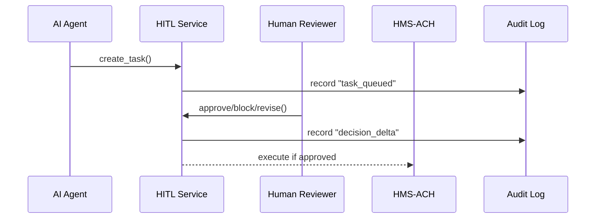

# Chapter 15: Human-in-the-Loop Oversight (HITL)
*(continuing from [Chapter 14: Agent Lifecycle Management (HMS-ACT)](14_agent_lifecycle_management__hms_act__.md))*  

---

## 1. Why Do We Need HITL?

Picture the **Department of Education’s Office for Civil Rights (OCR)**.  
An AI agent has just scanned 10 000 student-loan complaints and auto-drafted refund letters worth \$5 million.

Sounds great—until you ask:

* Did the agent apply the correct statute to every borrower?  
* Is a \$5 million debit within the day’s budget cap?  
* Who takes responsibility if even **one** letter is wrong?

Just as a **judge signs a search warrant generated by software**, HITL puts a credentialed human at the last mile:

1. AI proposes an action (`refund $2 500 to borrower #982`),  
2. A human reviewer sees the **diff** (what will change),  
3. Clicks **Approve**, **Revise**, or **Block**,  
4. HITL stamps the decision with a timestamp and checksum.  

Every decision delta lives in an immutable log so Inspectors General can later prove **no algorithm ran amok**.

---

## 2. Key Concepts (Plain English)

| Term | Friendly Description |
|------|----------------------|
| Task | A single AI-proposed action that needs sign-off (`refund`, `policy change`, `large ACH batch`). |
| Diff View | “Before vs. After” screen the reviewer sees. |
| Reviewer | A human with a role badge (Finance Officer, FOIA Counsel, etc.). |
| Chain-of-Custody | The unbroken timeline of who touched the task. |
| Decision Delta | JSON that shows exactly what the reviewer changed (even one comma). |
| IG Replay | Tool that re-plays the log line-by-line for auditors. |

---

## 3. Five-Minute Walking Tour  
*Use case: approve or block a \$2 500 student-loan refund proposed by an AI agent.*

### 3.1. Install & Spin Up a Tiny HITL Service

```bash
pip install hms-hitl
hms-hitl start --port 9100   # launches in-memory demo server
```

### 3.2. AI Agent Creates a Task

```python
# file: agent_refund.py   (≤ 15 lines)
import requests, json, uuid

task = {
    "id": str(uuid.uuid4()),
    "summary": "Refund $2 500 to borrower 982",
    "before": {"balance": -2500},
    "after":  {"balance":    0},
    "created_by": "loan_agent@1.4.2"
}
requests.post("http://localhost:9100/tasks", json=task)
print("Task queued for human review!")
```

Explanation  
• The AI only **queues** the action; nothing executes yet.  
• `before/after` forms the *diff* the human will see.

### 3.3. Human Reviewer Approves

```python
# file: reviewer_cli.py   (≤ 20 lines)
import requests, pprint, os

TID = requests.get("http://localhost:9100/tasks/pending").json()[0]["id"]

review = {
    "reviewer": os.getenv("USER", "alice@ed.gov"),
    "action":   "approve",
    "comment":  "Statute 20 U.S.C. §1087 clear ✅"
}
requests.post(f"http://localhost:9100/tasks/{TID}/decision", json=review)

print("Approved! Money will move via HMS-ACH.")
```

Console:

```
✓ Decision logged  (delta#23, ts=2024-05-17T14:21Z)
```

Now and only now does HITL call [HMS-ACH](04_payment___clearinghouse_engine__hms_ach__.md) to send the refund.

---

## 4. What Happens Under the Hood?



• **No task** reaches ACH until hitl logs a matching **approved** delta.  
• Every arrow also writes to `audit.log` with a SHA-256 hash of the payload.

---

## 5. Inside HITL (Gentle Code Peek)

### 5.1. Tiny Router (FastAPI, 18 lines)

```python
# hms_hitl/api.py
from fastapi import FastAPI, HTTPException
from .store import DB, audit

app = FastAPI()

@app.post("/tasks")
def new_task(t: DB.Task):
    DB.tasks[t.id] = t
    audit("task_queued", t.dict())
    return {"ok": True}

@app.get("/tasks/pending")
def pending():
    return [t for t in DB.tasks.values() if t.status == "queued"]

@app.post("/tasks/{tid}/decision")
def decide(tid: str, d: DB.Decision):
    task = DB.tasks.get(tid) or HTTPException(404)
    task.status = d.action
    task.decision = d
    audit("decision_delta", {"tid": tid, **d.dict()})
    if d.action == "approve":
        from hms_ach import refund          # import-on-demand
        refund(amount=2500, customer_id=task.summary.split()[-1])
    return {"ok": True}
```

*Explanation*  
• `audit()` appends one JSON line per event.  
• Business logic fits in one screen—easy to peer-review.

### 5.2. The Audit Helper (10 lines)

```python
# hms_hitl/audit.py
import json, time, hashlib
def audit(event, payload):
    blob = {"ts": time.time(), "event": event, "data": payload}
    blob["checksum"] = hashlib.sha256(json.dumps(blob["data"]).encode()).hexdigest()
    open("audit.log", "a").write(json.dumps(blob)+"\n")
```

*Checkpoints*  
• **Checksum** guarantees tamper-proofness.  
• Log file is later ingested by [HMS-OPS](10_operational_monitoring___telemetry__hms_ops__.md) and stored in [HMS-DTA](09_central_data_repository__hms_dta__.md).

### 5.3. IG Replay (6 lines)

```python
# hms_hitl/replay.py
import json
def replay(tid):
    for line in open("audit.log"):
        blob = json.loads(line)
        if blob["data"].get("tid") == tid:
            print(blob)
```

Auditors run `replay("123-tid")` to view every hop.

---

## 6. Where HITL Connects to the HMS World

| HITL Step | HMS Friend |
|-----------|------------|
| Executes approved tasks | [Payment & Clearinghouse (HMS-ACH)](04_payment___clearinghouse_engine__hms_ach__.md) or other micro-services |
| Logs metrics | [Operational Monitoring & Telemetry (HMS-OPS)](10_operational_monitoring___telemetry__hms_ops__.md) |
| Stores audit files | [Central Data Repository (HMS-DTA)](09_central_data_repository__hms_dta__.md) |
| Reviewer roles | Managed via [Governance Layer (HMS-GOV)](01_governance_layer__hms_gov__.md) |

---

## 7. Frequently Asked Questions

**Q1: Can reviewers edit the AI proposal instead of pure approve/block?**  
Yes—`action="revise"` stores a JSON patch in `decision_delta`. The patched task then flows downstream.

**Q2: What if no reviewer acts in time?**  
Define a `timeout` on each task. On expiry HITL auto-blocks and alerts [HMS-OPS](10_operational_monitoring___telemetry__hms_ops__.md).

**Q3: How granular are roles?**  
Up to you—Finance reviewers can’t approve policy changes, FOIA Counsel can’t release payments.  
Roles live in HMS-GOV’s RBAC table.

**Q4: Does HITL slow everything down?**  
Only for *irreversible* actions. Routine “read-only” AI steps skip HITL but still log to the audit file.

---

## 8. Mini Challenge (Optional)

1. Change reviewer `action` to `"revise"` and attach `{"after":{"balance":50}}` (partial refund).  
2. Re-run the agent & reviewer scripts.  
3. Open `audit.log`—find a new `decision_delta` that shows *exactly* what you changed.

---

## 9. What We Learned

• HITL guarantees a **credentialed human** can **approve, revise, or block** any AI action before it touches citizens or money.  
• Every action records a **decision delta, timestamp, and checksum**, creating an iron-clad chain-of-custody.  
• Inspectors General and FOIA officers can **replay** events with one command.  

Ready to share, buy, or retire approved agents across agencies?  
Hop to [Chapter 16: Agent Marketplace (HMS-MKT)](16_agent_marketplace__hms_mkt__.md).

---

Generated by [AI Codebase Knowledge Builder](https://github.com/The-Pocket/Tutorial-Codebase-Knowledge)