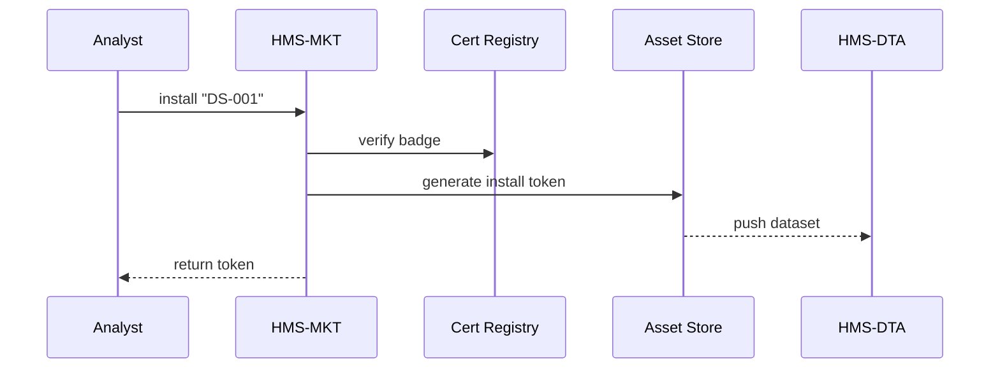

# Chapter 15: Marketplace & Discovery Layer (HMS-MKT)

*(linked from [Intent-Driven Navigation & Journey Engine](14_intent_driven_navigation___journey_engine_.md))*  

---

## 1. Why Do We Need an “Internal App Store”?

Picture the **Economic Research Service (ERS)** at the U.S. Department of Agriculture.  
An analyst is prototyping a *food-price forecasting* agent. She suddenly needs:

1. The latest **“County-Level Crop-Yield 2023”** dataset.  
2. A **time-series anomaly-detection model** already certified for federal use.  
3. A small **visual-charting tile** that can embed in the ERS portal.

If she has to email five other bureaus, wait for SFTP links, and copy/paste code, the pilot drags on for weeks.

**Marketplace & Discovery Layer (HMS-MKT)** works like an **internal app store**:

* Search: “crop yield” → see every certified asset.  
* One-click **Install** → the dataset appears in [HMS-DTA](07_central_data_repository__hms_dta__.md), the model in [HMS-AGT](09_agent_framework__hms_agt____extensions__hms_agx__.md), the tile in [HMS-MFE](13_micro_frontend_interface__hms_mfe__.md).  
* Billing / cost tracking handled automatically via [HMS-ACH](08_financial_transaction_hub__hms_ach__.md).

Result: ideas move at the speed of curiosity, not paperwork.

---

## 2. Key Concepts (Plain-English Cheat-Sheet)

| Term | What It Really Means | Friendly Analogy |
|------|---------------------|------------------|
| Listing | One dataset, model, tile, or full agent on the shelf. | A single app in Apple’s App Store. |
| Certification Badge | “Cleared for Federal Use” stamp after security & legal review. | USDA Organic label on produce. |
| Version | Immutable snapshot of a listing. | v1.2.3 on your phone apps. |
| Dependency | One listing requires another (e.g., model needs a dataset). | App that can’t run without iOS 15. |
| Install Token | Short-lived ticket that grants your service permission to pull the asset. | Digital receipt after purchase. |
| Cost Center | Budget code to which usage fees are booked. | “Travel – FY24 – Project 301.” |

---

## 3. A 5-Minute Walk-Through  
### Goal: Find & install a *crop-yield dataset* and an *anomaly model*.

#### 3.1  Search the Marketplace (7 lines)

```python
# file: search_assets.py
from hms_mkt_client import search

hits = search("crop yield 2023")
for h in hits:
    print(h["id"], h["title"], h["badge"])
```

Sample console:

```
DS-001 County-Level Crop-Yield 2023 ✅ Certified
DS-002 State-Level Crop-Yield 2023 🕒 In Review
```

Explanation:  
`search(query)` returns a list of listings with their **ID**, **title**, and a quick **badge** so you avoid un-certified items.

---

#### 3.2  Install the Certified Dataset (10 lines)

```python
# file: install_dataset.py
from hms_mkt_client import install

token = install(
    listing_id = "DS-001",
    cost_center = "ERS_R&D_2024"
)
print("Install token:", token)
```

What happened?

1. HMS-MKT checks the user’s role & budget.  
2. Reserves **$0.00** (free public dataset) in [HMS-ACH](08_financial_transaction_hub__hms_ach__.md).  
3. Returns an **install token** valid for 30 minutes.

---

#### 3.3  The Dataset Appears in HMS-DTA (Less than 15 lines)

```python
# file: verify_dta.py
from hms_dta_client import get_collection

rows = get_collection("crop_yield_2023", limit=3)
print(rows[0])
```

Output (truncated):

```json
{
  "county_fips": "01001",
  "corn_bushels_per_acre": 138,
  "soy_bushels_per_acre": 43
}
```

No manual ETL—the data is already in place!

---

#### 3.4  Install a Pre-Built Model (≤ 15 lines)

```python
# file: install_model.py
from hms_mkt_client import install
from hms_agt import Agent

install("ML-042", cost_center="ERS_R&D_2024")   # anomaly detector

agent = Agent(persona={"name": "ERS_Forecaster"})
agent.add_skill("ML-042")                      # skill auto-registered
print(agent.handle("detect_anomaly", {"series": [...] }))
```

Agent now uses the certified model with **zero** extra code.

---

## 4. What Happens Under the Hood?



Five actors, no clutter.

---

## 5. Peek at the Minimal Code

### 5.1  Public Client (`hms_mkt_client.py`, 18 lines)

```python
import requests, os
MKT = os.getenv("HMS_MKT_URL", "https://mkt.gov")

def search(q):
    return requests.get(f"{MKT}/search", params={"q": q}).json()

def install(listing_id, cost_center):
    body = {"listing_id": listing_id, "cost_center": cost_center}
    return requests.post(f"{MKT}/install", json=body).json()["token"]
```

Two helpers—**search** and **install**—cover 90 % of use cases.

---

### 5.2  Install Endpoint (`mkt/api.py`, 20 lines)

```python
from fastapi import FastAPI, HTTPException
from .store import push_to_target
app = FastAPI()

BADGES = {"DS-001": "certified", "ML-042": "certified"}

@app.post("/install")
def install(req: dict):
    if BADGES.get(req["listing_id"]) != "certified":
        raise HTTPException(403, "Not certified")
    token = f"TOK-{uuid4().hex[:6]}"
    push_to_target(req["listing_id"], req["cost_center"])
    return {"token": token}
```

Highlights:  
* Rejects un-certified listings with **one** dictionary lookup.  
* `push_to_target` copies the asset to HMS-DTA or AGT skill registry behind the scenes.

---

## 6. How HMS-MKT Cooperates with Other Layers

| Need | Layer |
|------|-------|
| Storage of installed datasets | [HMS-DTA](07_central_data_repository__hms_dta__.md) |
| Model plug-ins for agents | [HMS-AGT](09_agent_framework__hms_agt____extensions__hms_agx__.md) |
| UI tiles download | [HMS-MFE](13_micro_frontend_interface__hms_mfe__.md) |
| Billing & cost recovery | [HMS-ACH](08_financial_transaction_hub__hms_ach__.md) |
| Certification status | [HMS-ESQ](03_legal___compliance_reasoner__hms_esq__.md) for legal checks |

Everything is stitched with **install tokens** and **events**, so duplication is impossible.

---

## 7. Hands-On Mini-Lab (10 Minutes)

1. Clone the repo  
   ```bash
   git clone https://github.com/example/hms-nfo.git
   cd hms-nfo/examples/mkt_lab
   ```  
2. Start the mock marketplace  
   ```bash
   python -m mkt.mock_server
   ```  
3. Search and install  

   ```bash
   python search_assets.py
   python install_dataset.py
   python verify_dta.py      # confirm data is there
   ```  

4. Try installing the *uncertified* `DS-002` and watch the 403 error—safety first!

Congratulations—you just shopped in the government’s own app store.

---

## 8. Frequently Asked Questions

**Q1: Can agencies publish their own listings?**  
Yes—POST to `/publish` with a metadata JSON. HMS-MKT triggers automatic legal & security scans before a badge can be granted.

**Q2: How are *paid* assets handled?**  
`install()` reserves funds through [HMS-ACH](08_financial_transaction_hub__hms_ach__.md); recurring fees generate monthly ACH batches.

**Q3: What about version upgrades?**  
Use `install(listing_id="ML-042", version="2.0.1")`. Old versions remain frozen for reproducibility.

---

## 9. Recap

* **HMS-MKT** is the **internal marketplace** for datasets, models, tiles, and full agents.  
* Two simple client calls—`search()` and `install()`—bring certified assets into your project.  
* Integration with DTA, AGT, MFE, ACH, and ESQ makes installation safe, auditable, and budget-aware.  

Next, we’ll see how different **agencies** can **share data with each other**—even outside the marketplace—using secure pipes:  
[Inter-Agency Data Exchange (HMS-A2A)](16_inter_agency_data_exchange__hms_a2a__.md)  

---

---

Generated by [AI Codebase Knowledge Builder](https://github.com/The-Pocket/Tutorial-Codebase-Knowledge)