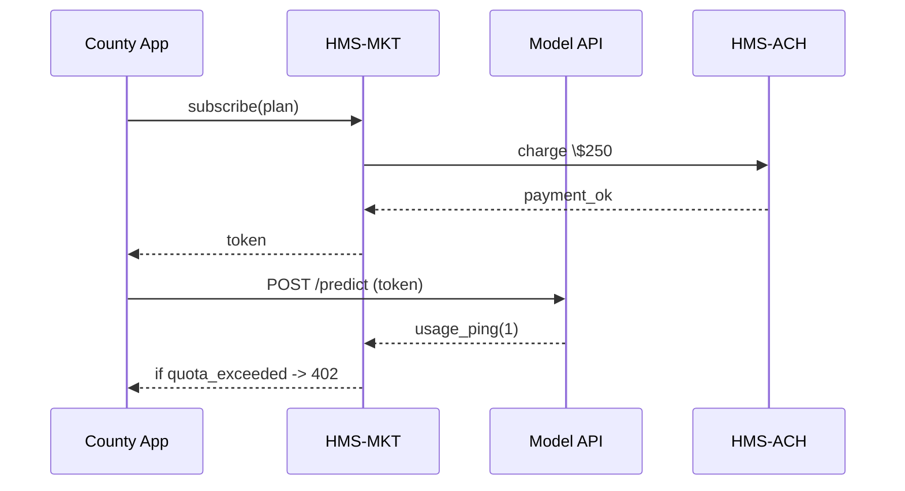

# Chapter 15: Marketplace & Discovery Service (HMS-MKT)

*(coming from [International Micro-Trade Analytics (HMS-MBL)](14_international_micro_trade_analytics__hms_mbl__.md))*  

---

## 1 · Why Does Government Need an “App Store”?

> One Monday morning the **Travis County Health Department** hears about a new  
> **CDC-certified “Early Outbreak Detector” model**.  
> They don’t want RFPs, FTP servers, or six-month contracts.  
> They just want to **click “Install”**, pay the \$250/month license, and start
> streaming alerts into their dashboard **today**.

HMS-MKT is that missing **App Store for agencies**.  
It lets any public entity:

1. **Publish** a dataset, API, or AI skill.  
2. **Set price, usage limits, and revocation rules**.  
3. **Subscribe** with one click and instantly receive an auth key.  
4. **Meter & pay** automatically through [Financial Transaction Core (HMS-ACH)](12_financial_transaction_core__hms_ach__.md).  
5. **Unsubscribe** or be revoked at any moment—no broken code, no security gaps.

Think of it as **Apple’s App Store, but for inter-agency data & AI services**.

---

## 2 · Key Concepts (Plain Words)

| Word | Beginner Analogy | Why It Matters |
|------|------------------|----------------|
| Listing | App Store page | Describes one dataset/API/skill |
| Plan | Phone data plan | Price + quota (e.g., 10 000 calls/mo) |
| Token | Movie ticket | Grants access until revoked |
| Meter | Gas pump counter | Counts every call for billing |
| Revocation Hook | Expire key fob | Cuts access instantly if needed |
| Marketplace Wallet | Pre-paid transit card | Holds credits, funds renewals |

---

## 3 · Five-Minute Quick-Start

### 3.1 Publish the “Early Outbreak Detector” Model (Provider side)

```python
# publish_model.py   (18 lines)
from hms_mkt import Listing, Plan

model = Listing.create(
    name        = "Early Outbreak Detector",
    category    = "AI Skill",
    endpoint    = "https://cdc.gov/outbreak/predict",
    doc_url     = "https://cdc.gov/outbreak/docs",
)

model.add_plan( Plan(
    name      = "County Plan",
    price_usd = 250,           # per month
    quota     = 50_000,        # predictions
    overage   = 0.01           # per extra call
))

print("📦 Published, id =", model.id)
```

What happened?  
1. `Listing.create` wrote a catalog record.  
2. `add_plan` attached pricing & quota.  
3. An **“Install”** button now appears for every verified agency.

---

### 3.2 Subscribe & Use the Model (Consumer side)

```python
# county_subscribe.py   (16 lines)
from hms_mkt import Marketplace, Wallet

mk  = Marketplace(agency="Travis County Health")
plan = mk.find("Early Outbreak Detector").plan("County Plan")

sub  = mk.subscribe(plan_id = plan.id)     # 1️⃣ one click
print("🔑 token =", sub.token[:8]+"...")

# 2️⃣ call the model just like any API
import requests, json
r = requests.post(
    plan.endpoint + "/predict",
    headers = {"Authorization": "Bearer "+sub.token},
    json    = {"zip":"78701","fever_reports":88}
)
print("🦠 risk =", r.json()["risk_score"])
```

Behind the scenes HMS-MKT:

* Debits \$250 from the Marketplace Wallet (via HMS-ACH).  
* Issues a **usage-metered JWT**.  
* Logs every call to enforce quota & billing.

---

## 4 · What Happens Behind the Curtain?



Five actors; every money or data hop is metered and signed.

---

## 5 · Peek Inside the Engine

### 5.1 Minimal Meter (≤ 15 lines)

```python
# hms_mkt/meter.py
USAGE = {}                       # {token: count}

def record(token, n=1, quota=50_000):
    used = USAGE.get(token, 0) + n
    if used > quota:
        raise RuntimeError("402 Payment Required")
    USAGE[token] = used
```

### 5.2 Revocation Hook (≤ 12 lines)

```python
# hms_mkt/revoke.py
REVOKED = set()

def revoke(token):
    REVOKED.add(token)

def is_valid(token):
    if token in REVOKED:
        raise RuntimeError("403 Revoked")
    return True
```

Providers (or auditors) can yank a token with `revoke(token)`—the next call fails instantly.

---

## 6 · Government-Friendly Features

1. **FedRAMP Billing Logs** – Each charge lines up with the payment batch in HMS-ACH for auditors.  
2. **Usage Caps** – Default hard stop prevents surprise over-spend, unlike some commercial clouds.  
3. **Procurement-Safe Contracts** – Listing metadata includes FAR clauses; approving a subscription auto-generates a micro-purchase record in [Governance Portal (HMS-GOV)](01_governance_portal__hms_gov__.md).  
4. **Auto-Sunset** – Plans may include `"end_date": "2025-09-30"` to align with fiscal year budgets.  

---

## 7 · Hands-On Exercise

1. `pip install hms-mkt`.  
2. Re-run `publish_model.py`.  
3. In the web console’s **Marketplace** tab, locate your model and click **Install**.  
4. Copy the issued token, paste it into `county_subscribe.py`, and call the API ten times.  
5. In the **Usage** tab watch the counter climb toward 50 000.  
6. Click **Revoke** in the UI; the 11th call returns HTTP 403—proof the hook works.

---

## 8 · FAQ for Absolute Beginners

**Q: Can private companies publish listings?**  
A: Yes, once vetted. Their payouts also flow through HMS-ACH.

**Q: What if two agencies share one subscription?**  
A: Create additional **seat tokens**—each is metered separately but billed to the same wallet.

**Q: Can an AI agent auto-install a skill?**  
A: Yes—agents from [AI Agent Framework (HMS-AGT)](06_ai_agent_framework__hms_agt___hms_agx__.md) can call `Marketplace.subscribe()` programmatically, subject to [Human-in-the-Loop Oversight (HITL)](07_human_in_the_loop_oversight__hitl__.md) if dollar limits require.

**Q: How are refunds handled?**  
A: Unused quota **× pro-rated price** is refunded automatically through HMS-ACH when a subscription is cancelled mid-cycle.

---

## 9 · How HMS-MKT Talks to Other Chapters

| Interaction | Uses Which Chapter? | Example |
|-------------|--------------------|---------|
| **Billing** | [Financial Transaction Core (HMS-ACH)](12_financial_transaction_core__hms_ach__.md) | Charges \$250 & overage pennies |
| **Legal Compliance** | [Legal Reasoning & Compliance Engine](03_legal_reasoning___compliance_engine__hms_esq__.md) | Checks license text vs FAR |
| **Agent Install** | [AI Agent Framework](06_ai_agent_framework__hms_agt___hms_agx__.md) | Agent installs “Translate Spanish-English” skill |
| **Audit** | [Monitoring & Operations Center](20_monitoring___operations_center__hms_ops__.md) | Live dashboard of top spenders |
| **Listing Formats** | [Model Context Protocol (HMS-MCP)](16_model_context_protocol__hms_mcp__.md) | Skill metadata stored in MCP format |

---

## 10 · Summary & Next Stop

You just saw how HMS-MKT turns **datasets, APIs, and AI skills** into one-click, pay-as-you-go resources for any agency:

1. **Publish** in ~15 lines of code.  
2. **Subscribe** and receive a token instantly.  
3. **Meter, bill, and revoke** without manual paperwork.  
4. Seamlessly plug into governance, payments, and oversight layers.

Next we’ll learn about the **Model Context Protocol (HMS-MCP)** that standardises metadata for those AI skills and datasets so every listing “just works.”  
Head over to [Model Context Protocol (HMS-MCP)](16_model_context_protocol__hms_mcp__.md) ➡️

---

Generated by [AI Codebase Knowledge Builder](https://github.com/The-Pocket/Tutorial-Codebase-Knowledge)