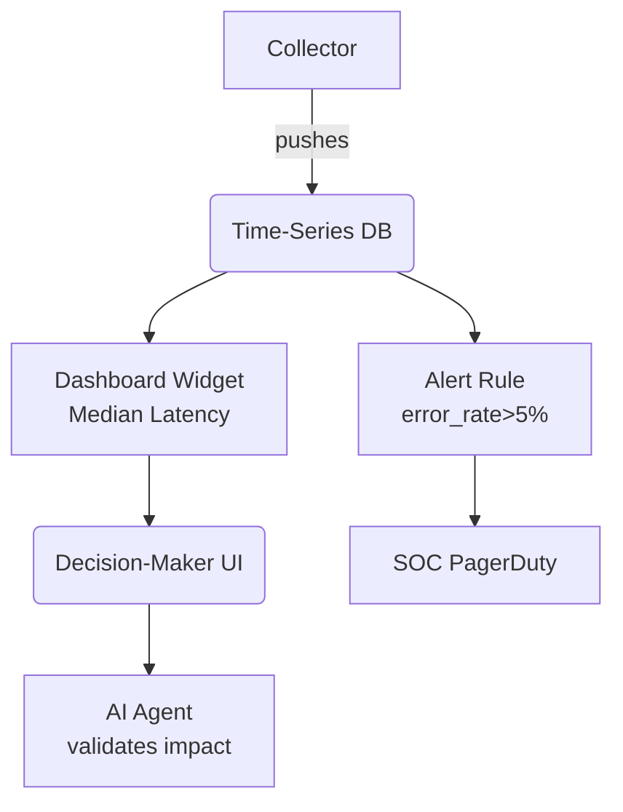
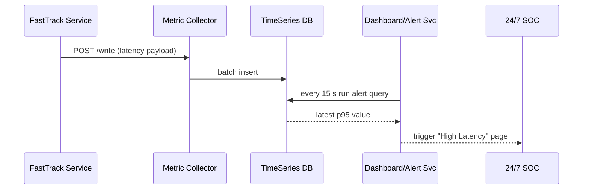

# Chapter 15: Metrics & Monitoring Dashboard  

*A friendly continuation from* [External System Integration Layer](14_external_system_integration_layer_.md)  

---

## 1 Why Keep a “NORAD‐Style Radar” on Your Apps?  

Picture the U.S. Department of Housing and Urban Development (HUD).  
Yesterday its portal rolled out a new **“Fast-Track Rental Assistance”** workflow.  
At 9 a.m. traffic spikes; by 9 : 07:

* Median response time has jumped from **350 ms → 2 s**.  
* 14 % of users abandon the form.  
* Security logs show 400 failed log-ins/min — maybe a brute-force attack.  

If no one sees these signals until tomorrow’s stand-up, **families miss rent and headlines blame HUD**.  

The **Metrics & Monitoring Dashboard (HMS-MON)** is the always-on radar that:

1. Collects live system health, latency, error rates, and **user satisfaction**.  
2. Streams alerts to a 24 × 7 Security Operations Center (SOC).  
3. Feeds numbers back to AI agents so they can *prove* a new process really reduced wait-times.  
4. Generates effortless **OMB A-123** compliance reports.

---

## 2 Key Ideas in Plain English  

| Concept | Think of it as… | Why it matters |
|---------|-----------------|----------------|
| Metric | A heartbeat beep | CPU %, 95th-percentile latency, “happy clicks” |
| Collector | Stethoscope | Pulls or receives metrics from every pod |
| Time-Series DB | Long roll of graph paper | Stores millions of points efficiently |
| Dashboard Widget | Radar blip | Visualizes a metric or group of them |
| Alert Rule | Smoke alarm | “If error _rate > 5 % for 2 min → page SOC” |
| Insight Loop | Fitness tracker report | AI compares **before vs. after** a change |

---

## 3 3-Minute Tour — “Did the New Workflow Help?”  



One stream of numbers powers **humans, AI, and alarms**—all at once.

---

## 4 Hands-On: Your First Metric in 15 Lines  

### 4.1 Service Side – Push a Metric  

```python
# File: push_metric.py  (15 lines)
import os, time, json, requests, random

MON_URL = os.getenv("HMS_MON", "http://mon:9000/write")
APP     = "fasttrack-portal"

while True:
    payload = {
        "app": APP,
        "metric": "latency_ms",
        "value": random.randint(280, 400),   # fake number
        "ts": int(time.time()*1000)
    }
    requests.post(MON_URL, json=payload, timeout=1)
    time.sleep(10)
```

Beginner explanation:  

* Every 10 s the portal POSTs a tiny JSON to `/write`.  
* `ts` is epoch-milliseconds; nothing fancy.  
* No auth code shown—sidecar already attaches a signed JWT (see [RBAC](08_role_based_access___permissions__rbac__.md)).

### 4.2 Operator Side – Define a Widget (8 lines)  

```yaml
# latency_widget.yaml
title: "HUD Fast-Track Latency (P95)"
query: "latency_ms{app='fasttrack-portal'}"
stat:  "p95"
color: "orange"
```

Upload once:

```bash
curl -X POST https://mon/api/widgets \
     --data-binary @latency_widget.yaml
```

The dashboard page now shows a slick orange graph—no front-end coding required.

### 4.3 Add a Smoke-Alarm (9 lines)  

```yaml
# alert_latency.yaml
name:  "High Latency"
expr:  "p95(latency_ms{app='fasttrack-portal'}) > 1000"
dur:   "2m"
contact: "soc@hud.gov"
```

```bash
curl -X POST https://mon/api/alerts \
     --data-binary @alert_latency.yaml
```

If the 95th percentile exceeds 1 s for two minutes, the SOC receives an email/SMS—automatically.

---

## 5 What Happens Behind the Curtain?  



Only **five participants**—easy to reason about.

---

## 6 Inside the Engine (All Code ≤ 18 Lines!)  

### 6.1 Collector Ingest (18 lines)  

```python
# collector.py
from fastapi import FastAPI, Request
import time, asyncio, json

app, batch = FastAPI(), []

@app.post("/write")
async def write(req: Request):
    metric = await req.json()
    batch.append(metric)
    return {"queued": True}

async def flusher():
    while True:
        if batch:
            payload = json.dumps(batch)
            await asyncio.to_thread(open("tsdb.log","a").write, payload+"\n")
            batch.clear()
        await asyncio.sleep(5)

@app.on_event("startup")
async def go():
    asyncio.create_task(flusher())
```

Explain:  
* Incoming metrics are buffered in memory.  
* Every 5 s they append one JSON line to `tsdb.log` (our toy time-series store).  
* No DB client needed for the demo; production swaps in InfluxDB, Prometheus remote-write, etc.

### 6.2 Alert Evaluator (14 lines)  

```python
# evaluator.py
import re, time, json, smtplib

RULE = {"expr": r"latency_ms.*", "gt": 1000, "dur": 120, "email": "soc@hud.gov"}
buff = []

while True:
    for line in open("tsdb.log"):
        recs = json.loads(line)
        buff.extend([r for r in recs if re.match(RULE["expr"], r["metric"])])
    if len(buff) > RULE["dur"]/10 and max(r["value"] for r in buff) > RULE["gt"]:
        smtplib.SMTP("mail").sendmail("mon@hud.gov", RULE["email"], "High latency!")
        buff.clear()
    time.sleep(10)
```

Explanation:  
* Reads new lines, filters matching metrics.  
* If the threshold stays high for `dur` seconds, fires an email.  
* Clears buffer to avoid spam.

*(Real deployments use Prometheus Alertmanager or Grafana OnCall; logic identical.)*

---

## 7 How Other HMS-UTL Layers Plug In  

* **Service Mesh** – Sidecars append `X-Policy-Version` and `X-Caller-Role` headers to metric payloads, letting dashboards segment data by policy version.  
* **AI Agent** – HMS-A2A (see [AI Representative Agent](05_ai_representative_agent__hms_a2a__.md)) pulls “before/after” stats to justify proposed changes.  
* **HITL Oversight** – Reviewers see live widgets next to each draft in [Human-in-the-Loop Oversight](06_human_in_the_loop__hitl__oversight_.md).  
* **SOC** – Alert emails/SMS integrate with existing federal SOC tools like Splunk On-Call or PagerDuty.  
* **Audit Ledger** – Daily snapshots auto-attach to A-123 packages generated by the [Continuous Delivery & Compliance Pipeline](12_continuous_delivery___compliance_pipeline_.md).

---

## 8 Frequently Asked Questions  

**Q: Does sending one JSON every 10 s hurt performance?**  
No—over HTTPS it’s < 1 KB; sidecar retry logic hides transient blips.

**Q: Can I scrape metrics instead of pushing?**  
Yes—export `/metrics` in Prometheus format; Collector supports pull & push.

**Q: How long are metrics retained?**  
Default 90 days online, 7 years in cold storage (meets federal record schedules).

**Q: Can the AI agent change alert thresholds?**  
Not directly. It submits a *draft* rule to HITL; a human must approve any change affecting SOC alerts.

---

## 9 What You Learned  

• HMS-MON keeps a live pulse on latency, errors, and user happiness—crucial for citizen-facing apps.  
• Adding a metric is a **15-line loop**; adding a widget or alert is a **single YAML**.  
• The dashboard powers decision-makers, AI feedback loops, SOC alerts, and A-123 compliance reports—all from the same data.  
• Internally it’s a simple flow: Collector → Time-Series DB → Widget/Alert Service.  
• The layer ties seamlessly into mesh security, RBAC, AI agents, and the audit ledger.  

Congratulations—you’ve reached the final piece of HMS-UTL!  
You now hold a full, end-to-end blueprint for building **accountable, observable, and citizen-friendly federal software.**  

*(No further chapters—go forth and monitor!)*

---

Generated by [AI Codebase Knowledge Builder](https://github.com/The-Pocket/Tutorial-Codebase-Knowledge)