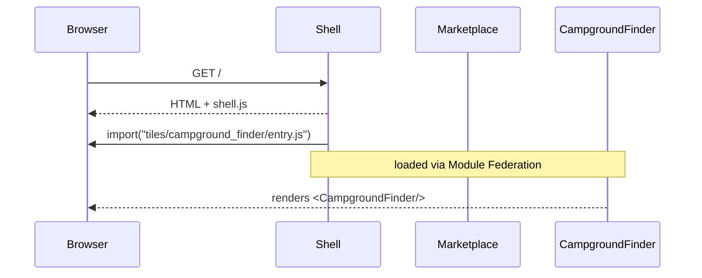

# Chapter 15: Micro-Frontend Experience (HMS-MFE)

*(A friendly sequel to [Marketplace Layer (HMS-MKT)](14_marketplace_layer__hms_mkt__.md))*  

---

## 1. Why Do We Need HMS-MFE?

Picture **rec.gov**, the federal recreation portal.  
Citizens use it to:

1. Buy a **National-Park Pass** (Interior)  
2. Reserve an **Army Corps campground** (DoD)  
3. Check **wildfire closures** (USFS)

Each feature lives in a *different* agency codebase, updated on *different* release cycles.  
If a single monolith served all three, **one** typo in the campground app could crash pass sales nation-wide. 😱

**HMS-MFE is the LEGO table**: each agency ships a self-contained UI *tile* (micro-frontend).  
The outer shell snaps them together at runtime, so:

* Teams deploy **independently**  
* Outages stay **isolated**  
* New widgets arrive **instantly**, often installed with one click from the [Marketplace](14_marketplace_layer__hms_mkt__.md)

---

## 2. Key Ideas in Plain English

| MFE Term | Friendly Analogy | Example |
|----------|------------------|---------|
| Shell App | The lobby floor | Loads tiles & handles routing |
| Tile (Widget) | A kiosk cart | “Buy Park Pass” |
| Slot | Power outlet on lobby wall | `<slot name="sidebar">` |
| Module Federation | Plug adaptor | Lets one bundle import code from another at runtime |
| Sandbox | Coffee-shop Wi-Fi | Keeps tiles from snooping on each other |

Keep these five words; you can now “speak MFE.”

---

## 3. 3-Minute Guided Tour – Adding a **Campground Finder** Tile

We will:

1. Install the tile from the Marketplace  
2. Mount it in the shell  
3. Verify it works in production **without redeploying** the whole site

### 3.1 Install From Marketplace (one liner)

```js
// ① shell/install.js  – called by an admin
await fetch('/api/mkt/campground_finder/install', { method:'POST' })
```

*HMS-MKT* downloads the bundle and registers it under **`tiles/campground_finder`**.

### 3.2 Declare a Slot in the Shell (8 lines)

```vue
<!-- ② ShellLayout.vue -->
<template>
  <main>
    <Tile name="park-pass"   />
    <Tile name="campground_finder" />  <!-- new! -->
  </main>
</template>
```

`<Tile>` is a **2-line helper** that lazy-loads the remote code (shown in §4).

### 3.3 Citizen Sees the New Tile – No Downtime

Open the portal, hit refresh → the **Campground Finder** appears, already talking to DoD APIs.

---

## 4. Tiny Code Pieces (all ≤ 20 lines)

### 4.1 The `<Tile>` Loader (14 lines)

```js
// components/Tile.vue (simplified)
<script setup>
import { defineAsyncComponent } from 'vue'
const props = defineProps({ name:String })

const Remote = defineAsyncComponent(() =>
  import(`/tiles/${props.name}/entry.js`)   // dynamic <script>
)
</script>

<template><Remote /></template>
```

**What it does:**  
1. Builds the URL `/tiles/{name}/entry.js`  
2. `import()` downloads & executes the tile bundle on-the-fly  
3. Vue renders whatever component `entry.js` exports

### 4.2 A Tile’s `entry.js` (18 lines)

```js
// tiles/campground_finder/entry.js
import { defineComponent, ref } from 'vue'
export default defineComponent({
  name: 'CampgroundFinder',
  setup(){
    const zip = ref('')
    const sites = ref([])
    async function search(){
      sites.value = await fetch(`/api/dod/camps?zip=${zip.value}`).then(r=>r.json())
    }
    return { zip, sites, search }
  },
  template: `
    <div>
      <h2>Find a Campground</h2>
      <input v-model="zip" placeholder="ZIP"/>
      <button @click="search">Search</button>
      <ul><li v-for="s in sites">{{s.name}}</li></ul>
    </div>`
})
```

*Self-contained:* no global CSS, no shared state, safe to load next to any other tile.

### 4.3 Shell Routing (optional, 10 lines)

```js
// shell/router.js
import { createRouter, createWebHistory } from 'vue-router'
export default createRouter({
  history: createWebHistory(),
  routes: [
    { path:'/', component: () => import('./ShellLayout.vue') },
    { path:'/tile/:name', component: () => import('./SingleTile.vue') }
  ]
})
```

Now `/tile/campground_finder` shows the widget full-screen (nice for mobile).

---

## 5. What Happens Under the Hood?



*Only four actors—clear & audit-friendly.*

---

## 6. Inside HMS-MFE (Server-Side)

### 6.1 Tile Registry (YAML, 5 lines)

```yaml
# mfe/tiles.yaml
- id: campground_finder
  path: /var/mfe/tiles/campground_finder
  exposed: entry.js
```

The shell reads this file on start-up. Marketplace writes to it during `install`.

### 6.2 Simple Static Server (Node, 12 lines)

```js
// server/static.js
import express from 'express'
import tiles   from './tiles.yaml' assert { type:'yaml' }

const app = express()
app.use('/tiles', express.static('/var/mfe/tiles'))
app.listen(8080)
```

No fancy logic—just serve static bundles.

---

## 7. Safety & Compliance Hooks

| Risk | Mitigation |
|------|------------|
| Tile leaks PII | Outbound XHR is proxied through [HMS-SVC](09_core_service_mesh__hms_svc__.md) filters |
| Conflicting CSS | Tiles scoped with Shadow DOM (`:host { … }`) |
| Rogue tile XSS | Each bundle is **sub-resource-integrity (SRI)** signed by Marketplace |
| Downtime | Shell skips tiles whose `entry.js` fails to load |

---

## 8. Frequently Asked Questions

**Q: Can tiles share state?**  
Yes—expose a tiny event bus (`window.mfeBus`) but keep use rare to preserve independence.

**Q: How big should a tile be?**  
Aim for < 300 KB gzipped. Large apps can be split into multiple tiles.

**Q: Do I need Webpack Module Federation?**  
It helps, but you can also ship plain ES modules; the `<Tile>` loader stays the same.

**Q: How do I update a tile?**  
Publish a new version in the Marketplace; HMS-MFE pulls it on next page refresh—no shell deploy.

---

## 9. What You Learned

• HMS-MFE lets agencies snap self-contained UI tiles into a shared portal **like LEGO bricks**.  
• Installing a new tile is a Marketplace POST; mounting it is one line of HTML.  
• Under the hood: dynamic `import()`, a YAML registry, and static file serving—easy for beginners.  
• Built-in guard-rails (SRI, mesh proxies, Shadow DOM) keep tiles safe and isolated.

Ready to guide citizens through these tiles based on *outcomes* (not raw pages)?  
Jump to [Outcome-Driven Navigation](16_outcome_driven_navigation_.md).

---

Generated by [AI Codebase Knowledge Builder](https://github.com/The-Pocket/Tutorial-Codebase-Knowledge)