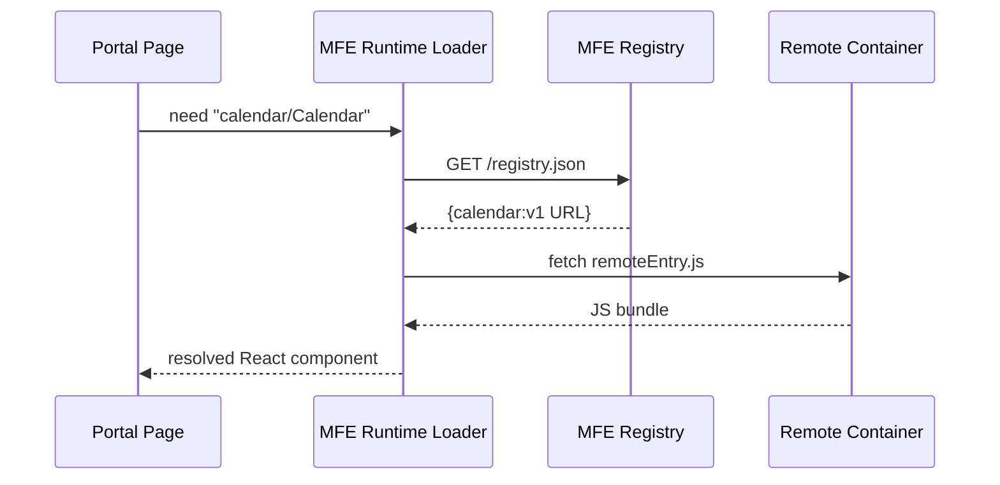

# Chapter 15: Micro-Frontend Interface Library (HMS-MFE)
[← Back to Chapter 14: Simulation & Training Environment](14_simulation___training_environment__hms_esr__.md)

> “Lego bricks for every government web-app.”

---

## 1. Why Do We Need HMS-MFE?

Imagine two very different portals:

* **Disability Benefits Portal** for citizens  
* **Banking Oversight Dashboard** for regulators

Both need a **calendar picker** that:

1. Respects Section 508 accessibility rules  
2. Shows federal holidays  
3. Can be upgraded overnight without redeploying either portal

Re-building that calendar in each code-base is wasteful and risks inconsistent behavior.  
**HMS-MFE** lets teams package UI parts—buttons, charts, calendars—into **plug-in “micro-frontends.”** Any portal can load them at runtime just like you plug a new printer into your laptop.

For a beginner: “It’s React components in separate boxes.”  
For an expert: “It’s Webpack Module Federation with design tokens and runtime hooks.”

---

## 2. Key Concepts (Beginner Friendly)

| Term | City-Hall Analogy | One-Line Job |
|------|------------------|--------------|
| Component | Lego brick | A self-contained UI piece (e.g., `<Calendar/>`) |
| Design Token | City-wide color scheme | Stores font sizes, colors, spacing |
| Remote Container | Shipping crate | Holds one or more components for download |
| Registry | Town directory | JSON file that lists available containers & URLs |
| Runtime Loader | Clerk with a dolly | Fetches a container when the page asks for it |
| Accessibility Hook | Building inspector | Ensures each component passes Section 508 tests |

Keep these six in mind—everything in HMS-MFE is just **containers + loader + tokens**.

---

## 3. Using HMS-MFE — A 3-Step Example

We’ll share one calendar picker between the **Benefits Portal** and the **Oversight Dashboard**.

### 3.1 Team A publishes the Calendar (18 lines)

```js
// calendarApp/src/Calendar.js
import dayjs from "dayjs";
export default function Calendar({ onSelect }) {      // 1
  return (                                            // 2
    <input                                            // 3
      type="date"                                     // 4
      onChange={e => onSelect(dayjs(e.target.value))} // 5
      aria-label="Choose date"                        // 6
    />                                                // 7
  );                                                  // 8
}
```

```js
// calendarApp/webpack.config.js  (≤12 lines)
module.exports = {
  plugins: [
    new ModuleFederationPlugin({
      name: "calendar",
      filename: "remoteEntry.js",          // the “crate”
      exposes: { "./Calendar": "./src/Calendar.js" },
      shared: { react: { singleton: true } }
    })
  ]
};
```

Run the build:

```bash
cd calendarApp && npm run build    # outputs /dist/remoteEntry.js
```

Team A uploads `/dist` to `https://cdn.gov/mfe/calendar/v1/`.

### 3.2 Team B consumes the Calendar (15 lines)

```js
// benefitsPortal/src/components/MyDateField.js
import { lazy, Suspense } from "react";
const Calendar = lazy(() =>
  import("calendar/Calendar")              // magic alias
);

export default function MyDateField() {
  return (
    <Suspense fallback="Loading…">
      <Calendar onSelect={d => console.log("Picked", d.toISO())}/>
    </Suspense>
  );
}
```

```js
// benefitsPortal/webpack.config.js  (≤10 lines)
new ModuleFederationPlugin({
  name: "portal",
  remotes: {
    calendar: `calendar@https://cdn.gov/mfe/calendar/v1/remoteEntry.js`
  }
})
```

Hit **F5** on the Benefits Portal—Calendar pops in, no redeploy needed.

### 3.3 How does the Dashboard get it?  
Exactly the same! Add the same `remotes` entry to its Webpack config.

---

## 4. What Happens Under the Hood?



1. **Loader** looks up the component in a tiny JSON registry.  
2. Downloads the JS bundle from the CDN.  
3. Mounts it into the page’s React tree.  
4. Design tokens and accessibility hooks are applied automatically.

---

## 5. Inside HMS-MFE

```
/hms-mfe
 ├─ loader/
 │    └─ index.js          # <50 lines, shown below
 ├─ registry/
 │    └─ registry.json     # maps name → URL → version
 ├─ tokens/
 │    └─ federal.json      # colors, spacing, fonts
 ├─ hooks/
 │    └─ a11y.js           # runs axe-core tests
 └─ README.md
```

### 5.1 Runtime Loader Core (≤18 lines)

```js
// loader/index.js
export async function load(name){              // name="calendar/Calendar"
  const [pkg, mod] = name.split("/");
  const url = (await fetch("/registry.json").then(r=>r.json()))[pkg];
  await import(/* webpackIgnore: true */ url); // pulls remoteEntry.js
  return window[pkg].get(`./${mod}`).then(f => f());
}
```

Line-by-line:

1-2  Parse “calendar/Calendar” → `pkg=calendar`, `mod=Calendar`.  
3    Get URL from registry.  
4    Dynamic import the remote container (WebPack sets up share scope).  
5    Ask the container for the exposed module and return it.

### 5.2 Accessibility Hook (≤10 lines)

```js
// hooks/a11y.js
import axe from "@axe-core/react";
export function withA11y(Component){
  return props => {
    axe(React, ReactDOM, 1000);  // run after 1 s
    return <Component {...props}/>;
  };
}
```

Any component exported through HMS-MFE is wrapped with `withA11y` before exposure, guaranteeing Section 508 checks.

---

## 6. Governance, Policy & Security

* **Content-Security-Policy** headers are set by [HMS-GOV](01_governance_layer__hms_gov__.md) to block rogue scripts.  
* A **policy pack** in [HMS-CDF](02_policy_codification_engine__hms_cdf__.md) enforces that every exposed component calls `withA11y`.  
* All downloads are version-pinned (`/v1/`) and checksum-verified.  
* Usage metrics flow into [Data Hub & Analytics Engine](09_data_hub___analytics_engine__hms_dta__.md) for UI performance dashboards.

---

## 7. Common Questions

**Q: Does every team need to use React?**  
No. Containers can export Web Components or Vue; the loader just ships JavaScript.

**Q: What if the Calendar v1 has a bug?**  
Publish `v1.1` on the CDN; update the registry entry. Pages auto-refresh without a redeploy.

**Q: Can I restrict who loads a component?**  
Yes. Registry entries include an `allowedOrigins` array checked by the loader.

**Q: How big can a container be?**  
Keep bundles < 200 KB gzip; the loader shows a “Loading…” skeleton after 150 ms for UX.

---

## 8. Key Takeaways

• HMS-MFE lets agencies build **Lego-style UI pieces** once and share them everywhere.  
• Components live in **remote containers** discovered by a tiny JSON registry.  
• A **runtime loader** fetches and mounts them on demand—no portal redeploy needed.  
• Built-in design tokens and accessibility hooks keep every micro-frontend on brand and compliant.

---

### Up Next  
Now that we have reusable UI bricks, we need a way to guide users through end-to-end tasks like “Apply for housing” or “Dispute a tax notice.” Enter intent-aware routing in [Chapter 16: Intent-Driven Navigation & Journeys](16_intent_driven_navigation___journeys_.md).

---

Generated by [AI Codebase Knowledge Builder](https://github.com/The-Pocket/Tutorial-Codebase-Knowledge)