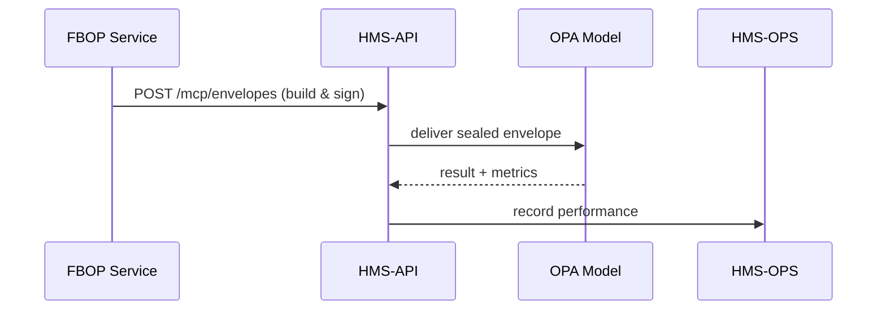

# Chapter 15: Model Context Protocol (HMS-MCP)

*(Coming from [Chapter 14: Marketplace & Capability Registry (HMS-MKT)](14_marketplace___capability_registry__hms_mkt__.md)?  
Perfect—now that agencies can **share** capabilities, let’s learn how those capabilities talk to each other safely, clearly, and without leaking private data.)*  

---

## 1. Why Do We Need a “Diplomatic Pouch” for AI?

### Hero Story — “Parole-Review Across Agencies”

1. The **Federal Bureau of Prisons (FBOP)** wants an AI agent to draft parole-eligibility summaries for inmates.  
2. Sentences and medical records live on FBOP’s servers, but the **Office of the Pardon Attorney (OPA)** runs the large-language model.  
3. If FBOP just ships a raw prompt—  
   * How does OPA know it may **NOT** pull in health data?  
   * How does FBOP verify the model used only its approved **risk-scoring plug-in**?  
   * Where is the performance target (“≤ 2 seconds per inmate”) written down?

**Model Context Protocol (HMS-MCP)** is the **standard envelope**—a diplomatic pouch—that travels with every AI request so both sides agree on:  

* **What** task to do.  
* **Which** tools are allowed.  
* **Which** data scopes are off-limits.  
* **How** success will be measured.  

If you’ve ever filled out the **“cover sheet”** on a classified document, you already know the idea!

---

## 2. Key Concepts (Plain-English Glossary)

| Term                | Friendly meaning                                   |
|---------------------|----------------------------------------------------|
| Envelope            | One JSON object that wraps the prompt + metadata   |
| Task Definition     | Plain-language description of the job (“draft parole summary”) |
| Allowed Tools       | List of plug-ins, APIs, or data tables the model may call |
| Privacy Constraints | Red/green list of data fields (e.g., SSN ✅ / HIV status 🚫) |
| Performance Metrics | Targets like “P50 latency ≤ 2 s”, “Accuracy ≥ 0.9” |
| Chain of Custody    | Signatures showing who touched the envelope        |

Keep these six in mind—everything else hangs off them.

---

## 3. Anatomy of an MCP Envelope

```json
{
  "mcp_version": "1.0",
  "task": {
    "id": "parole_draft_v1",
    "description": "Draft a 200-word parole-eligibility summary."
  },
  "allowed_tools": ["risk_score_plugin@2.1", "citation_helper@1.0"],
  "privacy": {
    "allow": ["sentence_length", "disciplinary_actions"],
    "deny":  ["medical_diagnosis", "HIV_status"]
  },
  "performance": {
    "latency_ms_p50": 2000,
    "quality_metric": "bleu>=0.80"
  },
  "chain_of_custody": [
    { "actor": "FBOP", "signed_at": "2024-09-01T10:12Z" }
  ],
  "prompt": "Inmate #445228 ... (truncated)"
}
```

### Beginner translation

* `task` = **what** to do.  
* `allowed_tools` = **how** you may do it.  
* `privacy` = **where not to look**.  
* `performance` = **how we’ll grade you**.  
* `chain_of_custody` = **who sealed the pouch**.  
* `prompt` = the actual text the model will read.

---

## 4. Using MCP in Practice

### 4.1 FBOP Creates the Envelope (Node.js, 17 lines)

```js
// build-mcp.js
import { signEnvelope } from '@hms/mcp-sdk';

const envelope = {
  mcp_version: '1.0',
  task: { id:'parole_draft_v1', description:'Draft parole summary' },
  allowed_tools: ['risk_score_plugin@2.1'],
  privacy: { allow:['sentence_length'], deny:['medical_diagnosis'] },
  performance: { latency_ms_p50:2000 },
  chain_of_custody: []
};

// attach FBOP signature
const sealed = signEnvelope(envelope, process.env.FBOP_PRIVATE_KEY);
console.log(JSON.stringify(sealed, null, 2));
```

Explanation  
1–10. Build the envelope object.  
11. `signEnvelope` adds the first **chain_of_custody** entry + a digital signature.  
12–14. Print or transmit—ready for OPA.

### 4.2 OPA Runs the Model (Python, 18 lines)

```python
# run_model.py
from hms_mcp import verify_envelope, run_with_tools

env = load_envelope()                # read JSON from queue

assert verify_envelope(env, issuer="FBOP")   # 1) safety check

result = run_with_tools(
    prompt=env["prompt"],
    tools=env["allowed_tools"],
    deny_fields=env["privacy"]["deny"]
)

send_back({
    "envelope_id": env["uid"],
    "latency_ms": result.latency,
    "content":    result.text
})
```

What happens?  
1. `verify_envelope` checks signature + version.  
2. `run_with_tools` loads only the approved plug-ins and masks denied fields.  
3. Output goes back **without altering the envelope**—the pouch remains sealed.

### 4.3 FBOP Assesses Performance (8 lines)

```bash
curl https://api.hms.gov/mcp/runs/abc123/metrics
```

Returns:

```json
{ "latency_ms": 1850, "quality_metric": 0.83, "status": "pass" }
```

Because both metrics meet the envelope targets, HMS-OPS logs a ✅; otherwise a **HITL Override** (see [Chapter 8](08_human_in_the_loop__hitl__override_flow_.md)) would fire.

---

## 5. Under the Hood – Life of an MCP Envelope



Four hops, one pouch—no ambiguity.

---

## 6. Inside HMS-API: Validation & Storage

### 6.1 Validation Flow (non-code)

1. **Schema Check** – Is every required key present?  
2. **Signature Check** – Does the first signer belong to the Program’s agency?  
3. **Constraint Check** – `allowed_tools` must exist in [Marketplace](14_marketplace___capability_registry__hms_mkt__.md).  
4. **Quota Check** – Envelope size ≤ 64 KB.

Only if all four pass does HMS-API forward the envelope.

### 6.2 Tiny Validator Snippet (PHP, 19 lines)

```php
class McpValidator {
  public static function validate(array $env) {
    Schema::check($env, 'mcp_v1.json');     // 1) shape
    Signer::verify($env['chain_of_custody']); // 2) signature
    foreach ($env['allowed_tools'] as $t) {  // 3) whitelist
        if (!Tool::exists($t)) throw new Ex("Tool $t not found");
    }
    if (strlen(json_encode($env)) > 65536)   // 4) quota
        throw new Ex("Envelope too big");
  }
}
```

Line-by-line explanation right above comments.

---

## 7. Where MCP Fits with Other Chapters

| Need                              | Where Filled                                             |
|-----------------------------------|----------------------------------------------------------|
| “Which Program is this?”          | Envelope references **Program ID** (see [Chapter 1](01_program__policy_container__.md)) |
| “Allowed Tools exist?”            | Verified via **Marketplace** listings (see [Chapter 14](14_marketplace___capability_registry__hms_mkt__.md)) |
| “Privacy violation?”              | Checked by **HMS-ESQ** (see [Chapter 9](09_compliance___legal_reasoning_engine__hms_esq__.md)) |
| “Latency breached?”               | Logged by **HMS-OPS** (see [Chapter 12](12_metrics___monitoring__hms_ops__.md)) |
| “Human veto?”                     | Escalates to **HITL Override** flow (see [Chapter 8](08_human_in_the_loop__hitl__override_flow_.md)) |

MCP is the **thread** that ties these beads together.

---

## 8. Best-Practice Checklist

1. **Keep Prompts Separate** – Only place the *minimum* text in `prompt`; bulk data should be referenced, not embedded.  
2. **Version Early** – Bump `mcp_version` whenever the schema changes.  
3. **Sign Every Hop** – Each actor appends its own signature to `chain_of_custody`—like postal stamps.  
4. **Store, Don’t Overwrite** – New results create a *sibling* record, not an update—important for FOIA.  
5. **Automate Redaction** – Use a library to enforce `privacy.deny` before the envelope leaves your network.

---

## 9. Recap

You can now:

1. Explain **why** HMS-MCP exists—secure, unambiguous AI hand-offs.  
2. Build, sign, and send an envelope in under 20 lines of code.  
3. Understand the validation flow inside HMS-API.  
4. See how MCP interacts with privacy, marketplace tools, metrics, and human overrides.

Congratulations—you’ve reached the final core abstraction of HMS-API!  
Armed with Programs, Protocols, Agents, Governance, Metrics, and now **Model Context Protocol**, you can design **end-to-end, legally-sound AI workflows for any federal agency**.

*Happy shipping—and may every envelope arrive sealed, signed, and on time!*

---

Generated by [AI Codebase Knowledge Builder](https://github.com/The-Pocket/Tutorial-Codebase-Knowledge)