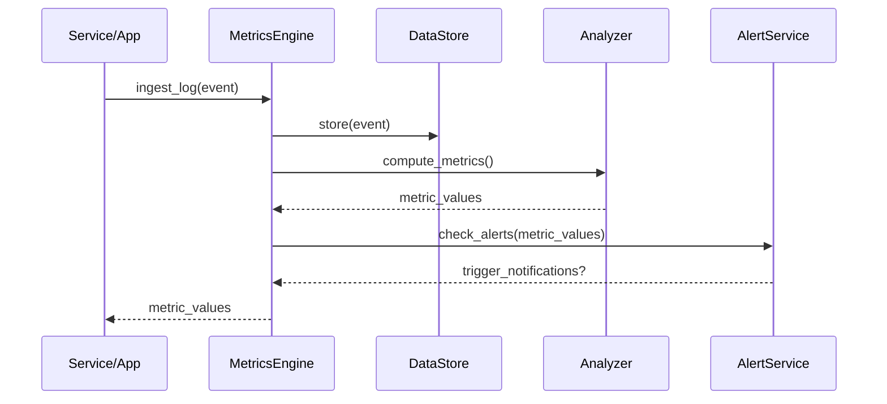

# Chapter 15: Monitoring & Metrics Engine

In the last chapter we saw how humans review and override AI proposals in [Human-in-the-Loop Override](14_human_in_the_loop_override_.md). Now we’ll explore the **Monitoring & Metrics Engine**—the dashboard that turns raw logs, analytics events, and user surveys into actionable insights, alerts, and continuous improvement for HMS-OPS.

---

## 1. Why a Monitoring & Metrics Engine?

Imagine the U.S. Capitol Police runs an incident-reporting portal. They need to know:

- How long does it take, on average, to resolve a report?  
- Are citizens satisfied with the follow-up?  
- When does resolution time spike above policy targets?  

Without a central engine, teams scramble to pull spreadsheets, write queries, or eyeball dashboards. The **Monitoring & Metrics Engine** automates this:

1. **Ingest** logs (e.g., “report_submitted”, “report_closed”).  
2. **Compute** cycle times, resolution rates, satisfaction scores.  
3. **Visualize** trends—like a Performance.gov KPI dashboard.  
4. **Alert** teams when thresholds are breached (e.g., average cycle > 48 hours).  
5. **Feed** insights back into continuous improvement loops (e.g., tweak workflows in [Process & Policy Module](09_process___policy_module_.md) or recommend policy changes via the [AI Representative Agent](13_ai_representative_agent_.md)).

---

## 2. Key Concepts

1. **Data Ingestion**  
   Collect events from microservices, API logs, and user surveys.  

2. **Metrics Computation**  
   Calculate values like average cycle time, resolution rate, satisfaction percentage.  

3. **Trend Visualization**  
   Generate time-series charts or summary reports.  

4. **Alerting**  
   Define thresholds and notify via email, Slack, or HMS-MSG when metrics cross them.  

5. **Improvement Loop**  
   Automate suggestions for policy/process tweaks or new AI proposals.

---

## 3. Using the Monitoring & Metrics Engine

Here’s a minimal example:

```python
from hms_ops.monitoring import MetricsEngine, LogEvent, SurveyFeedback

engine = MetricsEngine()

# 1. Ingest some events
engine.ingest_log(LogEvent("report_submitted", timestamp=1685600000))
engine.ingest_log(LogEvent("report_closed",   timestamp=1685603600))
engine.ingest_survey(SurveyFeedback("citizen_satisfaction", rating=4))

# 2. Compute key metrics
metrics = engine.compute_metrics()
print(metrics)
# -> {"avg_cycle_time": 1.0, "resolution_rate": 1.0, "satisfaction": 80}

# 3. Visualize a trend (e.g., over the last 7 days)
chart_url = engine.visualize("avg_cycle_time", period="7d")
print("View chart at:", chart_url)

# 4. Register an alert if cycle time > 2 hours
engine.register_alert("avg_cycle_time", threshold=2.0,
                      on_trigger=lambda m: print("Alert! Avg cycle is", m))
```

Explanation:
- `ingest_log` and `ingest_survey` feed raw data.  
- `compute_metrics` returns a simple dict of KPIs.  
- `visualize` generates a URL to view trends on a dashboard.  
- `register_alert` sets up real-time threshold monitoring.

---

## 4. Under the Hood

When you run `compute_metrics` or `register_alert`, here’s the high-level flow:



1. **Store** incoming events in a time-series or document store.  
2. **Analyze** stored data to compute the latest metrics.  
3. **Check** registered alerts against thresholds.  
4. **Notify** stakeholders if any alert fires.

---

## 5. Internal Implementation

### File: hms_ops/monitoring/engine.py

```python
from .storage import DataStore
from .analysis import Analyzer
from .alert import AlertService

class MetricsEngine:
    def __init__(self):
        self.store = DataStore()
        self.analyzer = Analyzer(self.store)
        self.alerts = AlertService()

    def ingest_log(self, event):
        self.store.save_event(event)

    def ingest_survey(self, survey):
        self.store.save_survey(survey)

    def compute_metrics(self):
        return self.analyzer.run_all()

    def visualize(self, metric, period):
        # stub: generate a URL to a dashboard service
        return f"https://dashboard.gov/{metric}?period={period}"

    def register_alert(self, metric, threshold, on_trigger):
        self.alerts.add_rule(metric, threshold, on_trigger)
```

### File: hms_ops/monitoring/storage.py

```python
class DataStore:
    def __init__(self):
        self.events = []      # in-memory stub
        self.surveys = []

    def save_event(self, event):
        self.events.append(event)

    def save_survey(self, survey):
        self.surveys.append(survey)
```

### File: hms_ops/monitoring/analysis.py

```python
class Analyzer:
    def __init__(self, store):
        self.store = store

    def run_all(self):
        # stub: compute a few metrics
        cycle_times = [
            e.closed - e.opened
            for e in self.store.events
            if hasattr(e, "opened") and hasattr(e, "closed")
        ]
        avg_cycle = sum(cycle_times)/len(cycle_times) if cycle_times else 0
        satisfaction = (
            sum(s.rating for s in self.store.surveys) /
            len(self.store.surveys) * 20
        ) if self.store.surveys else 0
        return {"avg_cycle_time": avg_cycle, "satisfaction": satisfaction}
```

### File: hms_ops/monitoring/alert.py

```python
class AlertService:
    def __init__(self):
        self.rules = []

    def add_rule(self, metric, threshold, callback):
        self.rules.append((metric, threshold, callback))

    def check_alerts(self, metrics):
        for metric, threshold, callback in self.rules:
            if metrics.get(metric, 0) > threshold:
                callback(metrics[metric])
```

These stubs show how ingestion, storage, analysis, and alerting tie together in one engine.

---

## 6. Analogy & Takeaways

- Think of the Monitoring & Metrics Engine as your **federal dashboard center**, like Performance.gov:
  - **Sensors** (logs, surveys) feed real-time data.  
  - **Analysts** (analyzer) compute KPIs.  
  - **Dashboards** (visualize) show trends.  
  - **Watchdogs** (alert) call you when performance slips.

- By automating data collection and alerts, agencies can focus on fixing policies and processes instead of hunting for numbers.

---

## Conclusion

You’ve learned how the **Monitoring & Metrics Engine** in HMS-OPS:

- Collects logs, events, and surveys.  
- Computes cycle times, satisfaction scores, and other KPIs.  
- Visualizes trends on dashboards.  
- Triggers alerts when thresholds are breached.  
- Feeds insights back into continuous improvement loops.

With this engine in place, your AI-driven workflows stay transparent, measurable, and always improving.

---

Generated by [AI Codebase Knowledge Builder](https://github.com/The-Pocket/Tutorial-Codebase-Knowledge)