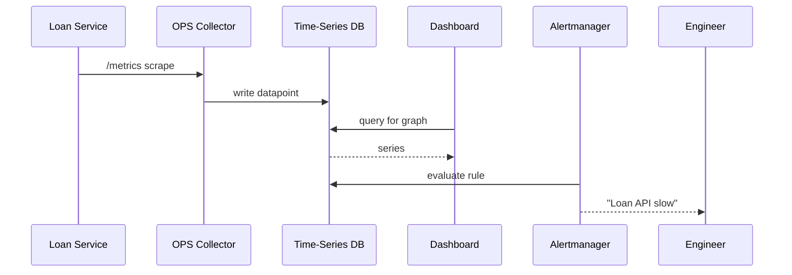

# Chapter 15: Monitoring & Metrics (HMS-OPS)

*(continuing from [Financial Transaction Engine (HMS-ACH)](14_financial_transaction_engine__hms_ach__.md))*  

---

## 1. Why Bother Watching the Gauges?

On **Friday at 4 pm** the U.S. Department of Education launches an online **“Loan-Forgiveness Status”** page built on HMS.  
Five minutes later phone lines explode—pages spin forever.

What went wrong?

* Latency on the **Permits Service** is 1 200 ms (should be < 300 ms).  
* 8 % of API calls error because an AI deputy’s recommendation is constantly overruled (policy mismatch).  
* Nobody receives the PagerDuty alert because it was never configured.

**HMS-OPS** is the always-awake **traffic-cam network** that notices, records, and warns:

1. Captures live telemetry from **every** HMS layer.  
2. Streams numbers into friendly dashboards.  
3. Fires alerts—or even launches a *governance flow*—when things drift.

No black-box surprises, even on Friday at 4 pm.

---

## 2. Key Concepts (Plain-English Cheatsheet)

| Term                   | Real-World Analogy                           | 1-Sentence Meaning                                                |
|------------------------|----------------------------------------------|-------------------------------------------------------------------|
| Telemetry Event        | Speed-camera snapshot                        | One data point: “/api/loan 128 ms 200-OK”.                        |
| Metric                 | Highway speed average                        | A rolled-up number: “95th-percentile latency = 280 ms”.           |
| Dashboard Panel        | Traffic-monitor TV screen                    | Graph or table that shows metrics over time.                      |
| Alert Rule             | Radar gun beeping when > 65 mph              | Condition that triggers a page/text.                              |
| SLO (Service Level Objective) | City ordinance: “respond in 300 ms”   | Formal target; falling short opens a governance ticket.           |
| Governance Trigger     | Police dispatch                              | Auto-create HITL ticket or Agent replacement flow.                |

Remember these six; everything else is wiring.

---

## 3. 5-Minute “Hello Gauge” Walk-Through

We’ll:

1. Collect latency from a **Loan API**.  
2. Show it on a web dashboard.  
3. Page an engineer if 95-th latency > 300 ms for 5 min.

All code ⬇️ fits in tiny blocks.

### 3.1 Instrument the Service (12 lines)

```js
// loanSvc/server.js
import express from 'express'
import { counter, histogram, exposeMetrics } from '@hms/ops-lite'

const app = express()
const latency = histogram('loan_api_latency_ms')

app.get('/loan/:id', async (req,res)=>{
  const start = Date.now()
  // ...do real work here...
  res.json({id:req.params.id, status:'PENDING'})
  latency.observe(Date.now()-start)       // 🔔 record ms
  counter('loan_api_hits').inc()          // 🔔 simple counter
})

app.get('/metrics', exposeMetrics)        // Prometheus-style endpoint
app.listen(4009)
```

**What happened?**  
• `histogram()` collects response times and buckets them.  
• `counter()` tracks total hits.  
• `/metrics` exposes everything in plain text—no database code.

### 3.2 Scrape & Store (1-command)

```bash
docker run -d -p 9090:9090 \
 -v ./prom.yml:/etc/prometheus/prometheus.yml prom/prometheus
```

`prom.yml` (6 lines)

```yaml
scrape_configs:
- job_name: loanSvc
  static_configs:
  - targets: ['host.docker.internal:4009']   # Prom fetches /metrics
```

### 3.3 Draw the Dashboard (10 lines)

```jsonc
// dashboards/loan_latency.json
{
  "title": "Loan-Forgiveness API",
  "panels": [{
    "type": "graph",
    "expr": "histogram_quantile(0.95, rate(loan_api_latency_ms_bucket[5m]))",
    "legend": "95-th Latency (ms)"
  }]
}
```

Import this JSON into Grafana → instant chart!

### 3.4 Create an Alert (14 lines)

```yaml
# alerts/loan_latency.yml
groups:
- name: loan-alerts
  rules:
  - alert: LoanHighLatency
    expr: histogram_quantile(0.95, rate(loan_api_latency_ms_bucket[5m])) > 300
    for: 5m
    labels:
      severity: page
    annotations:
      summary: "Loan API slow"
      description: "95-th percentile latency > 300 ms for 5 m"
```

Prometheus → Alertmanager → SMS/email/page.  
You just built end-to-end observability!

---

## 4. Under the Hood (Non-Scary View)



---

## 5. Internal Plumbing (Gentle Peek)

### 5.1 Collector Skeleton (18 lines)

```js
// ops/collector.js
import fetch from 'node-fetch'
import cron from 'node-cron'
import { write } from './tsdb.js'   // abstract wrapper

const targets = ['http://loanSvc:4009/metrics']

cron.schedule('*/15 * * * * *', async ()=>{
  for(const t of targets){
    const text = await fetch(t).then(r=>r.text())
    text.split('\n').forEach(l=>{
      if(l.startsWith('#')||!l) return
      const [name,val] = l.split(' ')
      write(name, Number(val))     // 👉 into TSDB
    })
  }
})
```

*Highlights*  
1. Scrapes every 15 s.  
2. Ignores comments (`#`).  
3. Stores **metric name → value** pairs.

### 5.2 Governance Trigger (15 lines)

```js
// ops/alertListener.js
import { onAlert } from '@hms/ops-lite'
import { createTicket } from '../hitl/sdk.js'

onAlert('LoanHighLatency', async alert=>{
  await createTicket({
    title: 'Replace AI deputy – too many overrides',
    body : JSON.stringify(alert),
    approverRole: 'program_manager'
  })
})
```

If the alert repeats N times/hour, OPS escalates to HITL—linking monitoring with **governance**.

---

## 6. Where OPS Talks to Other HMS Layers

| Layer | How They Chat |
|-------|---------------|
| [API Gateway](03_backend_api_gateway__hms_api___hms_svc__.md) | Emits metrics like `gateway_errors_total`. |
| [IAM](04_identity___access_management__iam__.md) | OPS dashboard filters by `user.role`, so a state agency sees only its metrics. |
| [HMS-ESQ](05_security__privacy___legal_guardrails__hms_esq___platform_controls__.md) | If alerts show a rule is ignored 3×, ESQ can auto-block the offending service. |
| [Workflow Orchestrator](07_workflow_orchestrator__hms_act___hms_oms__.md) | Each workflow step logs `duration_ms` → OPS graphs bottlenecks. |
| [Human-in-the-Loop](10_human_in_the_loop__hitl__oversight_.md) | Alert listener can auto-open approval tickets. |
| [HMS-ACH](14_financial_transaction_engine__hms_ach__.md) | Publishes `batch_settled_total` so finance teams know money cleared. |

---

## 7. Frequently Asked Beginner Questions

**Q: Do I need Prometheus and Grafana?**  
A: They’re defaults because they’re free & easy. Swap in CloudWatch, Datadog, or New Relic—OPS adapters already exist.

**Q: Won’t collecting every metric slow my service?**  
A: The library buffers in-memory; recording a metric ≈ 50 ns. Scrapes are pull-based so your service never waits.

**Q: Can I log business numbers (e.g., “permits approved”) not just CPU?**  
A: Absolutely. Call `counter('permits_approved').inc()` right next to your business logic.

**Q: How long is data kept?**  
A: Default retention is 13 months for high-resolution data, 7 years for 1-hour roll-ups (OMB A-123 audit window). Configurable per agency.

---

## 8. Recap & Next Steps

You built:

• Service instrumentation with **6 lines** of code.  
• A dashboard and alert in **< 25 lines** of YAML/JSON.  
• A governance trigger that opens HITL tickets on persistent issues.

HMS-OPS now keeps real-time eyes on every corner of the platform.  
But dashboards alone don’t catch *future* surprises—so let’s explore **simulations & test sandboxes** in the next chapter:  
[Simulation & Testing Environment (HMS-ESR)](16_simulation___testing_environment__hms_esr__.md)

---

Generated by [AI Codebase Knowledge Builder](https://github.com/The-Pocket/Tutorial-Codebase-Knowledge)