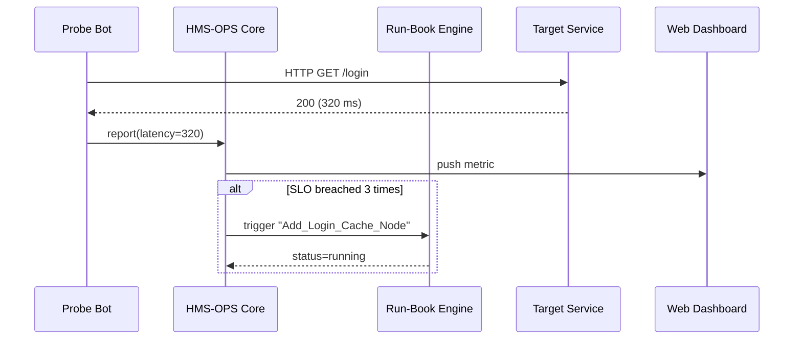

# Chapter 15: Observability & Operations Center (HMS-OPS)

[← Back to Chapter 14: Inter-Agency Data Exchange (HMS-A2A)](14_inter_agency_data_exchange__hms_a2a__.md)

---

## 1 Why Do We Need a “NORAD for Platform Health”?

It’s the night before **Tax Day**.  
Millions of citizens hit IRS.gov at once:

1. Login latency creeps from **120 ms → 3 s**.  
2. A rogue bot floods the “Where’s My Refund?” API.  
3. Cloud spend spikes $40 k in 15 minutes.

If an engineer has to wake-up, SSH, and grep logs at **2 a.m.**, refunds will be late—and Congress will notice.

**HMS-OPS** is the always-on Operations Center that:

* Watches every micro-service, gateway, and database in real time.  
* Autostarts a **run-book** (“add cache node, block bot IPs”) before humans even sip coffee.  
* Streams a single, friendly dashboard to executives and auditors.

Think **NORAD**, but for uptime, cost, and security instead of incoming missiles.

---

## 2 Key Concepts (Plain English)

| Term | What It Actually Is | Government Analogy |
|------|--------------------|--------------------|
| **Probe** | Small script that measures health (latency, error %, budget). | Census worker ringing one doorbell every hour. |
| **Dashboard** | Real-time screen of probe results. | Command center wall of radar blips. |
| **SLO / SLA** | Target & promise (e.g., “<250 ms 99 % of the time”). | Statute requiring passports in 8 weeks. |
| **Run-Book** | Automated or human step-by-step fix. | FEMA playbook for hurricane landfall. |
| **Incident** | Period when an SLO is violated. | Government shutdown notice. |

Keep these five words handy—everything else hangs off them.

---

## 3 5-Minute Quick-Start

Goal: watch an API endpoint, trigger an auto-scale run-book if latency >250 ms for 3 minutes.

### 3.1 Install & Authenticate
```bash
pip install hms-ops
export HMS_OPS_TOKEN="demo-sandbox-token"
```

### 3.2 Declare a Probe
```python
from hms_ops import Center, Probe, Runbook

ops = Center(token="demo-sandbox-token")

probe = Probe(
    name="IRS_Login_Latency",
    target="https://tax.gov/api/login",
    type="http_latency",
    slo_ms=250          # SLO target
)

ops.probes.register(probe)
```
Explanation  
1. A **Probe** pings the login API every 30 s (default).  
2. `slo_ms=250` sets the success target.

### 3.3 Attach an Auto-Scale Run-Book
```python
scale = Runbook(
    name="Add_Login_Cache_Node",
    steps=[
        "aws rds failover --cluster login-db",
        "aws elastiache scale-out --cluster login-cache"
    ]
)

ops.runbooks.attach(
    probe="IRS_Login_Latency",
    when="latency >250ms for 3m",
    do=scale
)
```
If the probe fires for 3 minutes, HMS-OPS runs both CLI commands (with stored creds) and opens a tracking ticket.

### 3.4 View the Live Dashboard
```python
url = ops.dashboard.url()
print("Open in browser:", url)
```
Go to the URL—green dot means happy; red with a ⚡ icon shows the run-book in progress.

---

## 4 What Happens Behind the Scenes?



Key takeaway: **Service code does nothing**—probes run externally, OPS orchestrates the rest.

---

## 5 Tiny Peek at the Implementation (15 Lines)

_File: `hms_ops/core/runner.py`_
```python
class Runner:
    def __init__(self, probe):
        self.probe = probe

    async def tick(self):
        t0 = time.time()
        ok = await _ping(self.probe.target)
        latency = int((time.time() - t0)*1000)

        result = {
            "probe": self.probe.name,
            "latency": latency,
            "ok": ok and latency <= self.probe.slo_ms
        }
        await _send("POST", "/metrics", json=result)

        # If failed, record for incident logic
        if not result["ok"]:
            _mark_failure(self.probe.name, latency)
```
Beginner notes:

1. `_ping()` is just an async `aiohttp` request.  
2. `latency` is compared to `slo_ms`.  
3. Failures accumulate; when threshold reached `_mark_failure` notifies the Run-Book engine.

---

## 6 Integrations With Earlier Chapters

| Module | How It Talks to OPS |
|--------|---------------------|
| **Backend Service Gateway** (Chapter 10) | Sends request counts & auth errors as probes. |
| **Activity Orchestrator** (Chapter 11) | Streams queue depth; OPS fires run-book “add worker”. |
| **Inter-Agency Exchange** (Chapter 14) | Writes pouch delivery latency; OPS alarms if >10 min. |
| **Governance Values Pipeline** (Chapter 7) | Pushes sensor failure counts; OPS triggers “pause deploys” run-book. |

All roads lead to OPS, providing a **single pane of glass** for tech, policy, and legal health.

---

## 7 Troubleshooting Cheat-Sheet

| Symptom | Likely Cause | Quick Fix |
|---------|--------------|-----------|
| Probe never appears on dashboard | Wrong token | `export HMS_OPS_TOKEN=...` |
| Run-book fires repeatedly | SLO too tight | Raise `slo_ms` or add back-off rule |
| Dashboard blank | WebSocket blocked by proxy | Use `ops.dashboard.url(ws="wss://")` |
| Cloud bill spikes but no alert | No cost probe created | `Probe(type="aws_cost", ...)` then register |

---

## 8 Recap & What’s Next

You learned to:

1. Register a **Probe** that measures latency.  
2. Attach an automated **Run-Book**.  
3. Watch real-time health on a **Dashboard**.  
4. Understand how HMS-OPS stitches every HMS module into one command center.

With the platform humming and self-healing, it’s time to see **how policies ship from Git to production without breaking that health**.  
March on to [Chapter 16: Policy Deployment Pipeline (HMS-CDF)](16_policy_deployment_pipeline__hms_cdf__.md).

---

---

Generated by [AI Codebase Knowledge Builder](https://github.com/The-Pocket/Tutorial-Codebase-Knowledge)