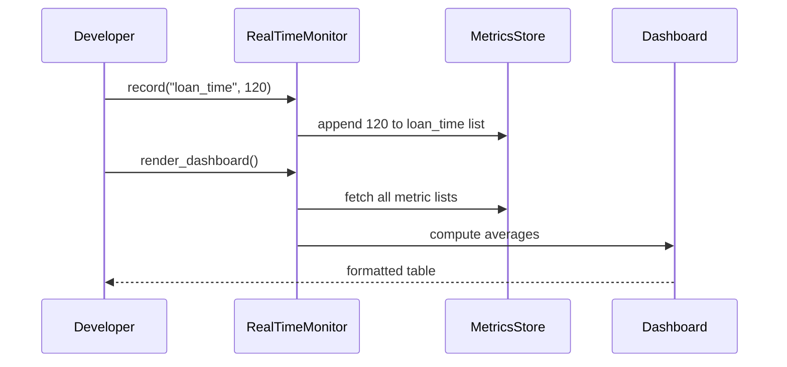

# Chapter 15: Real-Time Monitoring

In the previous chapter we built an [AI-Guided Journey](14_ai_guided_journey_.md) to drive workflows step by step. Now it’s time to **watch** those workflows and systems in action—just like a command center’s live dashboard. Welcome to **Real-Time Monitoring**!

---

## 1. Why Real-Time Monitoring?

Imagine the Rural Housing Service has a live dashboard showing:

- **Loan Processing Time**: average seconds per application  
- **Error Rate**: exceptions per minute  
- **User Satisfaction**: citizen feedback scores  

With continuous tracking, managers see a spike in errors or slowdowns immediately—and can dispatch fixes before citizens notice.

---

## 2. Key Concepts

1. **Metric**  
   A measurable data point (e.g. loan processing time).  
2. **Collector**  
   The component that **records** metric values as events occur.  
3. **Store**  
   A simple in-memory or database repository for recent metric values.  
4. **Dashboard**  
   A live view that aggregates and displays metrics (averages, charts).  
5. **Alert**  
   A rule that fires when a metric crosses a threshold (e.g. error_rate > 5).

---

## 3. Using Real-Time Monitoring

Below is a minimal example showing how to set up a monitor, record metrics, and render a dashboard.

```python
# File: app.py
from hms_ach.monitoring import RealTimeMonitor

# 1. Initialize the monitor
monitor = RealTimeMonitor()

# 2. Define metrics to track
monitor.define_metric("loan_time")    # seconds per loan
monitor.define_metric("error_rate")   # errors per minute
monitor.define_metric("satisfaction") # 0–100 score
```
Here we’ve registered three metrics. The monitor now knows which values to collect.

```python
# 3. Simulate recording during operations
monitor.record("loan_time", 120)       # 120 s
monitor.record("error_rate", 2)        # 2 errors/min
monitor.record("satisfaction", 85)     # score 85

# 4. Render a simple text dashboard
print(monitor.render_dashboard())
```
Running this might print:
```
Metric               | Value
---------------------|------
loan_time            | 120.0
error_rate           | 2.0
satisfaction         | 85.0
```
Every time you call `record()`, the new value shows up in the dashboard.

---

## 4. Under the Hood: Step-by-Step Flow

Below is what happens when you `record` a metric and then `render_dashboard`:



1. **record** appends the value to an in-memory list.  
2. **render_dashboard** retrieves stored values, computes averages, and returns formatted output.

---

## 5. Peek at the Implementation

Let’s look inside `hms_ach/monitoring.py` to see how this works.

```python
# File: hms_ach/monitoring.py

class RealTimeMonitor:
    def __init__(self):
        # name -> list of recorded values
        self.metrics = {}

    def define_metric(self, name):
        self.metrics[name] = []
```
- The constructor creates an empty `metrics` dict.  
- `define_metric` sets up a new list for each metric.

```python
class RealTimeMonitor:
    # ... (init and define_metric above) ...

    def record(self, name, value):
        if name in self.metrics:
            self.metrics[name].append(value)

    def render_dashboard(self):
        # Build a simple text table showing the average of each metric
        output = "Metric               | Value\n"
        output += "---------------------|------\n"
        for name, vals in self.metrics.items():
            avg = sum(vals) / len(vals) if vals else 0
            output += f"{name:20} | {avg}\n"
        return output
```
- `record` checks for a registered metric and appends the value.  
- `render_dashboard` loops through each list, computes an average, and builds a table.

---

## 6. Conclusion

You’ve now learned how to:

- **Define** and **record** real-time metrics.  
- Build a **live dashboard** to spot trends instantly.  
- Understand what happens **under the hood** when metrics are stored and aggregated.

With Real-Time Monitoring in place, you can detect problems—like performance slowdowns or spikes in errors—right away. That wraps up our HMS-ACH tutorial series!  

Happy monitoring!

---

Generated by [AI Codebase Knowledge Builder](https://github.com/The-Pocket/Tutorial-Codebase-Knowledge)