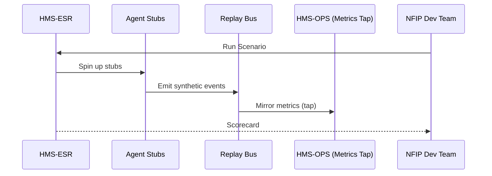

# Chapter 15: Simulation & Training Environment (HMS-ESR)

*[Jump back to Chapter&nbsp;14: External System Synchronization](14_external_system_synchronization_.md)*  

---

## 1. Why Do We Need HMS-ESR?

Picture the **National Flood Insurance Program (NFIP)** about to launch a brand-new “Instant Flood-Zone Re-rating” workflow.  
If something inside the flow mis-routes even **2 %** of policyholders, thousands of homeowners could see the wrong premium on day one.

Waiting for real citizens to uncover bugs is… expensive.  
HMS-ESR is the agency’s **flight simulator**:

1. **Generates synthetic yet realistic user traffic** (citizen log-ins, premium lookups, payment attempts).  
2. **Replays them through the entire HMS stack** without touching production data.  
3. Surfaces bottlenecks, compliance hits, or race conditions *before* anyone goes live.

In short, ESR lets teams rehearse a policy change the same way pilots practice landings—risk-free.

---

## 2. Key Concepts in Plain English

| Concept | Easy Analogy |
|---------|--------------|
| **Scenario** | The scripted play (“10 k citizens renew, 2 % abandon cart”). |
| **Agent Stub** | A “cardboard cut-out” of a real service—responds fast but never writes prod data. |
| **Replay Bus** | A private stage where fake events act out the script. |
| **Metrics Tap** | A spyglass that copies live OPS metrics without polluting them. |
| **Scorecard** | The final report card: latency, error %, compliance hits, etc. |

---

## 3. Hands-On: Rehearse “Instant Flood-Zone Re-rating” in 3 Steps

### 3.1 Create a Scenario

```python
# create_scenario.py  (≤18 lines)
import httpx, json
scenario = {
  "name": "flood_rerate_wave1",
  "actors": 10000,        # synthetic citizens
  "script": [
    {"action":"LOGIN","ratio":1.0},
    {"action":"FETCH_PREMIUM","ratio":1.0},
    {"action":"PAY","ratio":0.98},
    {"action":"ABANDON","ratio":0.02}
  ],
  "duration": "30m"
}
r = httpx.post("/api/esr/scenarios", json=scenario).json()
print(r)          # → { "id":"SCN-300", "status":"READY" }
```

Explain:  
• We define 10 k virtual citizens, their relative actions, and a 30-minute rehearsal window.  
• ESR stores it as **SCN-300**, ready to run.

### 3.2 Launch the Simulation

```bash
curl -X POST /api/esr/scenarios/SCN-300/run
# → { "runId":"RUN-9001","state":"STARTED" }
```

ESR now spins up **Agent Stubs** that imitate HMS-SVC, ACH, AGX, etc., and begins generating events.

### 3.3 Fetch the Scorecard

```bash
curl /api/esr/runs/RUN-9001/scorecard
# → {
#     "latency_p95_ms": 420,
#     "payment_success": 97.8,
#     "compliance_hits": 0,
#     "esq_rule_violations": [],
#     "notes": "Ready for production!"
#   }
```

If numbers look wrong, tweak code or policy and rerun until green.

---

## 4. What Happens Behind the Curtain?



Plain English:

1. Team hits **Run**.  
2. ESR boots lightweight **Stubs** that mimic real services (no prod writes!).  
3. Stubs flood the **Replay Bus** with synthetic requests.  
4. A **Metrics Tap** copies latency/error stats into ESR’s sandboxed DB.  
5. ESR crunches numbers and returns a Scorecard.

---

## 5. A Peek at the Internals

### 5.1 Stubbed Endpoint (Node.js, 14 lines)

```js
// stubs/premium.js
router.post('/fetch_premium', (req,res)=>{
  const delay = Math.random()*200 + 50;     // 50-250 ms
  setTimeout(()=>{
     res.json({ premium: 74200 });          // fake $742.00/yr
  }, delay);
});
```

Beginners’ view: returns a dummy premium after a randomized latency to mimic real network jitter.

### 5.2 Scenario Runner Loop (Python, 17 lines)

```python
def run(scn):
    end = time.time() + parse_duration(scn["duration"])
    while time.time() < end:
        for act in scn["script"]:
            spawn_actors(act, scn["actors"]*act["ratio"])
        time.sleep(1)       # simple pacing
```

• Loops until the timer ends.  
• `spawn_actors` fires async HTTP calls to the stubs according to ratios.

### 5.3 Scorecard Builder (SQL, 8 lines)

```sql
SELECT
  percentile_cont(0.95) WITHIN GROUP (ORDER BY latency_ms) AS p95,
  100.0*sum(case when status='OK' then 1 end)/count(*)     AS success_rate
FROM esr_metrics
WHERE run_id = 'RUN-9001';
```

Outputs the numbers shown in the Scorecard.

---

## 6. How ESR Connects to Other Layers

| Layer | Interaction |
|-------|-------------|
| [HMS-GOV](01_governance_layer___admin_portal__hms_gov__.md) | UI to pick scenarios, view scorecards. |
| [HMS-OPS](12_operational_monitoring___logging__hms_ops__.md) | Provides live metrics via the **Metrics Tap**; ESR never pollutes prod stats. |
| [HMS-ESQ](08_legal___compliance_module__hms_esq__.md) | Scans synthetic data to ensure no hidden PII leaks before rollout. |
| [HMS-MFE](04_micro_frontend_interface_library__hms_mfe__.md) | Allows devs to preview how widgets behave under load. |
| [HMS-ACT](06_agent_orchestration_engine__hms_act__.md) | Can inject a **simulate** stage before the real execution stage. |

---

## 7. Frequently Asked Questions

**Q: Does ESR touch real databases?**  
No. By default every write goes to in-memory or sandboxed stores. You can optionally mount a **read-only** replica for more realism.

**Q: Can ESR replay *real* production traffic?**  
Yes—export a slice of anonymized logs from HMS-OPS and feed them as a *trace-based* Scenario.

**Q: How long do scorecards stay stored?**  
30 days hot storage, then archived to HMS-DTA (you can restore on demand).

**Q: Can I simulate failures (e.g., ACH outage)?**  
Sure. Add `{ "action":"ACH_DOWN", "at": "15m" }` to the script. ESR pauses stubbed ACH responses or returns 503s.

---

## 8. What You Learned

• HMS-ESR is your **policy flight simulator**—spawning fake citizens, fake payments, and fake errors so teams can tune workflows safely.  
• You created a 10 k-user scenario, ran it, and read a green Scorecard in under 30 lines of code.  
• Under the hood, lightweight **Agent Stubs**, a **Replay Bus**, and a **Metrics Tap** make rehearsals cheap yet realistic.  

That wraps our tour of the entire HMS platform—from governance screens all the way to simulation sandboxes.  
Go forth and iterate with confidence—real citizens will thank you!

---

Generated by [AI Codebase Knowledge Builder](https://github.com/The-Pocket/Tutorial-Codebase-Knowledge)