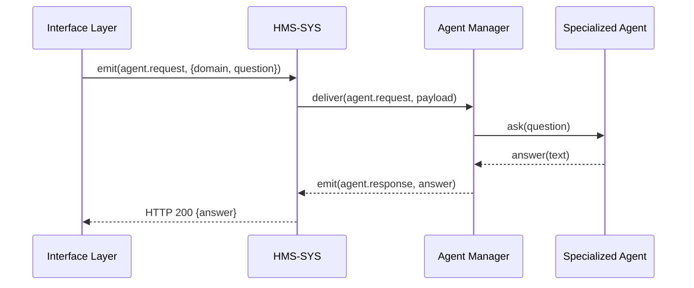

# Chapter 15: Specialized AI Agents (HMS-A2A)

In the previous chapter, we saw how an [AI Representative Agent](14_ai_representative_agent_.md) acts like a consultant across the whole platform. Now, let’s dive into **Specialized AI Agents**—domain‐tailored advisors built on our core agent framework for healthcare, education, finance, and more.

---

## 1. Motivation & Central Use Case

Imagine two federal ministries:

- The **Health Department** needs an AI that knows HIPAA rules, medical jargon, and clinical guidelines.  
- The **Finance Ministry** needs an AI that understands tax codes, audit procedures, and accounting terms.

A single, generic AI can’t handle both sets of rules well. Enter **HMS-A2A**: we create one AI agent per domain, each trained on its sector’s rules and language. Think of them as subject-matter specialists in your orchestration “cabinet,” each ready to answer domain-specific questions or perform tasks.

---

## 2. Key Concepts

1. Domain Model  
   A set of rules, vocabularies, and data schemas unique to one sector (e.g., medical codes vs. tax brackets).

2. Agent Interface  
   A standard way to ask any agent a question or give it a task (e.g., `agent.ask(query)`), built on the core agent framework from [Chapter 1: Core System Platform (HMS-SYS)](01_core_system_platform__hms_sys__.md).

3. Skill Modules  
   Pluggable components inside each agent—for example, a “claim-analysis” skill for healthcare, or an “audit-calculator” skill for finance.

4. Registration & Routing  
   Agents register themselves with a central **Agent Manager** so that incoming requests are routed to the correct domain agent.

---

## 3. Using Specialized AI Agents

Below is a minimal example showing how to set up two agents and ask each a question. We use an `AgentManager` to route by domain.

```js
// agentManager.js
const AgentManager = require('./coreAgentManager');
const HealthAgent  = require('./agents/healthcareAgent');
const TaxAgent     = require('./agents/financeAgent');

const manager = new AgentManager();
manager.register('healthcare', new HealthAgent());
manager.register('finance',    new TaxAgent());

// Later, when a user asks:
async function handleRequest(domain, question) {
  const answer = await manager.ask(domain, question);
  console.log(`[${domain}] Answer:`, answer);
}

handleRequest('healthcare', 'How do I file a claim under HIPAA?');
handleRequest('finance',    'Calculate tax refund for $45,000 income.');
```

Explanation:

1. We create an `AgentManager`.  
2. We register a `healthcare` and a `finance` agent.  
3. When a request arrives, `manager.ask()` routes to the correct agent and returns its answer.

---

## 4. Under the Hood: Step-by-Step Flow



1. The front­end calls the Interface Layer ([Chapter 2](02_interface_layer_.md)).  
2. It emits an `agent.request` event to HMS-SYS.  
3. HMS-SYS routes the event to the **Agent Manager**.  
4. The manager calls the correct **Specialized Agent** (`healthcareAgent`, `financeAgent`).  
5. The agent returns its answer, which flows back through HMS-SYS to the UI.

---

## 5. Internal Implementation Details

### 5.1 File Structure

```
hms-a2a/
├─ coreAgentManager.js
├─ agents/
│  ├─ healthcareAgent.js
│  └─ financeAgent.js
└─ skills/
   ├─ hipaaSkill.js
   └─ auditSkill.js
```

### 5.2 coreAgentManager.js

```js
// coreAgentManager.js
class AgentManager {
  constructor() { this.agents = {}; }
  register(domain, agent) { this.agents[domain] = agent; }
  async ask(domain, question) {
    const agent = this.agents[domain];
    if (!agent) throw new Error(`No agent for ${domain}`);
    return agent.handle(question);
  }
}
module.exports = AgentManager;
```

This manager holds a map of domain → agent and delegates questions.

### 5.3 healthcareAgent.js

```js
// agents/healthcareAgent.js
const hipaaSkill = require('../skills/hipaaSkill');
class HealthcareAgent {
  async handle(query) {
    // Pre-process query (extract terms, check compliance)
    // Here we simply call the HIPAA skill
    return hipaaSkill.answer(query);
  }
}
module.exports = HealthcareAgent;
```

`hipaaSkill` knows how to parse medical terms and apply HIPAA rules.

### 5.4 financeAgent.js

```js
// agents/financeAgent.js
const auditSkill = require('../skills/auditSkill');
class FinanceAgent {
  async handle(query) {
    // Route to auditSkill for tax calculations
    return auditSkill.calculate(query);
  }
}
module.exports = FinanceAgent;
```

The `auditSkill` contains tax tables and formulas.

---

## 6. Summary

In this chapter you learned how to:

- Build **domain-specific AI agents** on top of our core framework.  
- Register them with an **Agent Manager** for routing.  
- Let each agent load its own **skill modules** (rules, vocabularies, calculations).  
- See the end-to-end flow from UI to specialized agent through HMS-SYS.

With HMS-A2A, you now have a cabinet of AI experts—each tailored to a ministry’s needs!

---

Generated by [AI Codebase Knowledge Builder](https://github.com/The-Pocket/Tutorial-Codebase-Knowledge)