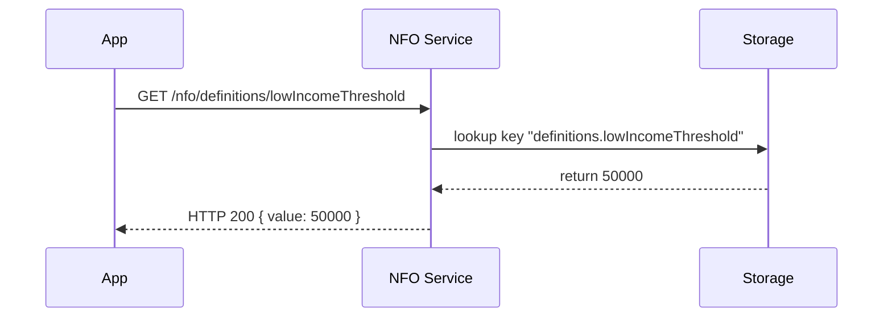

# Chapter 15: System-Level Info Repository (HMS-NFO)

Welcome back! In [Chapter 14: Knowledge Graph System (HMS-AGX)](14_knowledge_graph_system__hms_agx__.md), you learned how to connect statutes, cases, and reports into a graph. Now let’s explore the **System-Level Info Repository (HMS-NFO)**—the federal “archives” for standards, definitions, and reference data that every program, protocol, and agent can consult to stay compliant.

---

## 15.1 Motivation & Central Use Case

Imagine you run a local “Low-Income Housing” program. You need the official federal definition of “low income” so your eligibility rules match national policy. Rather than hard-coding numbers, you point to the HMS-NFO repo which holds a `fed.json` file:

```json
{
  "definitions": {
    "lowIncomeThreshold": 50000,
    "livingWage": 15000
  },
  "standards": {
    "dateFormat": "YYYY-MM-DD",
    "currency": "USD"
  }
}
```

**Use Case**  
When your citizen portal or an AI agent checks eligibility, it asks HMS-NFO for `definitions.lowIncomeThreshold`. This ensures everyone uses the same numbers and formats—just like a librarian who always refers you to the same authoritative book.

---

## 15.2 Key Concepts

1. **Repo Config**  
   The source location (file path, URL, or database) for federal reference files like `fed.json`.

2. **Definitions**  
   Named values (thresholds, codes) used by programs and agents.

3. **Standards**  
   Uniform rules (date formats, currency codes) to enforce consistency.

4. **Query API**  
   A simple endpoint to fetch a definition or standard by key at runtime.

---

## 15.3 How to Use HMS-NFO

Below is a minimal example. We’ll register the NFO repo, then fetch a definition.

```js
import { NFORepository } from 'hms-cdf/nfo/repository'

// 1) Configure where your federal JSON lives
const nfo = new NFORepository({
  id: 'fed-archive',
  source: '/data/fed.json'  // could be an S3 URL or DB key
})
nfo.initialize()

// 2) Later in your code, fetch a standard
const threshold = await nfo.getDefinition('lowIncomeThreshold')
// threshold → 50000
```

Explanation:  
- We point `NFORepository` at our `fed.json`.  
- `initialize()` loads and indexes the file.  
- `getDefinition()` returns the up-to-date value.

---

## 15.4 Runtime Flow

What happens under the hood when you call `getDefinition()`?



1. Your application requests a definition by key.  
2. The **NFO Service** queries its loaded data.  
3. The value is returned in a consistent JSON payload.

---

## 15.5 Under the Hood: Core Implementation

Let’s peek at a simplified version of `nfo/repository.ts`.

```ts
// File: nfo/repository.ts
export class NFORepository {
  private data: any

  constructor(private cfg: { id: string; source: string }) {}

  async initialize() {
    // Load the JSON once at startup
    this.data = JSON.parse(await readFile(this.cfg.source))
    ApiRouter.get(`/nfo/definitions/:key`, (req, res) => {
      const val = this.get(req.params.key)
      res.send({ value: val })
    })
  }

  get(path: string) {
    // Simple dot-path lookup: "definitions.lowIncomeThreshold"
    return path.split('.').reduce((o, k) => o?.[k], this.data)
  }
}
```

Explanation:  
- **constructor** captures where to load data.  
- **initialize()** reads the JSON and sets up an HTTP route.  
- **get()** traverses the in-memory object by dot-path.

---

## 15.6 Recap

You’ve learned how the **System-Level Info Repository (HMS-NFO)**:

- Serves as the federal knowledge base for definitions and standards.  
- Loads a central JSON (like `fed.json`) and exposes a simple API.  
- Ensures that programs, portals, and agents all use identical reference data.

With HMS-NFO in place, you eliminate “magic numbers” and keep the entire system compliant with national archives. There are no further chapters—this completes our walkthrough of HMS-CDF’s key abstractions. Happy coding!

---

Generated by [AI Codebase Knowledge Builder](https://github.com/The-Pocket/Tutorial-Codebase-Knowledge)