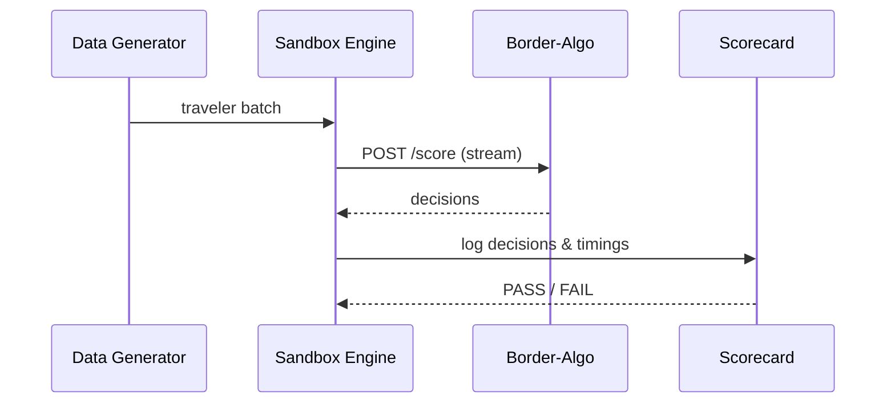

# Chapter 15: Training & Simulation Sandbox (HMS-ESR / HMS-EDU)

[← Back to Chapter 14: Monitoring, Operations & DevSecOps (HMS-OPS / HMS-DEV)](14_monitoring__operations___devsecops__hms_ops___hms_dev__.md)

---

## 1. Why Do We Need a “Flight Simulator” for Policy Algorithms?

Imagine U.S. Customs & Border Protection (CBP) wants to deploy a **new risk-scoring algorithm** that decides whether a traveler can use the express e-Gate line.  
Rolling it straight into production risks:

* 3-hour lines if the model is too strict  
* Missed threats if the model is too lenient  
* Civil-rights lawsuits if the model shows demographic bias  

**Training & Simulation Sandbox (HMS-ESR / HMS-EDU)** is the **flight simulator** where that algorithm can crash safely:

1. A **digital twin** airport is filled with **synthetic travelers**.  
2. The algorithm runs exactly as it would at real gates.  
3. Analysts inspect *wait-times, false-positives, demographic fairness*.  
4. Only after passing the scorecard does code move toward production.

---

## 2. Key Concepts (Five Sticker-Notes)

| Concept            | Airline Analogy                   | One-Line Meaning |
|--------------------|-----------------------------------|------------------|
| Digital Twin       | Mock airport on a movie set       | Replica of real environment (queues, sensors) but no live passengers. |
| Scenario Script    | Flight plan                       | YAML file describing today’s “flight schedule” of traveler types & volumes. |
| Synthetic Data Generator | Casting agency           | Produces fake but realistic passports, itineraries, biometrics. |
| Scorecard          | Pilot exam sheet                  | Metrics to pass: ≤ 1 % false reject, ≤ 45 sec avg wait, ≤ 0.2 bias index. |
| Reset Switch       | “Sim-reset” button                | Clears state so next run starts from zero lines & logs. |

---

## 3. End-to-End Walk-Through (≤ 20 Lines per Step)

### 3.1  Write a Scenario

```yaml
# file: scenarios/visa_waiver_peak.yaml
name: Visa-Waiver Morning Rush
duration: 2h
arrivals_per_minute: 120
traveler_mix:
  US:          30 %   # returning citizens
  EU:          50 %   # visa-waiver tourists
  High-risk:   20 %   # simulated watch-list hits
```

*Beginners’ note:* YAML is just text—change numbers to test other loads.

---

### 3.2  Generate Synthetic Travelers

```python
# generate.py (18 lines)
from hms_esr import synth

travellers = synth.build(
        "scenarios/visa_waiver_peak.yaml",
        seed=42        # deterministic for replay
)
print(len(travellers))     # 14 400 fake arrivals
```

*What it does:* creates JSON records (name, passport, face-embedding, travel history) but **no real PII**.

---

### 3.3  Launch a Simulation Run

```bash
hms-esr run \
   --algo=http://localhost:8000/score \
   --data=travellers.json \
   --scorecard=standard.yaml
```

Output:

```
Run ID  : sim_2024-05-01T10-00Z
Queued  : 14 400 passengers
Result  : PASSED  ✅  (see scorecard.html)
```

*Under 1 command!*  
The CLI streams travelers to the algorithm’s `/score` endpoint exactly as production would.

---

### 3.4  Inspect the Scorecard

```python
from hms_esr import reports
report = reports.load("scorecard.html")
print(report["false_reject_rate"])    # 0.7 %
print(report["avg_wait_sec"])         # 39
```

*If any metric breaches the thresholds, the CLI marks the run **FAILED ❌** and blocks the deployment pipeline.*

---

## 4. What Happens Behind the Curtain?



Only **four participants** keep the story beginner-friendly.

---

## 5. Peek Inside the Engine Room

### 5.1  Scenario Parser (8 Lines)

```python
# hms_esr/scenario.py
def load(path):
    yml = yaml.safe_load(open(path))
    return dict(
        arrivals=int(yml["duration"].rstrip("h"))*60*
                 yml["arrivals_per_minute"],
        mix=yml["traveler_mix"]
    )
```

*Turns YAML into simple Python dicts.*

---

### 5.2  Tiny Traveler Generator (12 Lines)

```python
def generate(arrivals, mix, seed):
    random.seed(seed)
    for _ in range(arrivals):
        country = random.choices(list(mix), mix.values())[0]
        yield synth_one(country)      # returns JSON doc
```

*`synth_one()` pulls templates from `data/fake_passports.csv`—omitted here.*

---

### 5.3  Real-Time Timer (15 Lines)

```python
# hms_esr/engine.py (simplified)
async def stream(travelers, algo_url):
    for t in travelers:
        start = time.time()
        r = await post(algo_url, json=t)
        log_decision(t["id"], r.json(), time.time()-start)
```

*Logs every decision with latency—later used by the Scorecard.*

---

### 5.4  Bias Checker (18 Lines)

```python
# hms_esr/scorecard.py
def bias_index(log):
    hits = [r for r in log if r["decision"] == "reject"]
    groups = defaultdict(int)
    for r in hits:
        groups[r["country"]] += 1
    # simple Gini-like ratio
    diffs = [abs(groups[a]-groups[b]) for a,b in combinations(groups,2)]
    return sum(diffs) / (len(hits) * len(groups))
```

*If `bias_index` > `0.2`, the run automatically fails.*

---

## 6. How the Sandbox Connects to Other HMS Layers

| Layer | Interaction | Example |
|-------|-------------|---------|
| [HMS-DTA](05_data___privacy_management_hub__hms_dta__.md) | Provides **synthetic datasets** and ensures real PII never leaks into the sandbox. | `dta.request_ticket(dataset="synthetic_passports")` |
| [HMS-GOV](03_governance_layer___human_in_the_loop__hitl__.md) | A **FAILED** run auto-creates a *proposal* to delay production release. | `gov.submit({"action":"delay_deploy", "run":"sim_..."})` |
| [HMS-OPS](14_monitoring__operations___devsecops__hms_ops___hms_dev__.md) | Sandbox metrics show up in the same Grafana dashboard but tagged `env=sim`. | Green vs. red bars side-by-side |
| [HMS-MFE](12_micro_frontend_interface_library__hms_mfe__.md) | Analysts view scorecards in a `<mfe-scorecard>` widget. | Drag-and-drop into any portal |

All traffic **stays inside** the sandbox network; no calls reach production APIs unless explicitly whitelisted.

---

## 7. Hands-On Lab (2 Minutes)

```bash
git clone hms-utl
cd hms-utl/demo
docker compose up esr algo_stub grafana   # starts sandbox + fake algo

# 1. Generate scenario & run
python generate.py
hms-esr run --algo=http://algo_stub/score \
            --data=travellers.json \
            --scorecard=standard.yaml

# 2. Open dashboard
open http://localhost:3000/d/sandbox
```

Green bars? You’re ready to request deployment; red bars? Iterate safely.

---

## 8. Resetting & Replaying

```bash
hms-esr reset sim_2024-05-01T10-00Z
hms-esr replay sim_2024-05-01T10-00Z --algo=new_params.json
```

*Ideal for A/B testing parameter tweaks without regenerating travelers.*

---

## 9. Recap

* You met **HMS-ESR / HMS-EDU**, the *flight simulator* for risky algorithms.  
* Five key concepts: Digital Twin, Scenario Script, Synthetic Data Generator, Scorecard, Reset Switch.  
* A full test cycle: **write scenario → generate data → run → inspect scorecard → pass/fail**.  
* Tiny internal bits: YAML parser, generator loop, latency logger, bias checker.  
* Tight integration with Data-Privacy, Governance, Ops, and UI layers—yet *zero* risk to real citizens.

Go forth and crash as many virtual planes as you need—**before** you ever taxi onto the real runway!

---

Generated by [AI Codebase Knowledge Builder](https://github.com/The-Pocket/Tutorial-Codebase-Knowledge)