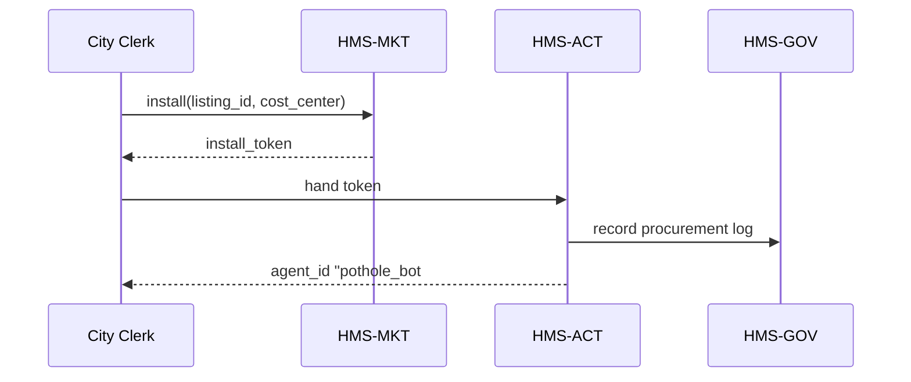

# Chapter 16: Agent Marketplace (HMS-MKT)

*(continuing from [Chapter&nbsp;15: Human-in-the-Loop Oversight (HITL)](15_human_in_the_loop_oversight__hitl__.md))*  

---

## 1. Why Do We Need a Marketplace?

Picture the *City of Springfield* looking for a **pothole-reporting chatbot**.  
Today the IT office must:

1. Google “government chatbot vendors,”  
2. read 40 PDFs,  
3. beg Purchasing to draft an RFP,  
4. wait **6 – 18 months** for legal vetting.

Meanwhile, citizens keep dodging potholes.

**HMS-MKT** is a government-friendly **App Store for AI agents**:

* Browse ready-made agents (chatbots, FOIA bots, wildfire predictors …).  
* See agency-style listings:   capabilities, certifications, cost center codes, peer reviews.  
* One-click **install** → agent is provisioned, badged, and logged in [HMS-ACT](14_agent_lifecycle_management__hms_act__.md).  

Result: *Minutes* instead of months, with procurement rules still 100 % satisfied.

---

## 2. Key Concepts (no jargon, promise!)

| Term                | Beginner-friendly description |
|---------------------|--------------------------------|
| Listing             | The “app card” you see: name, version, screenshots, price tag. |
| Certification Badge | Proof it passed security & legal checks (e.g., FedRAMP Moderate). |
| Cost Center Code    | Where the bill goes (OMB’s *Common Baseline* codes, or your city GL). |
| Peer Review Stars   | 1-to-5 rating left by other agencies. |
| Install Token       | Signed blob that lets [HMS-ACT](14_agent_lifecycle_management__hms_act__.md) hire the agent. |
| Procurement Log     | Automatic PDF summarizing FAR/OMB boxes ticked—auditors love it. |

---

## 3. Five-Minute Walking Tour  
We’ll install the Springfield **Pothole Bot** in three tiny steps.

### 3.1. Browse Listings

```python
# file: browse.py  (13 lines)
from hms_mkt import Marketplace

mkt = Marketplace(url="https://mkt.gov")      # SaaS or self-host

for lst in mkt.search("pothole"):
    print(lst["id"], lst["title"], lst["stars"])
```

Output:

```
AGT-POT-001  Pothole Bot (v2.1)  ⭐⭐⭐⭐☆
```

Explanation  
`search()` returns plain dicts—easy to filter or script-around.

---

### 3.2. Inspect One Listing

```python
det = mkt.details("AGT-POT-001")
print(det["certifications"])
print(det["monthly_cost"])
```

Sample:

```
['FedRAMP Moderate', 'ADA Chat Compliance']
$125 / month
```

So you know *at a glance* it ticks both **security** and **accessibility** boxes.

---

### 3.3. Install With One Line

```python
token = mkt.install(
    listing_id="AGT-POT-001",
    cost_center="SPR-TRAN-4230",
    reviewer="alice@springfield.gov"   # HITL signer
)
```

What happens next?

1. Marketplace returns a **signed install token**.  
2. Your local [HMS-ACT](14_agent_lifecycle_management__hms_act__.md) consumes the token and hires `pothole_bot#001`.  
3. HITL logs the signer so procurement is transparent.

*(Under the hood flow in §5.)*

---

## 4. Under-the-Hood (No heavy code yet)



Key facts  
• *No agent code* travels until the install token is validated.  
• Governance gets a copy for auditors—zero extra paperwork.

---

## 5. Peeking Inside the Marketplace Code

### 5.1. Listing Schema (10 lines)

```python
# hms_mkt/models.py
Listing = {
    "id":      str,    # e.g. AGT-POT-001
    "title":   str,
    "version": str,
    "price":   str,
    "badges":  list,   # ['FedRAMP', ...]
    "stars":   float,
    "vendor":  str,
}
```

### 5.2. Install Endpoint (≤ 20 lines)

```python
# hms_mkt/api.py
from fastapi import FastAPI, HTTPException
from .store import LISTINGS, make_token

app = FastAPI()

@app.post("/install")
def install(req: dict):
    lst = LISTINGS.get(req["listing_id"])
    if not lst:
        raise HTTPException(404, "Not found")
    token = make_token(lst, req["cost_center"], req["reviewer"])
    return {"install_token": token}
```

Explanation  
* `make_token()` signs a JWT containing listing metadata + reviewer email.  
* That JWT is what [HMS-ACT](14_agent_lifecycle_management__hms_act__.md) expects.

### 5.3. Token Maker (12 lines)

```python
# hms_mkt/token.py
import jwt, time

SECRET = "super-secret-key"     # env var in real life

def make_token(lst, cost_center, reviewer):
    payload = {
        "listing": lst["id"],
        "version": lst["version"],
        "cost_center": cost_center,
        "reviewer": reviewer,
        "iat": int(time.time())
    }
    return jwt.encode(payload, SECRET, algorithm="HS256")
```

Tokens are **short**, human readable, and cryptographically signed.

---

## 6. Procurement Log Generated (Auto-magic)

Upon first run, HMS-MKT writes a PDF like:

```
SPRINGFIELD PROCUREMENT RECEIPT
Listing:  Pothole Bot v2.1 (AGT-POT-001)
Vendor:   CivicAI Inc.
Badges:   FedRAMP Moderate, ADA Chat Compliance
Cost Ctr: SPR-TRAN-4230
Reviewer: Alice Smith (alice@springfield.gov)
Time:     2024-05-17 14:12 UTC
Checksum: 6f2a…d0c9
```

Drop this in your finance folder—**no** extra FOIA requests later.

---

## 7. FAQ

**Q1: Can I publish my own agent?**  
Yes—`mkt.publish(listing_yaml)` uploads your package after it passes [Compliance & Legal Reasoning](03_compliance___legal_reasoning__hms_esq__.md).

**Q2: What if the agent price changes?**  
Listings are **immutable** once published; vendors must push a *new* version (e.g., v2.2) so purchasing history is rock-solid.

**Q3: Does the marketplace handle license payments?**  
Payment flows through [HMS-ACH](04_payment___clearinghouse_engine__hms_ach__.md) using the *cost center* you provide.

**Q4: Can federal and city agencies share the same marketplace?**  
Yes—multi-tenant namespaces (`fed/`, `state/`, `city/`) keep listings separated while reusing the same codebase.

---

## 8. Mini Challenge (Optional)

1. Publish a **Fire Risk Forecaster** agent with badge `US Fire Administration Approved`.  
2. Install it twice with two different cost centers (`FIRE-OPS` and `FIRE-TRAIN`).  
3. Run `mkt.report_purchases()` and verify both appear with separate GL codes.

---

## 9. What We Learned

• **HMS-MKT** turns months-long procurement into a **one-click, audit-friendly** process.  
• Listings carry *badges*, *cost center codes*, and *peer reviews* so you can choose wisely.  
• A signed **install token** hands off to [HMS-ACT](14_agent_lifecycle_management__hms_act__.md) for safe provisioning, while automatic PDFs satisfy procurement officers.

Ready to surface these agents inside citizen-facing webpages without rewriting entire front-ends?  
Jump ahead to [Chapter 17: Frontend Micro-Frontend Library (HMS-MFE)](17_frontend_micro_frontend_library__hms_mfe__.md).

---

Generated by [AI Codebase Knowledge Builder](https://github.com/The-Pocket/Tutorial-Codebase-Knowledge)