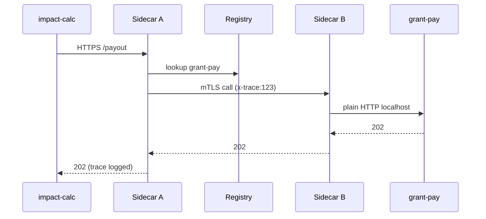

# Chapter 16: Backend Service Mesh (HMS-SVC & APIs)

[← Back to Chapter 15: External System Sync Gateway (Inter-Agency Integration)](15_external_system_sync_gateway__inter_agency_integration__.md)

---

## 1. Why a “Service Mesh” at All?

Picture the **Council on Environmental Quality (CEQ)** running dozens of micro-services:

* **`impact-calc`** – estimates carbon impact for new highway projects  
* **`grant-pay`** – wires money to states (talks to [HMS-ACH](07_financial_clearinghouse__hms_ach__.md))  
* **`public-docs`** – serves PDFs to citizens

If `impact-calc` needs data from `public-docs`, should developers hard-code:

```
https://10.42.7.55:8443/v2/docs/{id}
```

?  
Tomorrow that IP might change, TLS certs may expire, or traffic might spike.

**Backend Service Mesh (HMS-SVC)** is the **agency’s circulatory system**:

1. Micro-services register once, **auto-discover each other** by name (`public-docs.svc`).  
2. Common plumbing (TLS, retries, logging) is injected automatically.  
3. Policies (rate limits, zero-trust) can be tweaked live—no code edits.

Result: Devs focus on *logic*, ops teams tune *policies*, auditors get *perfect traces*.

---

## 2. Central Story – “Carbon Impact Meets Payments”

> 1. `impact-calc` finishes a highway analysis and needs to trigger a **$200 000 tree-planting grant**.  
> 2. It calls `grant-pay` with `/payout` JSON.  
> 3. Both services are **versioned**, authenticated, and fully traced by HMS-SVC—*no IPs, no shared secrets*.

We’ll implement this call end-to-end in **18 lines each**, then peek under the hood.

---

## 3. Key Mesh Concepts (Beginner Friendly)

| Concept | Everyday Analogy | 1-Line Explanation |
|---------|------------------|--------------------|
| Service Registry | Phone book | Keeps **name → location** mappings (`grant-pay` → `10.0.3.7:9000`). |
| Sidecar Proxy | Chauffeur | Sits next to each micro-service, drives traffic safely. |
| mTLS | Secret handshake | Every call is encrypted & identity-verified **by default**. |
| Circuit Breaker | Surge protector | Stops cascades when a service misbehaves. |
| Observability Tap | Water meter | Records latency, errors, and request IDs for [HMS-OPS](19_system_observability___ops_center__hms_ops__.md). |

---

## 4. Calling Another Service in 18 Lines

### 4.1 Producer (`impact_calc.py`)

```python
# impact_calc.py  (18 lines)
import svcmesh as mesh, json

mesh.init(service="impact-calc", version="v1")

def send_grant(project_id, amount):
    client = mesh.client("grant-pay")      # 🔍 service discovery
    payload = {"project": project_id, "usd": amount}
    res = client.post("/payout", json=payload, timeout=2)
    print("Status:", res.status_code, "Trace:", res.headers["x-trace"])

if __name__ == "__main__":
    send_grant("HWY-94", 200_000)
```

Explanation  
1. `mesh.init()` registers with HMS-SVC.  
2. `mesh.client("grant-pay")` returns a ready-to-go HTTPS session; DNS, TLS, retries already baked in.  
3. Trace ID is auto-propagated for auditors.

### 4.2 Consumer (`grant_pay.py`)

```python
# grant_pay.py  (18 lines)
import svcmesh as mesh, hms_ach as ach, flask

app = flask.Flask(__name__)
mesh.init(service="grant-pay", version="v2")

@app.route("/payout", methods=["POST"])
def payout():
    req = flask.request.get_json()
    ach.send(payment_id=req["project"], amount=req["usd"])
    return {"ok": True}, 202

if __name__ == "__main__":
    app.run(port=9000)          # sidecar handles TLS & auth
```

Explanation  
Sidecar proxy injects client cert auth, logs, and circuit-breaking automatically.

---

## 5. Step-By-Step Under the Hood



*Only sidecars talk across the network; your apps stay blissfully ignorant.*

---

## 6. Mini Implementation Peek (All ≤ 20 Lines)

### 6.1 In-Memory Registry

```python
# svcmesh/registry.py
REG = {}
def register(name, host, port): REG[name] = f"https://{host}:{port}"
def resolve(name): return REG[name]
```

### 6.2 Sidecar Stub

```python
# svcmesh/sidecar.py
import requests, uuid, time, registry

def outbound(dst, path, **kw):
    url = registry.resolve(dst) + path
    hdrs = kw.pop("headers", {})
    hdrs["x-trace"] = tid = uuid.uuid4().hex
    t0 = time.time()
    r = requests.post(url, headers=hdrs, **kw)
    log(tid, url, time.time()-t0, r.status_code)
    return r

def log(tid, url, ms, code):
    print(f"[TRACE {tid[:6]}] {url} {code} {ms:.2f}s")
```

*Real life* uses Envoy or Linkerd; here we show the gist: trace ID + timing.

### 6.3 Convenience Wrapper

```python
# svcmesh/__init__.py
from registry import register, resolve
from sidecar import outbound
def init(service, version): register(service, "127.0.0.1", 9000)
def client(name):           # returns obj with .post()
    class C: post=lambda self,p,**k: outbound(name, p, **k)
    return C()
```

You just built a toy mesh in < 60 lines!

---

## 7. Policy Tweaks Without Re-Deploy

```yaml
# mesh_policies.yml
circuit_breakers:
  grant-pay:
    max_failures: 3
    reset_seconds: 30
rate_limits:
  impact-calc:
    rps: 50
```

Ops staff can `mesh apply mesh_policies.yml` in prod; sidecars reload live—no service restarts.

---

## 8. Mesh & the Rest of HMS-CDF

| Layer | Integration Point |
|-------|-------------------|
| [Governance Layer](01_governance_layer__ai_governance_model__.md) | Blocks registry entry if service code failed policy scan. |
| [Universal Identity & Access](12_universal_identity___access__account___authn__.md) | Mesh mTLS certs are issued using the same UIA identity. |
| [Compliance Guardrail Framework](05_compliance_guardrail_framework__hms_esq__.md) | Inspects request headers/body in sidecar—blocks illegal data export. |
| [System Observability & Ops Center](19_system_observability___ops_center__hms_ops__.md) | Consumes per-trace logs for dashboards & alerts. |
| [Activity Orchestrator](13_activity_orchestrator__hms_act__.md) | Emits events like `mesh.timeout` or `mesh.circuit_open` for workflows. |

---

## 9. 90-Second Lab

1. Clone the stub repo (placeholder):

   ```bash
   git clone https://github.com/example/hms-svc-mini.git
   cd hms-svc-mini
   ```

2. Open two terminals.

   Terminal A:

   ```bash
   python grant_pay.py
   ```

   Terminal B:

   ```bash
   python impact_calc.py
   ```

3. Watch Terminal A print payment logs; Terminal B shows:

   ```
   Status: 202 Trace: 123abc...
   [TRACE 123abc] https://127.0.0.1:9000/payout 202 0.03s
   ```

4. Kill `grant_pay.py` and rerun `impact_calc.py` twice; sidecar opens a **circuit** after 3 failures and prints a warning.

Congratulations—you survived your first mesh outage! 🚒

---

## 10. Recap & Next Steps

* HMS-SVC gives every micro-service a **name**, secure pipes, retries, and trace IDs.  
* Devs call `mesh.client("service")`, write zero networking code, and remain policy-compliant.  
* Ops teams adjust rate limits, circuit breakers, and mTLS certs **without redeploying apps**.  

Next we’ll see how services (and even third parties) **publish & discover** these APIs in a searchable catalog:  
[Chapter 17: Marketplace Registry (HMS-MKT)](17_marketplace_registry__hms_mkt__.md)

---

---

Generated by [AI Codebase Knowledge Builder](https://github.com/The-Pocket/Tutorial-Codebase-Knowledge)