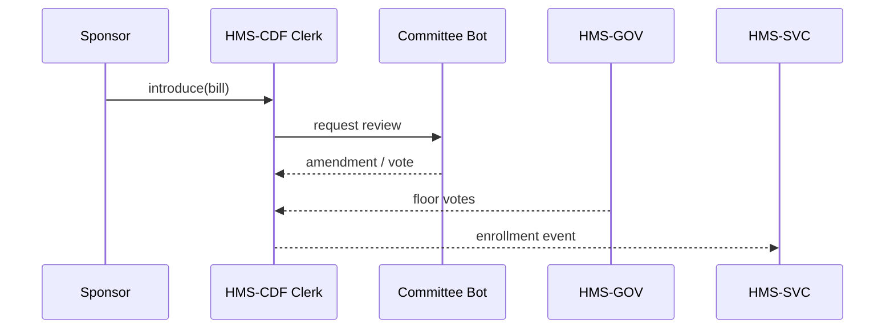

# Chapter 16: Codified Democracy Foundation (HMS-CDF)

[← Back to Chapter 15: Governance Layer (HMS-GOV)](15_governance_layer__hms_gov__.md)

---

## 1  •  Why Do We Need HMS-CDF?

Picture this:

*Monday, 11 p.m.* — a tiny line is added to a configuration file that bumps a **“Federal Broadband Rebate”** cap from **\$100 M → \$250 M**. No notice, no debate.

By Tuesday morning Treasury bots are sending out two-and-a-half times the intended refunds.  
Where was the vote? Who scheduled the change? **Who even knew?**

HMS-CDF is the **automated legislative clerk** that stops these “midnight regulations.”  
Every rule, policy, or code change must walk the **same public, step-by-step path** a bill follows through Congress:

1. Draft  
2. Committee review  
3. Floor debate  
4. Final vote  
5. Enrollment into law  

If a step is skipped, the change simply **cannot** deploy.

---

## 2  •  Key Concepts (Capitol-Hill Analogies)

| HMS-CDF Term | Capitol-Hill Analogy | Plain English |
|--------------|---------------------|---------------|
| **Bill**     | Printed bill text   | YAML describing the proposed change. |
| **Reading**  | 1st / 2nd Reading   | Mandatory waiting period for public comment. |
| **Committee**| Committee markup    | Group of bots / humans who may amend. |
| **Chamber Vote** | House or Senate vote | Formal yes/no tally captured by [HMS-GOV](15_governance_layer__hms_gov__.md). |
| **Enrollment** | President’s signature | Final, immutable publish to production. |

Keep these five nouns in mind—HMS-CDF is simply a programmable workflow that enforces them.

---

## 3  •  3-Minute Hands-On Tour  
*(All code blocks < 20 lines)*

### 3.1 Draft a Bill

```yaml
# bills/broadband_rebate.yaml
id      : HR-1203
title   : Increase Broadband Rebate Cap
version : 1.0.0
proposes:
  rebateCap: 250000000          # $250 M
sponsor : FCC.Admin
committees:
  - Budget.Committee
  - Technology.Committee
```

*Explanation*  
A single YAML file is the “bill paper.” It names a sponsor and which committees must review.

---

### 3.2 Introduce the Bill

```bash
$ cdf introduce bills/broadband_rebate.yaml
✓ Bill HR-1203 filed
✓ Scheduled for First Reading (24 h clock starts)
```

*Explanation*  
`cdf introduce` drops the bill into the **Docket** you met in Chapter 15 and starts the first waiting period.

---

### 3.3 Progress Through Readings & Committees

```bash
$ cdf status HR-1203
STEP               STATE      UNTIL
────────────────────────────────────────
First Reading      OPEN       2024-10-01 14:00Z
Second Reading     PENDING
Budget Committee   PENDING
Tech Committee     PENDING
Floor Vote         PENDING
Enrollment         PENDING
```

After 24 h:

```bash
$ cdf advance HR-1203
✓ First Reading closed
✓ Second Reading timer (48 h) started
```

*Explanation*  
Only the clerk (`cdf advance`) can move steps, and only when clocks or votes allow.

---

### 3.4 Committee Amendment (Budget trims the cap)

```bash
$ cdf amend HR-1203 --committee Budget.Committee --field rebateCap=200000000
✓ Amendment recorded as A-1
```

The file is now at **version 1.1.0**; every amendment increments the minor version.

---

### 3.5 Floor Vote & Enrollment

```bash
$ cdf vote HR-1203 --chamber House --pass
$ cdf vote HR-1203 --chamber Senate --pass
$ cdf enroll HR-1203
✓ Bill enrolled into LawBook
✓ Triggered Policy Deployment Pipeline
```

At this moment HMS-CDF emits a **Green-Light event** to  
[HMS-SVC](14_policy_deployment_pipeline__backend_api___hms_svc__.md) which publishes the new \$200 M cap to every service.

---

## 4  •  What Happens Under the Hood?

### 4.1 Plain-English Flow

1. **Introduce** writes the YAML as a versioned record in [HMS-DTA](06_central_data_repository__hms_dta__.md).  
2. HMS-CDF creates a **state-machine row** with `state = FirstReading`.  
3. A **Scheduler** tick checks each bill every minute:
   * If a reading timer expired → move to next step.  
   * If required committee votes all in → move to `FloorVote`.  
4. When both chambers vote **pass**, `state = Enrolled`.  
5. Clerk publishes an **enrollment event**; downstream layers react.

### 4.2 Mini Sequence Diagram (≤ 5 participants)



---

## 5  •  A Peek at the Rust Engine (≤ 20 lines)

```rust
// src/state_machine.rs  (simplified)
pub fn advance(bill: &mut Bill) {
    use Step::*;
    bill.step = match bill.step {
        FirstReading if timer_done(bill)        => SecondReading,
        SecondReading if timer_done(bill)       => Committee,
        Committee if committees_all_clear(bill) => FloorVote,
        FloorVote if chambers_passed(bill)      => Enrolled,
        s => s                                  // no change
    };
}
```

*Explanation*  
A match-statement maps the **U.S. legislative steps** onto code.  
Because it is compiled, an invalid transition (skipping a step) simply will **not compile**, so midnight shortcuts are impossible.

---

## 6  •  How HMS-CDF Connects to Earlier Layers

| Goal | Layer |
|------|-------|
| Store bill versions & amendments | [HMS-DTA](06_central_data_repository__hms_dta__.md) |
| Collect committee & chamber votes | [HMS-GOV](15_governance_layer__hms_gov__.md) |
| Publish enrolled rules | [HMS-SVC](14_policy_deployment_pipeline__backend_api___hms_svc__.md) |
| Enforce security on edits | [Security & Compliance Engine](10_security___compliance_engine__hms_esq___hms_ops__.md) |
| Allow emergency halt | Overrides in [HITL](07_human_in_the_loop_oversight__hitl__.md) call `cdf veto` |

Thus, HMS-CDF is the **spine** that aligns all other layers into a transparent, democratic flow.

---

## 7  •  Frequently Asked Questions

1. **Can a bill start in the Senate?**  
   Yes—`origin: Senate` in the YAML swaps chamber order.

2. **What about multiple committees in parallel?**  
   List them in `committees:`; HMS-CDF waits until *all* report back.

3. **Can amendments be controversial?**  
   Each amendment is itself a mini-bill that must survive its own votes.

4. **How long can readings last?**  
   Default timers: 24 h (First), 48 h (Second). Override per bill: `firstReading: "P12H"`.

5. **Who can run `cdf enroll`?**  
   Only seats with the `ClerkOfTheHouse` role authenticated by HMS-GOV.

---

## 8  •  Summary

You just saw how **Codified Democracy Foundation**:

* Encodes every change as a **Bill**.  
* Forces it through readings, committees, and votes—no skipped steps.  
* Compiles the process in Rust, so illegal jumps quite literally **cannot happen**.  
* Emits the final **Enrollment Event** that lights up the rest of HMS-CUR.

With HMS-CDF, our software now follows the **same transparent, accountable path** that real-world laws do.  
Midnight regulations are history, and every citizen can trace a rule from first draft to final byte.

---

✅  **Congratulations!** You’ve completed the HMS-CUR journey—from micro-frontends all the way to a fully **codified democracy** in code.  
Thank you for building better government tooling with us!

---

Generated by [AI Codebase Knowledge Builder](https://github.com/The-Pocket/Tutorial-Codebase-Knowledge)