# Chapter 16: Data & Metrics Observatory (HMS-DTA + OPS)
[← Back to Chapter 15: Financial & Transaction Layer (HMS-ACH)](15_financial___transaction_layer__hms_ach__.md)

---

## 1 . Why do we need a “NORAD for government dashboards”?

Friday 2 a.m. — a winter-storm relief portal suddenly takes **45 seconds** to load one page.  
Citizens on mobile give up, funding requests pile up, and social media explodes.

By the time an engineer wakes, the backlog tops **18 000** forms.

**Data & Metrics Observatory (DTA + OPS)** is HMS-AGX’s always-awake **radar station**:

* Collects live signals from every chapter you’ve met so far (payments, EHR pulls, A2A pouches…).  
* Spots bad weather early: slow throughput, rising error rates, strange spending spikes.  
* Pings AI agents or human watch-officers to jump in before citizens even notice.

Think of it as **NORAD**, but instead of tracking planes it tracks **performance, compliance, and user happiness** across the entire stack.

---

## 2 . Key ideas in plain English  

| Concept | Think of it as… | Analogy |
|---------|-----------------|---------|
| **Metric Source** | Any HMS service that emits numbers | Radar blip |
| **Ingest Pipe** | Lightweight stream that accepts metrics | Radio receiver |
| **Time-Series Store** | Database optimised for “value every X seconds” | Flight log tape |
| **Anomaly Watcher** | AI routine that looks for weird shapes | Radar operator |
| **Dashboard Brick** | Tiny UI widget from [Chapter 2](02_micro_frontend_library__hms_mfe__.md) | Green radar screen |
| **Alert Channel** | Where warnings are sent (Slack, SMS, HITL task) | Red siren |

Remember the flow: **Source → Ingest → Store → Watcher → Dashboard/Alert**.

---

## 3 . Quick start in 18 lines  

Below we track the **permit-payment success rate** and raise an alert if it dips below 95 %.

```python
from hms_agx.dta import Observatory, Metric

obs = Observatory()                            # power on the radar

# 1️⃣ service records outcomes
obs.emit(Metric(name="permit.pay.ok",  value=1))    # success
obs.emit(Metric(name="permit.pay.ok",  value=0))    # failure
# ... emit every request

# 2️⃣ set a simple rule
obs.watch(
    metric   = "permit.pay.ok",
    window   = 100,               # last 100 events
    rule     = lambda arr: sum(arr)/len(arr) < 0.95,
    on_fire  = lambda: print("🚨 Payment success <95%")
)
```

What happens:

1. `emit()` sends each 0/1 result into the **Ingest Pipe**.  
2. `watch()` evaluates the last 100 values every few seconds.  
3. If the average < 0.95, the lambda prints (or pings Slack, HITL, etc.).

---

## 4 . What happens under the hood?  

```mermaid
sequenceDiagram
    participant SRC as Metric Source
    participant ING as Ingest Pipe
    participant DB  as Time-Series Store
    participant WAT as Anomaly Watcher
    participant OPS as Ops Officer
    SRC->>ING: Metric JSON
    ING->>DB: append
    WAT-->>DB: pull recent slice
    WAT-->>OPS: 🔔 if rule fails
```



Only **five** players!

---

## 5 . Tiny inside code (all < 20 lines each)

### 5.1 Metric dataclass  

```python
# file: hms_agx/dta/models.py
from dataclasses import dataclass, field
import time
@dataclass
class Metric:
    name: str
    value: float
    ts:   float = field(default_factory=time.time)
```

### 5.2 Ingest Pipe + Store (ring-buffer)  

```python
# file: hms_agx/dta/store.py
from collections import defaultdict, deque
MAX = 10_000                           # keep last 10 k points

class Store:
    def __init__(s): s.buf = defaultdict(lambda: deque(maxlen=MAX))
    def add(s, m): s.buf[m.name].append((m.ts, m.value))
    def slice(s, name, n): return [v for _,v in list(s.buf[name])[-n:]]
```

### 5.3 Observatory wrapper  

```python
# file: hms_agx/dta/core.py
import threading, time
from .store import Store

class Observatory:
    def __init__(s):
        s.store, s.rules = Store(), []
        threading.Thread(target=s._loop, daemon=True).start()

    def emit(s, metric): s.store.add(metric)

    def watch(s, metric, window, rule, on_fire):
        s.rules.append((metric, window, rule, on_fire))

    def _loop(s):
        while True:
            for metric, window, rule, fire in s.rules:
                data = s.store.slice(metric, window)
                if len(data)==window and rule(data): fire()
            time.sleep(2)
```

That’s the **whole minimal radar**: ingest, store, watch, alert.

---

## 6 . Wiring other chapters into the Observatory  

| Chapter | Metric examples |
|---------|-----------------|
| [Service Mesh](11_backend_service_mesh__hms_svc_layer__.md) | `svc.latency_ms`, `svc.error_5xx` |
| [Financial Layer](15_financial___transaction_layer__hms_ach__.md) | `ach.ledger.mismatch`, `ach.volume_usd` |
| [HITL Oversight](04_human_in_the_loop__hitl__oversight_.md) | `hitl.queue.wait_sec` |
| [Healthcare Pipe](14_healthcare_domain_integration__hms_uhc___med__.md) | `uhc.phi.requests`, `uhc.denied_consent` |
| [A2A Pouches](13_secure_inter_agency_exchange__hms_a2a__.md) | `a2a.latency_ms`, `a2a.seal_fail` |

Each service just calls:

```python
obs.emit(Metric(name="svc.latency_ms", value=123))
```

No extra plumbing needed.

---

## 7 . Building a live dashboard brick (2 lines of HTML)

```html
<div id="dash"></div>
<script>
  mfe.load("dta/mini-chart", { target:"#dash", metric:"ach.volume_usd" });
</script>
```

The brick polls the store via a tiny REST endpoint and draws a line chart, reusing the [Micro-Frontend Library](02_micro_frontend_library__hms_mfe__.md).

---

## 8 . Setting up a smarter AI Watcher (optional 8 lines)

```python
from hms_agx.dta.ai import AutoWatcher

AutoWatcher(
    metric      ="svc.latency_ms",
    sensitivity =2.5,                   # std-devs from mean
    on_fire     =lambda val: hitl.task(
                    title="Latency spike", details=f"{val} ms")
)
```

Under the hood it keeps a rolling mean/σ and fires when the z-score > 2.5.

---

## 9 . Common pitfalls & guardrails  

| Pitfall | Observatory response |
|---------|----------------------|
| Flood of metrics (DDoS) | Ingest drops messages after 10 k ops/s and emits `dta.dropped` alert |
| Wrong metric name | Stored in its own bucket; dashboards show “no data” (easy to spot) |
| Alert fatigue | Rules can throttle (`min_interval=300 s`) |
| Disk fills | Store auto-prunes oldest data & warns ops |

---

## 10 . FAQ  

**Q:** Is this a full Grafana/Prometheus replacement?  
**A:** No. It’s the **minimum viable radar** baked into HMS-AGX. You can export to Prometheus if you prefer.

**Q:** How long is data kept?  
Default 30 days in hot storage; older points roll into hourly averages (configurable).

**Q:** Can citizens see any of this?  
Only aggregated, anonymised KPIs published as open data.

**Q:** How does it stay secure?  
Metrics ride the encrypted Service Mesh; sensitive values (e.g., PII) are stripped by emitting services.

---

## 11 . What you learned  

• Why a unified “radar station” prevents silent outages.  
• Core parts: Metric Source, Ingest Pipe, Store, Anomaly Watcher, Dashboard Brick, Alert Channel.  
• A < 20-line demo that tracks payments and fires an alert.  
• Tiny internal code for ingest, store, and watch loops.  
• How every previous HMS chapter streams numbers into the Observatory.

---

Next up, we’ll **test drive** the whole platform in a safe sandbox—disasters, spikes, and all—without breaking production.  
Continue to [Chapter 17: Simulation & Training Environment (HMS-ESR)](17_simulation___training_environment__hms_esr__.md) →

---

Generated by [AI Codebase Knowledge Builder](https://github.com/The-Pocket/Tutorial-Codebase-Knowledge)