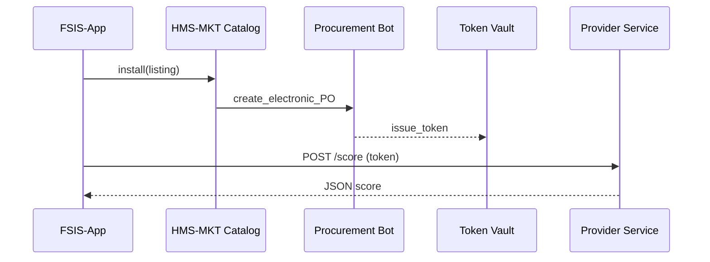

# Chapter 16: HMS-MKT (Marketplace & Capability Discovery)
[← Back to Chapter 15: Simulation & Training Sandbox](15_simulation___training_sandbox__hms_esr___hms_edu__.md)

---

## 1. Why Do We Need a Marketplace?

Imagine the **Food Safety and Inspection Service (FSIS)** wants a quick way to predict which meat-processing plants are most likely to fail tomorrow’s inspection.  
A perfect **“Risk-Scoring Model”** already exists inside another agency’s data lab, but:

* Nobody at FSIS knows it exists.  
* Even if they did, paperwork to share it could take **6 months**.  
* Developers would have to reverse-engineer its API.

**HMS-MKT** is the **“App Store for Government Re-Use.”**  
Agencies browse, compare, and click “Install” on:

* Micro-services (e.g., Risk-Scoring API)  
* Datasets (e.g., Historic Violations CSV)  
* AI Skills (e.g., Spanish-language sentiment model)

All procurement signatures, security scans, and billing codes are handled **behind the curtain**.

---

## 2. Key Concepts (Plain English)

| Term | Friendly Analogy | One-Sentence Meaning |
|------|------------------|----------------------|
| Listing | Product page in an app store | Describes one micro-service, dataset, or AI skill. |
| Capability Card | Nutrition label | Snapshot: inputs, outputs, cost, compliance stamps. |
| Tag | Shelf label | Quick category like “food-safety”, “machine-learning”. |
| Install Token | Activation code | Grants your app access, handles billing & auth. |
| Trial Sandbox | Free sample table | Lets you test 100 calls or 1 GB before paying. |
| Compliance Stamp | USDA sticker | Shows listing passed HIPAA, FedRAMP, etc. |
| Rating | 5-star review | Agencies can leave feedback after usage. |

---

## 3. The 5-Minute “Hello-MKT”

Goal: FSIS finds a **Risk-Scoring model**, installs it, and calls it from Python.

### 3.1 Search & Inspect

```python
# file: search.py  (≤ 12 lines)
from hms_mkt import Market

hits = Market.search(tags=["food-safety", "risk-score"])
for i, h in enumerate(hits, 1):
    print(i, h.title, "—", h.card.cost, "/ 1,000 calls")
```

Sample console:

```
1 Plant Risk-Scoring API — $0.00 (trial) / 1,000 calls
2 General Food Recall Dataset — Free
```

**Explanation** – `Market.search()` returns **Listings** that match your tags and lets you peek at each **Capability Card**.

### 3.2 Install

```python
# file: install.py  (≤ 10 lines)
choice = hits[0]                         # first result
token = choice.install(agency="FSIS")
print("Install Token:", token.value[:8], "...")
```

What happens  
1. HMS-MKT creates a **Procurement ticket** behind the scenes.  
2. A **Compliance Stamp** (FedRAMP Low) is attached to FSIS’s record.  
3. You get a time-bound **Install Token** ready for use.

### 3.3 Call the Capability

```python
# file: call_api.py  (≤ 15 lines)
from hms_mkt import Service

risk_api = Service(token)       # auto-discovers base URL
score = risk_api.post("/score", {
    "establishment_id": "MEAT-123",
    "last_inspection": "2024-02-14"
})
print("Risk score:", score["risk_pct"])
```

Expected output:

```
Risk score: 87.2
```

No extra keys, no procurement spreadsheets—**three tiny scripts and you’re live**.

---

## 4. What Happens Behind the Curtain?



1. **Procurement Bot** files the electronic purchase order with the Treasury code that both agencies already trust.  
2. **Token Vault** signs an **Install Token** (JWT).  
3. Provider Service validates the token on every call—no passwords exchanged.

---

## 5. Peek Inside the Codebase

### 5.1 Minimal Listing (JSON)

```json
{
  "id": "plant-risk-score",
  "title": "Plant Risk-Scoring API",
  "owner": "NIDDK",
  "endpoint": "https://svc.gov/risk",
  "inputs": { "establishment_id": "STRING", "last_inspection": "DATE" },
  "outputs": { "risk_pct": "FLOAT" },
  "cost": "0.002 USD per call",
  "stamps": ["FedRAMP Low", "HIPAA Ready"],
  "tags": ["food-safety", "machine-learning"]
}
```

### 5.2 Nano-Search Function

```python
# file: mkt/search.py  (≤ 10 lines)
def search(**filters):
    with open("catalog.json") as f:
        rows = json.load(f)
    return [Listing(r) for r in rows
            if all(t in r["tags"] for t in filters.get("tags", []))]
```

Eight lines—filter by tags and return **Listing** objects.

### 5.3 Token Issuer (simplified)

```python
# file: mkt/token.py  (≤ 14 lines)
import jwt, time, os
SECRET = os.getenv("MKT_SECRET", "dev")

def issue(listing_id, agency):
    payload = {
        "sub": agency,
        "scope": listing_id,
        "iat": int(time.time()),
        "exp": int(time.time()) + 86400  # 1 day
    }
    return jwt.encode(payload, SECRET, algorithm="HS256")
```

Tokens are **JWTs**—any micro-service can verify without phone calls.

---

## 6. Handy Recipes

### 6.1 List All Free Datasets

```python
for d in Market.search(tags=["dataset"]):
    if d.card.cost == "Free":
        print("-", d.title)
```

### 6.2 Rotate Tokens Nightly

```python
from hms_mkt import Token

Token.rotate(agency="FSIS")        # invalidates old, issues new
```

---

## 7. FAQ & Troubleshooting

| Symptom | Likely Cause | Quick Fix |
|---------|--------------|-----------|
| `401 Unauthorized` when calling service | Token expired | `token = listing.install()` again or rotate nightly. |
| Listing not visible to my agency | Restricted scope | Ask provider to add your agency or join a consortium. |
| Cost shows “Pending” | Procurement still processing | Wait or check status with `listing.po_status()`. |
| Need higher rate limit | Click “Request Upgrade” on listing; new PO auto-generated. |

---

## 8. What You Learned

You now know how to:

1. **Search** the Marketplace by tag.  
2. **Install** a capability with one call—paperwork handled for you.  
3. **Integrate** it in less than 20 lines of code.  
4. Peek inside HMS-MKT’s simple JSON catalog and JWT token logic.

Next we’ll see how these newly installed services stay **in-sync** with legacy mainframes, state systems, or vendor clouds through the **External System Sync Layer**.

→ Continue to [External System Sync Layer](17_external_system_sync_layer_.md)

---

Generated by [AI Codebase Knowledge Builder](https://github.com/The-Pocket/Tutorial-Codebase-Knowledge)