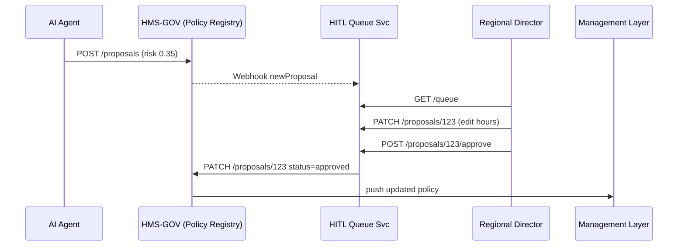

# Chapter 16: Human-in-the-Loop (HITL) Oversight  
*Coming from [AI Representative Agent (HMS-A2A)](15_ai_representative_agent__hms_a2a__.md).*

---

## 1. Why Do We Need “Humans in the Control Tower”? – A 2-Minute Story  

The **Social Security Administration (SSA)** has an AI tool that scans office-usage metrics and just recommended:

> “Close the rural **Kodiak, Alaska** field office; shift staff to Anchorage.”

Great for budgets—terrible for seniors who rely on in-person help.  
Before any press release goes out, a **regional director must**:

1. **See** the AI proposal.  
2. **Tweak** it (e.g., reduce hours instead of closing).  
3. **Approve** or **Reject** with a clear audit trail.

That *pause-button* is **Human-in-the-Loop (HITL) Oversight**.

---

## 2. Key Concepts (Beginner Cheat-Sheet)

| Analogy                 | HITL Term        | Beginner Explanation |
|-------------------------|------------------|----------------------|
| Inbox of tasks          | **HITL Queue**   | List of AI proposals awaiting eyes-on review. |
| Red “Reject” stamp      | **Veto**         | Human can block a proposal—nothing changes. |
| Pencil edits            | **Tweak**        | Human edits proposal JSON before approval. |
| Green “Approved” stamp  | **Rubber-Stamp** | Proposal passes unchanged; auto-deploys. |
| Scoreboard              | **Decision Log** | Immutable list of who did what, when. |

---

## 3. End-to-End Use Case: Review the “Close Kodiak Office” Proposal  

1. **AI Agent** drafts a *“close office”* proposal (risk = 0.35).  
2. Proposal lands in the **HITL Queue**.  
3. Regional director opens the **HITL Portal**, edits action to *“reduce hours”*.  
4. Clicks **Approve** ➜ Policy auto-applies.  
5. Audit log stores both the original and the edited version.

We’ll build this flow with **< 60 lines** of code + one tiny micro-frontend.

---

## 4. HITL Workflow – Five Actors, One Diagram  



---

## 5. Minimal Code – Server Side (≤ 20 Lines Each)

### 5.1 HITL Queue Service (`hitl_queue.py`)

```python
from fastapi import FastAPI, HTTPException
import uuid, json, requests
app = FastAPI(); QUEUE = {}          # id -> proposal dict

@app.post("/webhook/newProposal")          # called by HMS-GOV
def intake(p: dict):
    pid = p["id"]; QUEUE[pid] = p; return {"queued": pid}

@app.get("/queue")
def list_all(): return list(QUEUE.values())

@app.patch("/proposals/{pid}")
def edit(pid: str, patch: dict):
    if pid not in QUEUE: raise HTTPException(404)
    QUEUE[pid].update(patch); return QUEUE[pid]

@app.post("/proposals/{pid}/approve")
def approve(pid: str):
    prop = QUEUE.pop(pid, None)
    if not prop: raise HTTPException(404)
    requests.patch(f"https://gov.hms.gov/proposals/{pid}",
                   json={"status":"approved", "body":prop})
    return {"status":"sent"}
```

**What it does**  
* Stores incoming proposals.  
* Lets humans PATCH them.  
* On approval, forwards the *edited* proposal back to HMS-GOV.

---

### 5.2 Tiny Decision Log (`decision_log.py`)

```python
LOG = []          # simple list

def record(actor, pid, action, diff):
    LOG.append({"actor":actor, "pid":pid, "action":action,
                "diff":diff, "ts":__import__("time").time()})
```

Call `record()` inside `edit()` and `approve()` to keep an immutable log.

---

## 6. A Super-Small HITL Portal (Front-End)

#### 6.1 HTML Stub (auto-loaded as an MFE in the Portal Shell)

```html
<!-- hitl.html -->
<div id="root"></div>
<script type="module">
import React, {useEffect, useState} from 'https://cdn.skypack.dev/react';
import {render} from 'https://cdn.skypack.dev/react-dom';
function App(){
  const [q,setQ]=useState([]);
  useEffect(()=>fetch('/hitl/queue')
     .then(r=>r.json()).then(setQ),[]);
  const approve=(p)=>fetch('/hitl/proposals/'+p.id+'/approve',{method:'POST'});
  const tweak=(p)=> {
     const hours=prompt("New hours:", p.action.newHours||"9-3");
     fetch('/hitl/proposals/'+p.id,{method:'PATCH',headers:{'Content-Type':'application/json'},
           body:JSON.stringify({action:{type:'REDUCE_HOURS',newHours:hours}})});
  };
  return <ul>{q.map(p=><li key={p.id}>
     <b>{p.title}</b> 
     <button onClick={()=>tweak(p)}>edit</button> 
     <button onClick={()=>approve(p)}>approve</button>
  </li>)}</ul>;
}
render(<App/>, document.getElementById('root'));
</script>
```

*Explanation*  
• Fetches the queue once.  
• Two buttons: *edit* (opens `prompt()`), *approve* (POST).  
• Zero build tooling required—works in any modern browser.

---

## 7. What Happens Under the Hood (Step-By-Step)

1. **AI Agent** posts proposal (`risk 0.35`) ➜ HMS-GOV.  
2. HMS-GOV fires `POST /webhook/newProposal` ➜ HITL Queue.  
3. Portal Shell loads *HITL MFE* for users with `role=approver`.  
4. Director tweaks JSON (`type: REDUCE_HOURS`).  
5. Clicks **Approve** ➜ HITL Queue ➜ HMS-GOV.  
6. HMS-GOV publishes the updated policy; Management Layer adjusts office schedule.  
7. **Decision Log** stores diff for auditors.

---

## 8. Tying Back to Earlier Guard-Rails

| Guard-Rail Chapter | How HITL Uses It |
|--------------------|------------------|
| [Security & Compliance](09_security___compliance_framework_.md) | Masks PII in proposal body before logging. |
| [RBAC](10_role_based_access_control__rbac__.md) | Only users with `role=approver` can load the HITL Portal. |
| [Change Management & Versioning](04_change_management___versioning_.md) | Approved proposals create a new version; rollback is one click. |
| [Monitoring & KPIs](08_monitoring__telemetry__and_kpis_.md) | Emits `HITL_Decision` metric (approve vs reject counts). |

---

## 9. Debugging Tips for Beginners  

* Queue empty? Confirm HMS-GOV’s webhook URL in its config.  
* Every proposal should have a `riskScore`; default to `1.0` (forces human review).  
* Grep logs for `"action":"REDUCE_HOURS"` to verify your patch stuck.  
* Use `GET /decisionLog` (add a debug endpoint) to trace past approvals.

---

## 10. Summary  

• **HITL Oversight** is the circuit-breaker that keeps AI accountable to humans.  
• Core pieces: **Queue**, **Portal**, **Decision Log**—all fit in under 60 lines each.  
• Humans can veto, tweak, or rubber-stamp proposals with full auditability.  
• HITL plugs seamlessly into existing security, policy, and change-management rails.

Next we’ll see what happens if **both** AI and humans go offline—how does the system escalate or replace components automatically?  
Find out in [Replacement / Escalation Mechanism](17_replacement___escalation_mechanism_.md).

---

Generated by [AI Codebase Knowledge Builder](https://github.com/The-Pocket/Tutorial-Codebase-Knowledge)